**ABSTRACT**

Space the final frontier, has been a elusive dream since the birth of
the humankind. After humankind broke out from the limits of Earth and
reached space, it inspired us even more. CubeSats provide access to
space for a wider audience pushing the frontier once more. As a step
towards that future UPSat, the first truly open source in both hardware
and software paves the way for a more open and democratized space. \
\
This thesis describes the design, implementation and testing of 2
software modules of UPSat: the command and control module plus the
on-board computer software.\
\
The command and control module holds all the reusable software used in
the subsystems, a common way to access it through the protocol defined
ECSS-E-70-41A specification and implemented in the form of services that
each subsystem provides.\
\
The on-board computer, the heart of UPSat provide critical operation and
it is responsible for packet routing, housekeeping, timekeeping, the
science unit m-NLP and the image acquisition component operation and
finally mass storage of logs and configuration parameters.\
\
The software besides the required functionality must be written in a way
that is fault tolerant and protected from the radiation induced effects
and possible failures and errors.\
\
The primary purpose of this thesis is for the reader to easily
comprehend our rational and thought process behind every action so it
will give him an insight to our design intentions and hopefully provide
the necessary information so that future designs are improved.

**SUBJECT AREA**: CubeSat.

**KEYWORDS**: fault tolerance, space, CubeSat, command and control

**CONTENTS**

[1. INTRODUCTION 21](#introduction)

[1.1 Time 21](#time)

[1.2 Space and software 21](#space-and-software)

[1.3 CubeSats 22](#cubesats)

[1.4 Commercial Off The Shelf Components
22](#commercial-off-the-shelf-components)

[1.5 Space and open source 23](#space-and-open-source)

[1.6 SatNOGS 23](#satnogs)

[1.7 Mission requirements 25](#mission-requirements)

[1.8 UPSat 27](#upsat)

[1.8.1 COMMS 29](#comms)

[1.8.2 OBC 30](#obc)

[1.8.3 ADCS 31](#adcs)

[1.8.4 EPS 32](#eps)

[1.8.5 Science Unit 33](#science-unit)

[1.8.6 IAC 33](#iac)

[2. RESEARCH 34](#research)

[2.1 Single event effects and rad hard
34](#single-event-effects-and-rad-hard)

[2.1.1 Radiation effects 35](#radiation-effects)

[2.1.2 Protection from radiation effects
36](#protection-from-radiation-effects)

[2.2 State of the art 37](#state-of-the-art)

[2.2.1 NASA state of the art 37](#nasa-state-of-the-art)

[2.2.2 ZA-Aerosat 37](#za-aerosat)

[2.2.3 SwissCube 37](#swisscube)

[2.2.4 Phonesat 39](#phonesat)

[2.2.5 CKUTEX 40](#ckutex)

[2.2.6 i-INSPIRE II 40](#i-inspire-ii)

[2.3 Command and control module 41](#command-and-control-module)

[2.3.1 Requirements 41](#requirements)

[2.3.2 CSP 41](#csp)

[2.3.3 ECSS 42](#ecss)

[2.3.4 Comparison 43](#comparison)

[2.3.5 Result 44](#result)

[2.4 Safety critical software 44](#safety-critical-software)

[2.4.1 Undefined behavior 44](#undefined-behavior)

[2.4.2 Coding standards 45](#coding-standards)

[2.5 Fault tolerance 45](#fault-tolerance)

[2.5.1 Fault tolerant mechanisms 46](#fault-tolerant-mechanisms)

[2.5.2 Built in tests 46](#built-in-tests)

[2.5.3 Single point of failure 46](#single-point-of-failure)

[2.5.4 State of the art fault tolerance
47](#state-of-the-art-fault-tolerance)

[2.5.5 Fault tolerance in hardware 48](#fault-tolerance-in-hardware)

[2.5.6 Fault tolerance in software 49](#fault-tolerance-in-software)

[3. DESIGN 50](#design)

[3.1 Coding standards on UPSat 50](#coding-standards-on-upsat)

[3.1.1 10 rules 50](#rules)

[3.1.2 17 steps 50](#steps)

[3.2 Fault tolerance on UPSat 51](#fault-tolerance-on-upsat)

[3.2.1 Assertions 51](#assertions)

[3.2.2 Watchdog 51](#watchdog)

[3.2.3 Heartbeat 53](#heartbeat)

[3.2.4 Multiple checks 54](#multiple-checks)

[3.3 OBC 54](#obc-1)

[3.3.1 OBC-ADCS schism 54](#obc-adcs-schism)

[3.3.2 OBC real time constraints 54](#obc-real-time-constraints)

[3.3.3 RTOS Vs baremetal and FreeRTOS
55](#rtos-vs-baremetal-and-freertos)

[3.3.4 FreeRTOS concepts 56](#freertos-concepts)

[3.3.5 Introduction to FreeRTOS 56](#introduction-to-freertos)

[3.3.6 Tasks 57](#tasks)

[3.3.7 Critical sections 57](#critical-sections)

[3.3.8 Stack overflow detection 58](#stack-overflow-detection)

[3.3.9 Heap modes 58](#heap-modes)

[3.3.10 Advanced concepts 58](#advanced-concepts)

[3.3.11 Logging and file system 58](#logging-and-file-system)

[3.4 ECSS services 60](#ecss-services)

[3.4.1 Services 60](#services)

[3.4.2 Application ids 63](#application-ids)

[3.4.3 Packet frame 64](#packet-frame)

[3.4.4 Services in subsystems 66](#services-in-subsystems)

[3.4.5 Software reuse 66](#software-reuse)

[3.4.6 Telecommand verification service
66](#telecommand-verification-service)

[3.4.7 Housekeeping 68](#housekeeping)

[3.4.8 WOD 68](#wod)

[3.4.9 Extended WOD 69](#extended-wod)

[3.4.10 CW WOD 69](#cw-wod)

[3.4.11 Housekeeping & diagnostic data reporting service
70](#housekeeping-diagnostic-data-reporting-service)

[3.4.12 Function management service 71](#function-management-service)

[3.4.13 Large data transfer service 72](#large-data-transfer-service)

[3.4.14 On-board storage and retrieval service
74](#on-board-storage-and-retrieval-service)

[3.4.15 Test service 75](#test-service)

[4. Implementation 78](#implementation)

[4.1 ST cubeMX 78](#st-cubemx)

[4.2 Project folder organization 79](#project-folder-organization)

[4.3 GPS 79](#gps)

[4.4 HLDLC 80](#hldlc)

[4.5 Packet Pool 81](#packet-pool)

[4.6 Queues 83](#queues)

[4.7 Hardware abstraction layer 84](#hardware-abstraction-layer)

[4.8 Peripheral modes 85](#peripheral-modes)

[4.9 ECSS services 88](#ecss-services-1)

[4.10 upsat module 88](#upsat-module)

[4.11 Service module 91](#service-module)

[4.11.1 Error codes 92](#error-codes)

[4.11.2 ECSS packet structure 92](#ecss-packet-structure)

[4.11.3 Assertions 96](#assertions-1)

[4.12 Service utilities module 96](#service-utilities-module)

[4.13 Test service module 97](#test-service-module)

[4.14 Telecommand verification service module
98](#telecommand-verification-service-module)

[4.15 Event reporting service module
99](#event-reporting-service-module)

[4.16 Housekeeping & diagnostic data reporting service module
100](#housekeeping-diagnostic-data-reporting-service-module)

[4.16.1 OBC Housekeeping 101](#obc-housekeeping)

[4.17 Function management service module
101](#function-management-service-module)

[4.18 Time management service module
102](#time-management-service-module)

[4.19 Large data transfer service module
104](#large-data-transfer-service-module)

[4.20 Mass storage service module 105](#mass-storage-service-module)

[4.20.1 Note on mass storage and large data services
107](#note-on-mass-storage-and-large-data-services)

[4.20.2 2nd design 108](#nd-design)

[4.20.3 3rd design 108](#rd-design)

[4.21 SatNOGS client command and control module
109](#satnogs-client-command-and-control-module)

[4.22 Life of a packet 109](#life-of-a-packet)

[4.23 On-board computer 111](#on-board-computer)

[4.23.1 Discovery kit 111](#discovery-kit)

[4.23.2 FreeRTOS 111](#freertos)

[4.23.3 Real time clock 113](#real-time-clock)

[4.23.4 FatFS 113](#fatfs)

[4.23.5 Generic 114](#generic)

[5. Testing 115](#testing)

[5.1 OBC/ADCS PCB tests 115](#obcadcs-pcb-tests)

[5.2 COMMS testing 116](#comms-testing)

[5.3 Unit testing 117](#unit-testing)

[5.4 Static analysis 118](#static-analysis)

[5.5 Command and control testing software
118](#command-and-control-testing-software)

[5.6 SatNOGS client, command and control module
120](#satnogs-client-command-and-control-module-1)

[5.7 Debug tools, techniques 120](#debug-tools-techniques)

[5.7.1 UART 121](#uart)

[5.7.2 ST link and SWD 121](#st-link-and-swd)

[5.7.3 Segger J-Link 122](#segger-j-link)

[5.7.4 Segger systemview 122](#segger-systemview)

[5.8 RTOS and services timing analysis
124](#rtos-and-services-timing-analysis)

[5.8.1 Python script 124](#python-script)

[5.8.2 Arduino stress test 124](#arduino-stress-test)

[5.8.3 Packet processing time analysis
124](#packet-processing-time-analysis)

[5.8.4 Packet pool timestamp 125](#packet-pool-timestamp)

[5.8.5 Systemview 125](#systemview)

[5.9 ECSS statistics 128](#ecss-statistics)

[5.10 System operation test 129](#system-operation-test)

[5.11 Functional tests 130](#functional-tests)

[5.12 e2e tests 130](#e2e-tests)

[5.13 Environmental testing 132](#environmental-testing)

[5.14 Testing campaign 132](#testing-campaign)

[6. Conclusions 133](#conclusions)

[6.1 Project key points 133](#project-key-points)

[6.2 Simplicity 134](#simplicity)

[6.3 Refactor 134](#refactor)

[6.4 Future work 135](#future-work)

[ABBREVIATIONS - ACRONYMS 141](#abbreviations---acronyms)

[REFERENCES 142](#references)

**LIST OF FIGURES**

[Figure 1.1 CubeSat unit specification 22](#_Toc493950398)

[Figure 1.2 CubeSat numbers 23](#_Toc493950399)

[Figure 1.3 SatNOGS \[4\] 24](#_Toc493950400)

[Figure 1.4 QB50 targets \[8\] 25](#_Toc493950401)

[Figure 1.5 UPSat subsystems. 27](#_Toc493950402)

[Figure 1.6 UPSat subsystems diagram 28](#_Toc493950403)

[Figure 1.7 COMMS subsystem \[6\] 29](#_Toc493950404)

[Figure 2.1 Missions with radiation issues \[25\] 34](#_Toc493950405)

[Figure 2.2 SEE classification \[49\] 35](#_Toc493950406)

[Figure 2.3 Cost of 2Mbytes rad-hard SRAM \[30\] 36](#_Toc493950407)

[Figure 2.4 Argos testbed rad-hard board SEU \[43 36](#_Toc493950408)

[Figure 2.5 Argos testbed COTS board SEU \[43\] 36](#_Toc493950409)

[Figure 2.6 SwissCube exploded view \[45\] 38](#_Toc493950410)

[Figure 2.7 PhoneSat 2.0 data distribution architecture
40](#_Toc493950411)

[Figure 2.8 i-INSPIRE II CubeSat \[47\] 40](#_Toc493950412)

[Figure 2.9 i-INSPIRE II software state machine \[47\]
40](#_Toc493950413)

[Figure 2.10 CSP header 41](#_Toc493950414)

[Figure 2.11 ECSS TC frame header 42](#_Toc493950415)

[Figure 2.12 ECSS TC data header 42](#_Toc493950416)

[Figure 2.13 Fault tolerance mechanisms \[29\] 47](#_Toc493950417)

[Figure 2.14 Hardware fault tolerance \[26\] 48](#_Toc493950418)

[Figure 2.15 B777 flight computer \[57\] 48](#_Toc493950419)

[Figure 2.16 AIRBUS A320-40 flight computer \[57\] 49](#_Toc493950420)

[Figure 3.1 Tasks \[12\] 58](#_Toc493950421)

[Figure 3.2 tasks life cycle \[12\] 58](#_Toc493950422)

[Figure 3.3 FAT file system structure \[60\] 59](#_Toc493950423)

[Figure 3.4 FatFS critical operations \[32\] 60](#_Toc493950424)

[Figure 3.5 FatFS optimized critical operations \[32\]
60](#_Toc493950425)

[Figure 3.6 CW WOD frame 69](#_Toc493950426)

[Figure 3.7 CW WOD dataset 70](#_Toc493950427)

[Figure 3.8 Large data transfer split of the original packet
73](#_Toc493950428)

[Figure 4.1 OBC's CubeMX project 78](#_Toc493950429)

[Figure 4.2 Project organization 79](#_Toc493950430)

[Figure 4.3 The life of a packet 110](#_Toc493950431)

[Figure 4.4 On-board computer software diagram 111](#_Toc493950432)

[Figure 5.1 ADCS IMU communication debugging in a logic analyzer
116](#_Toc493950433)

[Figure 5.2 Packetcraft 119](#_Toc493950434)

[Figure 5.3 UPSat command and control 120](#_Toc493950435)

[Figure 5.4 Example use of a breakpoint 121](#_Toc493950436)

[Figure 5.5 Systemview events display 123](#_Toc493950437)

[Figure 5.6 OBC extended WOD communications 126](#_Toc493950438)

[Figure 5.7 Delay before task notification fix 127](#_Toc493950439)

[Figure 5.8 Delay after task notification fix 127](#_Toc493950440)

[Figure 5.9 Mass storage service WOD storage 128](#_Toc493950441)

**\
LIST OF IMAGES**

[Image 1.1 SatNOGS rotator \[4\] 24](#_Toc493950645)

[Image 1.2 UPSat subsystems mounted in the aluminum structure
28](#_Toc493950646)

[Image 1.3 UPSat's umbilical connector and remove before flight switch
28](#_Toc493950647)

[Image 1.4 The antenna deployment system
29](file:////Users/nanimo/Desktop/thesis/di_thesis.docx#_Toc493950648)

[Image 1.5 OBC subsystem during testing 30](#_Toc493950649)

[Image 1.6 OBC and ADCS subsystem 31](#_Toc493950650)

[Image 1.7 ADCS subsystem unpopulated PCB 31](#_Toc493950651)

[Image 1.8 ADCS Spin-Torquer
31](file:////Users/nanimo/Desktop/thesis/di_thesis.docx#_Toc493950652)

[Image 1.9 EPS subsystems PCBs 32](#_Toc493950653)

[Image 1.10 The EPS PCB with the battery pack mounted
32](#_Toc493950654)

[Image 1.11 Solar panel used in UPSat along with a SU probe
32](#_Toc493950655)

[Image 1.12 The science unit m-NLP 33](#_Toc493950656)

[Image 1.13 The DART4460 of the IAC subsystem 33](#_Toc493950657)

[Image 2.1 PhoneSat v1.0 39](#_Toc493950658)

[Image 2.2 PhoneSat v2.5 40](#_Toc493950659)

[Image 5.1 OBC prototype board 115](#_Toc493950660)

[Image 5.2 COMMS power amplifier testing 115](#_Toc493950661)

[Image 5.3 UPSat stack prototype boards 120](#_Toc493950662)

[Image 5.4 The on-board ST-link connected to the stack
121](#_Toc493950663)

[Image 5.5 J-links connected to UPSat for debugging 122](#_Toc493950664)

[Image 5.6 UPSat systemview 125](#_Toc493950665)

[Image 5.7 UPSat systemview testing 125](#_Toc493950666)

[Image 5.8 UPSat systemview testing operation 129](#_Toc493950667)

[Image 5.9 UPSat systemview operational plot 129](#_Toc493950668)

[Image 5.10 UPSat extended WOD operational plot 129](#_Toc493950669)

[Image 5.11 During S.U. E2E tests 130](#_Toc493950670)

[Image 5.12 TVAC chamber with UPSat 132](#_Toc493950671)

[Image 5.13 TVAC results 132](#_Toc493950672)

[Image 5.14 UPSat vibration test pod 132](#_Toc493950673)

[Image 5.15 UPSat subsystem thermal inspection 132](#_Toc493950674)

[Image 6.1 Some people of the team, the day before the delivery
136](#_Toc493950675)

[Image 6.2 UPSat during the final tests before delivery
136](#_Toc493950676)

[Image 6.3 UPSat in the Nanorack's deployment pod. 137](#_Toc493950677)

[Image 6.4 UPSat 138](#_Toc493950678)

[Image 6.5 the CYGNUS supply ship that had UPSat, before docking to ISS
139](#_Toc493950679)

[Image 6.6 UPSat along with 2 other CubeSats released from ISS
140](#_Toc493950680)

**LIST OF TABLES**

[Table 1.1 QB50 related requirements. 26](#_Toc493950478)

[Table 3.1 10 rules for developing safety critical code \[39\]
52](#_Toc493950479)

[Table 3.2 17 steps to safer C code \[40\] 53](#_Toc493950480)

[Table 3.3 ECSS services 62](#_Toc493950481)

[Table 3.4 ECSS services implemented by UPSat 63](#_Toc493950482)

[Table 3.5 UPSat application ids 63](#_Toc493950483)

[Table 3.6 Telecommand Data header 64](#_Toc493950484)

[Table 3.7 Telemetry Data header 65](#_Toc493950485)

[Table 3.8 Command and control packet frame 65](#_Toc493950486)

[Table 3.9 Services implemented in each subsystem. 66](#_Toc493950487)

[Table 3.10 Telecommand packet data ACK field settings
67](#_Toc493950488)

[Table 3.11 Telecommand verification service subtypes
67](#_Toc493950489)

[Table 3.12 Telecommand verification service acceptance report frame
67](#_Toc493950490)

[Table 3.13 Telecommand verification service acceptance failure frame.
68](#_Toc493950491)

[Table 3.14 Telecommand verification service error codes
68](#_Toc493950492)

[Table 3.15 WOD packet format 69](#_Toc493950493)

[Table 3.16 WOD dataset 69](#_Toc493950494)

[Table 3.17 Housekeeping service structure IDs 71](#_Toc493950495)

[Table 3.18 Housekeeping service request structure id frame
71](#_Toc493950496)

[Table 3.19 Housekeeping service report structure id frame
71](#_Toc493950497)

[Table 3.20 Function management service data frame 71](#_Toc493950498)

[Table 3.21 Function management services in each subsystem
72](#_Toc493950499)

[Table 3.22 Large data transfer service transfer data frame.
73](#_Toc493950500)

[Table 3.23 Large data transfer service acknowledgement frame
73](#_Toc493950501)

[Table 3.24 Large data transfer service repeat part frame
74](#_Toc493950502)

[Table 3.25 Large data transfer service abort transfer frame
74](#_Toc493950503)

[Table 3.26 On-board storage and retrieval service uplink subtype frame
75](#_Toc493950504)

[Table 3.27 On-board storage and retrieval service downlink subtype
frame 75](#_Toc493950505)

[Table 3.28 On-board storage and retrieval service downlink content
subtype frame 76](#_Toc493950506)

[Table 3.29 On-board storage and retrieval service subtypes used on
UPSat 76](#_Toc493950507)

[Table 3.30 On-board storage and retrieval service delete subtype frame
76](#_Toc493950508)

[Table 3.31 Store IDs 77](#_Toc493950509)

[Table 3.32 On-board storage and retrieval service catalogue list
subtype frame 77](#_Toc493950510)

[Table 3.33 On-board storage and retrieval service catalogue report
subtype frame 77](#_Toc493950511)

[Table 4.1 Number of packets and data payload sizes in each subsystem
81](#_Toc493950512)

[Table 4.2 ECSS status codes 93](#_Toc493950513)

[Table 4.3 Event service frame 99](#_Toc493950514)

[Table 4.4 Large data transfer service, different states of the Large
data state machine 105](#_Toc493950515)

[Table 5.1 Functional test list and description 131](#_Toc493950516)

 
==============================================================================================

INTRODUCTION
============

The thesis is separated into 6 chapters that loosely correspond to the
chronological time line of the events related to design and
implementation.

In chapter 0 general information providing the context of the thesis
will be presented.

In chapter 1 the research that was conducted in order to familiarize
with the aspects of developing software for a CubeSat will be presented.

In chapter 2 the design choices that derived from the research of the
previous chapter and the reasons behind them will be presented

In chapter 3 the actual implementation and the parts that diversify from
the initial design and the causes of that will be discussed.

In chapter 4 the overall testing campaign and the techniques used will
be presented.

In the final chapter, conclusions, thoughts and future improvements are
presented and discussed.

Time 
----

The most important factor in this project was time. From the first time,
I heard of UPSat, to the day I was officially involved and the original
date of delivery to the final delivery date of Aug. 18, only 6 months
had passed.

Even though I consider my shelf to as an experienced in programmer and
especially in embedded systems, writing fault tolerant software for a
CubeSat was definitely new experience.

The time duration of 6 months was for: research, design, development and
testing.

In this limited time frame, decisions had to be made in a instant,
followed by the implementation.

Research time was reduced to minimum, design was given more time and
testing was happening as the development progressed.

Due to these strict conditions, time limitations affected all aspects of
the CubeSat development and it was the prominent factor in all
decisions.

Space and software 
------------------

Having to design and implement software that is indented to work in
space, differs from other projects in 2 significant factors:
Environmental radiation affects the electronics resulting in corrupt
memory or more permanent damage like flash and the fact that once the
CubeSat is launched into space, it cannot be examined or repaired.

CubeSats 
--------

Figure 1.1 CubeSat unit
specification

CubeSats provide a low-cost access to space, it first started from
California Polytechnic State University and Stanford developing the
specification at 1999 with the first CubeSat launching at 2003. Most of
the firsts CubeSats came from the academia but as soon as CubeSats
proved their usefulness commercial companies started using it as well.
Following the CubeSat as low-cost platform success are plans to send
swarm of CubeSats to the moon or even mars, while all of CubeSats until
now are confined to LEO.

CubeSats are ideal for experiments especially high risk that justify due
to the low cost of a CubeSat. A good example of that is the QB50
experiment: The cost of fleet of 50 traditional satellites is not
justified by the research conducted and other means like one satellite
or a rocket doesn't spend the time in the thermosphere the researchers
wished \[11\].

CubeSats dimensions are defined in 1U that is equal to 10x10x10 cm and
multiples of that. At first most of the CubeSats were 1U but later more
options became available for launch configurations to 6U or even 12U.

Commercial Off The Shelf Components 
-----------------------------------

One reason that makes CubeSats a low-cost solution is the use of COTS.
The aerospace industry traditionally uses radiation hardened components
that are especially designed to withstand the extreme conditions in
space. These components are a lot more expensive from the commercial
available counter parts and usually one generation behind in the
technologies used.

  ------------------------------------------------------------------------------------ -------------------------------------------------------------------------------------
  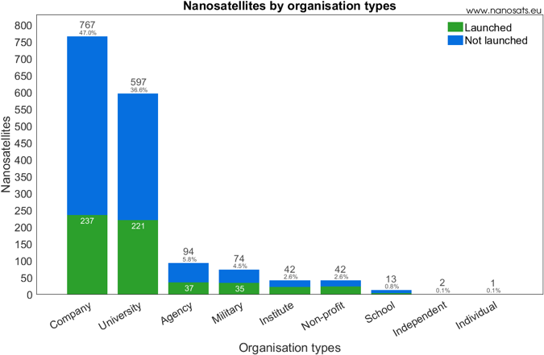   
  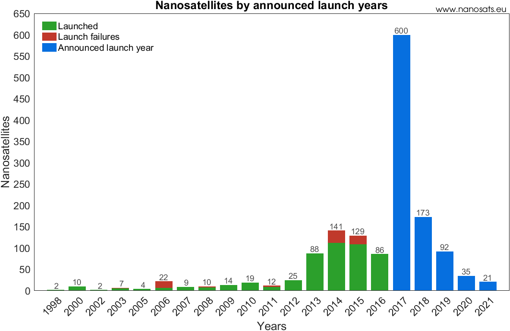
  \(a) Cubesat launches per year \[13\].                                               \(b) CubeSat launches per organization \[13\].
  Figure 1.2 CubeSat numbers
  ------------------------------------------------------------------------------------ -------------------------------------------------------------------------------------

Space and open source 
---------------------

NASA states in \[19\]: "At the other end of the spectrum, low-cost
easy-to-develop systems that take advantage of open source software and
hardware are providing an easy entry into space systems development,
especially for those who lack specific spacecraft expertise or for the
hobbyist.". This is also reflected in \[53\] as one of the best ways to
improve is by reading other people’s code.

Sharing the same opinion, our experience, when we started working on
UPSat, we couldn't find any open source code available for examination.
This made more difficult as there wasn't a starting point in an already
difficult project.

In my opinion, open source in space that fault tolerance is a must, it
isn't a luxury, but a critical necessity. By open sourcing and allowing
a wider audience to view and analyze the code, not only help engage the
community but also increases the possibility of discovering errors.

SatNOGS 
-------

The SatNOGS \[4\] project aim is to provide an open source software and
hardware solution of a constellation of ground stations for continuous
communication with satellites in LEO. Most of the parts are designed so
they can be 3d printed in order to make a ground station construction
more feasible. It is currently maintained from the Libre Space
Foundation \[3\].

SatNOGS consists of 4 parts:

-   The Network is the web application used from the users for ground
    station operation.

-   The Database provides information about active satellites.

-   The Client is the software that runs on the ground stations.

-   The Ground Station contains the rotator, antennas and electronics.

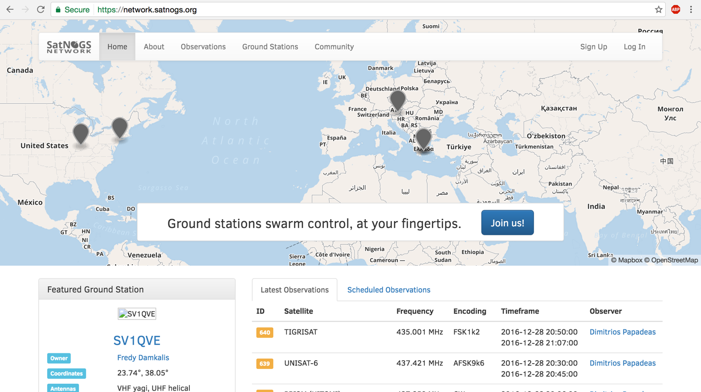

Figure 1.3 SatNOGS \[4\]

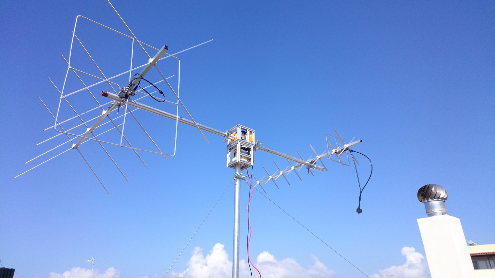

Image 1.1 SatNOGS rotator
\[4\]

Mission requirements 
--------------------

Figure 1.4 QB50 targets
\[8\]

QB50 is a European FP7 project with worldwide participation from the von
Karman Institute for Fluid Dynamics (VKI) in Brussels with the purpose
to study the lower thermosphere, between 200 - 380km altitude using a
network of 50 low cost cubesats.

QB50 provides 3 different types of Science Units and it's up to the
universities that participate to provide the cubesat to run the
experiments.

The mission requirements derive first from the QB50 system requirements,
the SU specifications and finally from subsystem requirements defined
internally from the UPSat team. The mission requirements is the most
prominent factor that shapes the software design. Some of the
requirements are generic like the QB50-SYS-1.4.6 and the rest are
related to specific parts of the UPSat. The QB50 requirements define
operations regarding the WOD format and frequency, mass storage
operations, time keeping format, clock accuracy and testing
requirements.

Table 1.1 QB50 related
requirements.

  QB50 requirement number   description
  ------------------------- ------------------------------------------------------------------------------------------------------------------------------------------------------------------------------------------------
  QB50-SYS-1.4.1            The CubeSat shall collect whole orbit data and log telemetry every minute for the entire duration of the mission.
  QB50-SYS-1.4.2            The whole orbit data shall be stored in the OBC until they are successfully downlinked.
  QB50-SYS-1.4.3            Any computer clock used on the CubeSat and on the ground segment shall exclusively use Coordinated Universal Time (UTC) as time reference.
  QB50-SYS-1.4.4            The OBC shall have a real-time clock information with an accuracy of 500ms during science operation. Relative times should be counted / stored according to the epoch 01.01.2000 00:00:00 UTC.
  QB50-SYS-1.4.6            The OBSW shall protect itself against unintentional infinite loops, computational errors and possible lock ups.
  QB50-SYS-1.4.7            The check of incoming commands, data and messages, consistency checks and rejection of illegal input shall be implemented for the OBSW.
  QB50-SYS-1.4.8            The OBSW programmed and developed by the CubeSat teams shall only contain code that is intended for use on that CubeSat on ground and in orbit.
  QB50-SYS-1.4.9            Teams shall implement a command to be sent to the CubeSat which can delete any SU data held in Mass Memory originating prior to a DATE-TIME stamp given as a parameter of the command.
  QB50-SYS-1.5.11           The CubeSat shall transmit the current values of the WOD parameters and its unique satellite ID through a beacon at least once every 30 seconds or more often if the power budget permits.
  QB50-SYS-1.7.1            The CubeSat shall be designed to have an in-orbit lifetime of at least 6 months.
  QB50-SYS-3.1.1            The Cubesat functionalities shall be verified using the functional test sets.
  QB50-SYS-3.1.2            The satellite flight software shall be tested for at least 14h satellite continuous up-time under representative operations.
  QB50-SYS-3.2.1            CubeSats boarding the QB50 Sensors Unit shall perform an End-to- End test, to verify the functionality of the sensors and the interfaces with the CubeSat subsystems.

UPSat 
-----

In this section, the subsystems of UPSat are analyzed along with the
respective hardware.

Most of the hardware was already designed from the university of Patras
with the sole exception the separation of the OBC and the ADCS.

UART is used for subsystems communication except the IAC which uses SPI
because the OBC didn't had any UART peripheral left. All subsystems are
connected to the OBC which is responsible for packet routing.

All subsystems implement at least the minimum ECSS services and provide
the necessary services functionality.

The umbilical connector is used for charging the on-board batteries and
serial connection with the OBC used for testing.

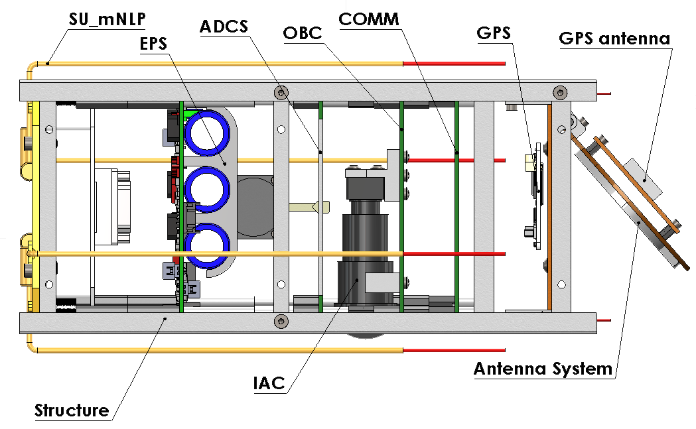

Figure 1.5 UPSat
subsystems.

Figure 1.6 UPSat
subsystems diagram

  ------------------------------------------------------------------------------------------------------------------------------------------------------------------------------------------------------------------------------------
  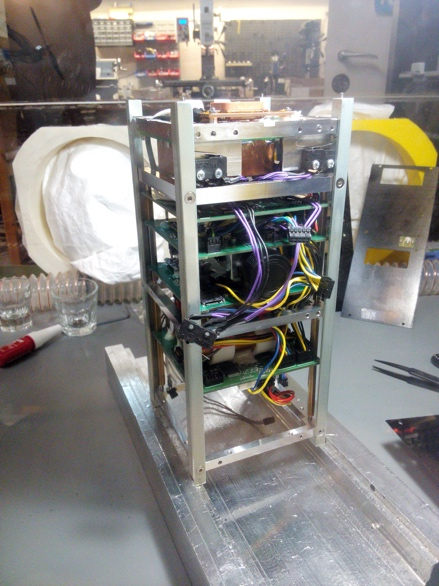                          
  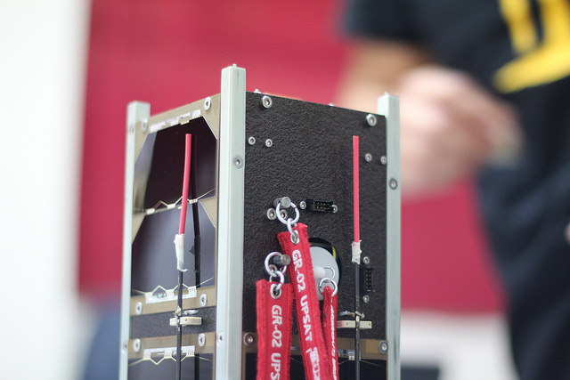
                                                                                                                
  Image 1.2 UPSat subsystems mounted in the aluminum structure   Image 1.3 UPSat's umbilical connector and remove before flight switch

### COMMS

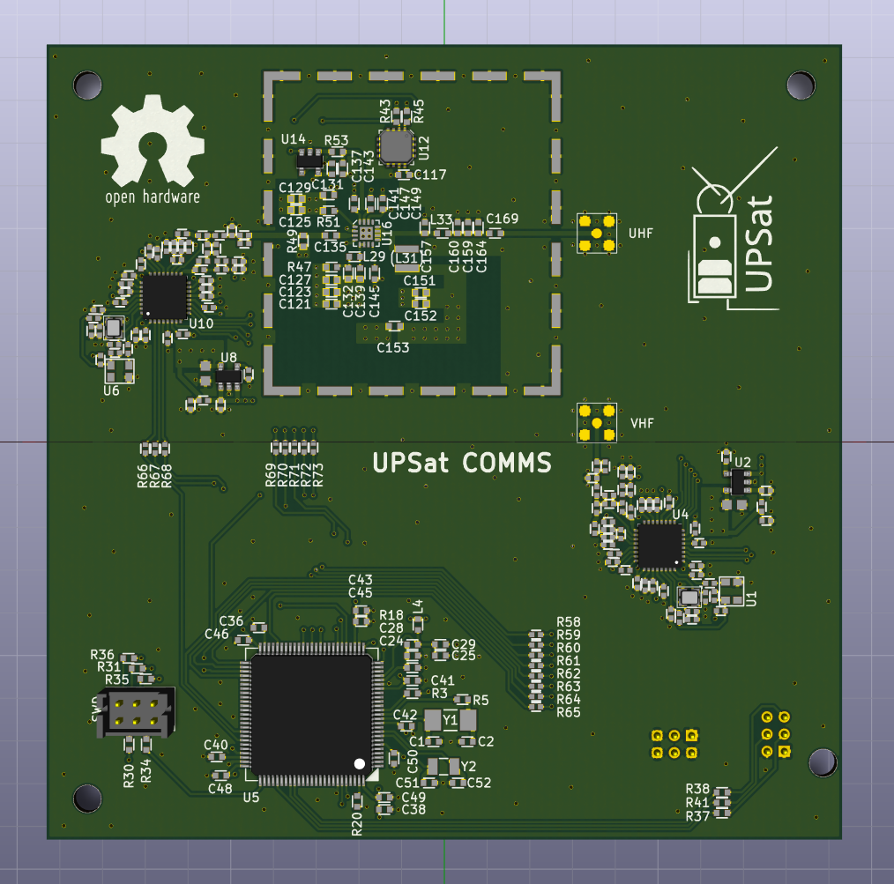

Figure 1.7 COMMS
subsystem \[6\]

The communications subsystem (COMMS) is responsible for the UPSat
communication with the Earth and the ground stations.

It consists of: STM32F407 microcontroller with an ARM cortex M4 CPU core
that has 1 Mbyte of Flash and

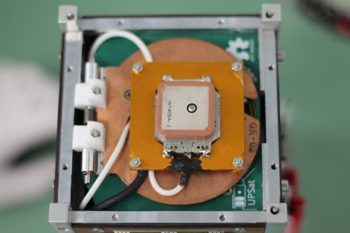192 Kbytes of SRAM, 2 CC1120 RF
transceivers with 2-FSK modulation, connected with the microcontroller
with SPI, one used for reception at 145 MHZ and the other for
transmission at 435 MHZ, the ADT7420 temperature sensor connected with
\\(I\^2C\\) and the RF5110g power amplifier used for amplifying the
transmitted signal.

The COMMS is connected to the antenna deployment system that deploys the
2 antennas after the launch from the ISS.

### OBC

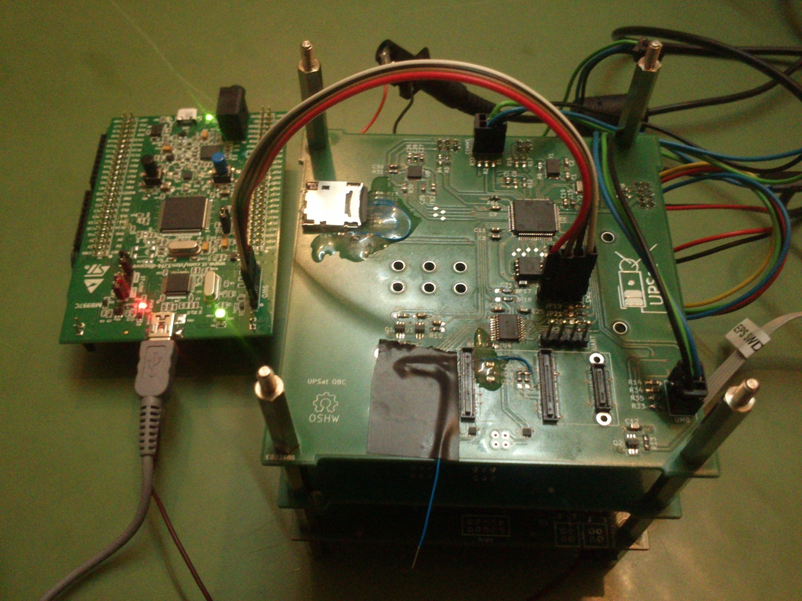

Image 1.5 OBC subsystem
during testing

The On-Board Computer is responsible for routing the packets to the
subsystems, operating the mass storage memory used for logs and
configuration storage, managing housekeeping, maintaining UTC time and
operating the SU via the SU scripts.

It consists of:

-   STM32F405 microcontroller with an ARM cortex M4 cpu core that has 1
    Mbyte of Flash and 192 Kbytes of SRAM.

-   The microcontroller's internal Real Time Clock connected with a coin
    cell battery.

-   An SD card connected with SDIO.

-   IS25LP128 128 MBIT Flash memory connected with SPI.

The initial design that was delivered from the university had the OBC
and the ADCS in one PCB running all the functionality in one
microcontroller. As at that time, it was unknown if the microcontroller
could host both functionalities, it was decided to split the subsystems
into 2 PCBs and microcontrollers respectively.

  -------------------------------------------------------------------------------------------------------------------------------------------------------------------------------
  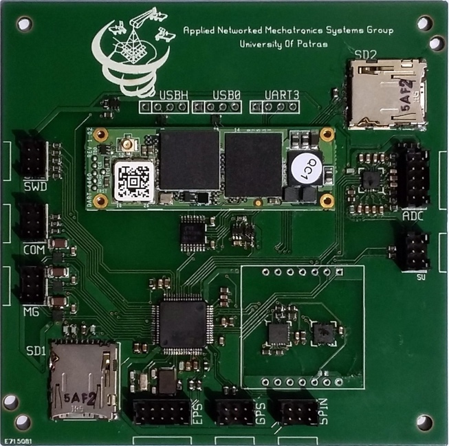   
  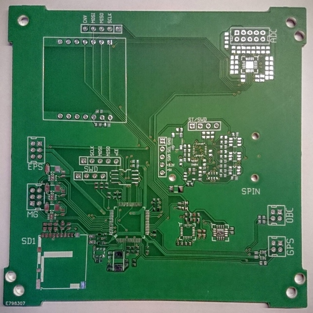
                                                                                        
  Image 1.6 OBC and ADCS subsystem       Image 1.7 ADCS subsystem unpopulated PCB

### ADCS

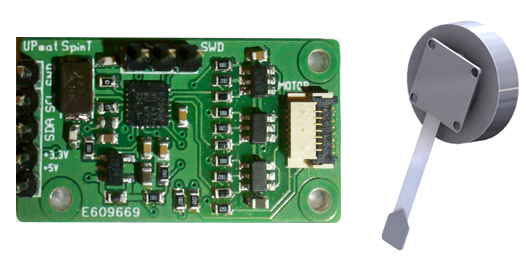The Altitude Determination and Control
Subsystem (ADCS) is responsible for determine UPSat's position and
rotation and controlling the behaviour according to the defined set
points. The microcontoller takes the sensors information, feeds it to
the controllers, which provide the output of the actuators. The B-dot
controller is used during the detumbling phase (rotation greater than
0.3 deg/s) and after UPSat has stable rotation the pointing controller
takes control.

It consists of:

-   STM32F405 microcontroller with an ARM cortex M4 CPU core that has 1
    Mbyte of Flash and 192 Kbytes of SRAM.

-   IS25LP128 128 MBIT Flash memory connected with SPI.

-   An SD card connected with SPI.

-   GPS PQNAV-L1 connected with UART.

-   PNI RM3100 3 axis high precision magnetometer connected with SPI.

-   LSM9DS0 3 axis gyroscopes and magnetometers, connected
    with \\(I\^2C\\).

-   Newspace systems sun sensor.

-   AD7682 A/D converter for the sun sensor connected with SPI.

-   AD7420 temperature sensor connected with \\(I\^2C\\).

-   Spin-Torquer, a BLDC motor with a custom controller.

-   2 Magneto-Torquers embedded into the solar panels and a controller
    with PWM connection.

    1.  ### EPS

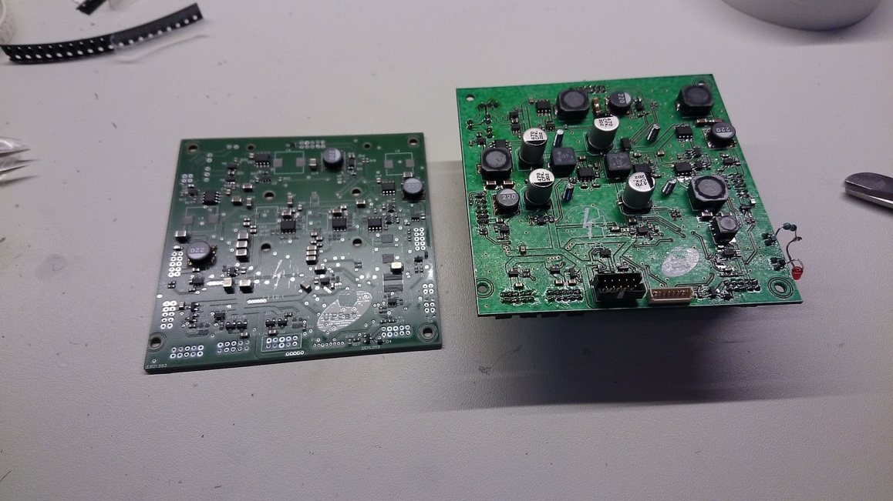

Image 1.9 EPS subsystems
PCBs

The Electrical Power Subsystem (EPS) is responsible for charging the
batteries from the solar panels, subsystems power management and
batteries temperature control. It is also responsible for the post
launch sequence that keeps the subsystems turned off for 30 minutes
after the launch from the ISS and after the 30 minutes have passed, it
deploys the antennas and the SU m-NLP probes by using a resistor to burn
a thread that keeps the mechanism closed.

It consists of:

-   STM32L152 microcontroller with an ARM cortex M3 cpu core that runs
    the MPTT algorithm for charging the batteries.

-   3 Li-Po batteries.

-   MOSFET switches for controlling the subsystems power.

  -----------------------------------------------------------------------------------------------------------------------------------------------------------------------------------------------------------------
  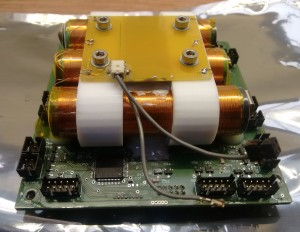                  
  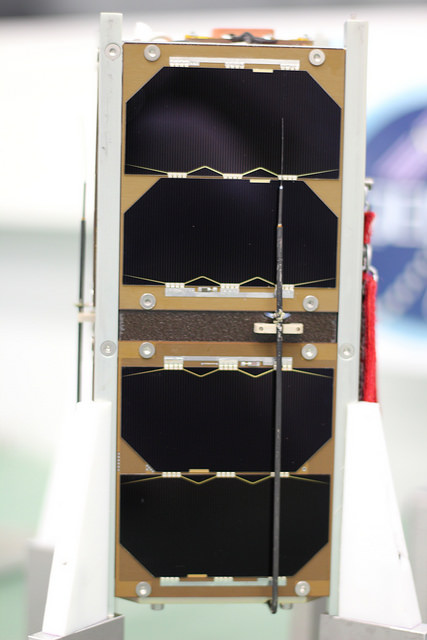
                                                                                                        
  Image 1.10 The EPS PCB with the battery pack mounted   Image 1.11 Solar panel used in UPSat along with a SU probe
  
### Science Unit

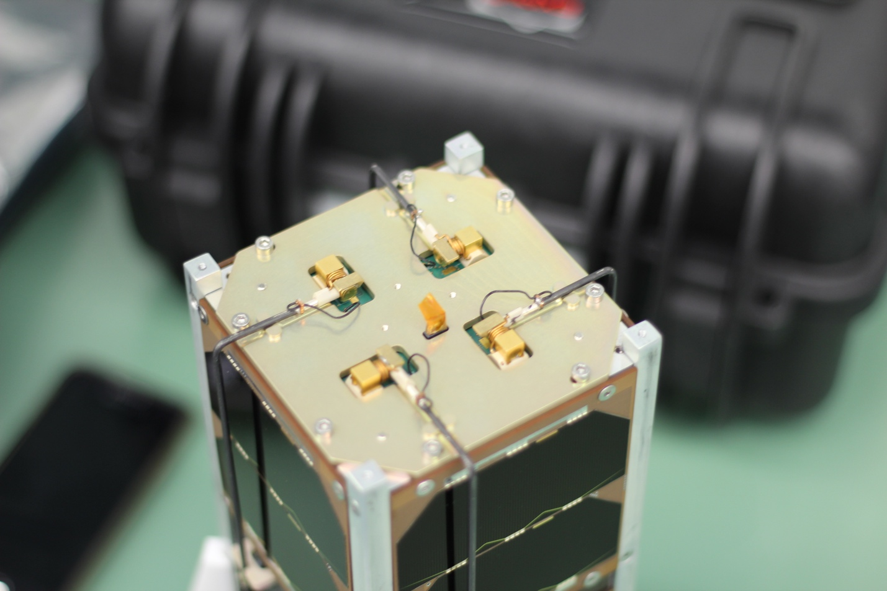

Image 1.12 The science
unit m-NLP

The science unit (SU) is the primary payload of UPSat. It is provided
from the QB50 program and it's the multi-Needle Langmuir Probe (m-NLP)
type. It has 4 probes that are deployed after the UPSat launch from ISS.

SU communicates with the OBC through a serial connection. The OBC is
responsible for sending commands to the SU and saving the SU information
to the OBC's mass storage.

### IAC

The Image Acquisition Component (IAC) is the secondary payload of UPSat,
defined from the university of Patras. It is comprised from the embedded
linux board DART4460 running a custom OpenWRT build and the Ximea
MU9PM-MH USB camera with a 50mm 1/2” IR MP lens.

The IAC's DART and camera is connected to the OBC PCB and communicated
directly to the OBC's microcontroller through SPI.

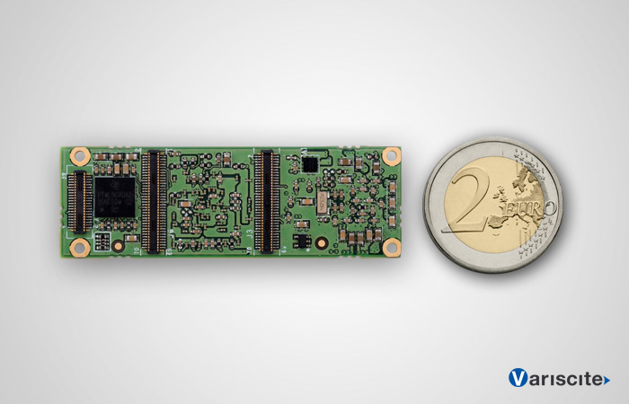

Image 1.13 The DART4460
of the IAC subsystem

RESEARCH
========

In this chapter, the preliminary research for the software development
of UPSat regarding the command & control module and the OBC is
introduced.

Single event effects and rad hard 
---------------------------------

The most characteristic issue, during the design and operation of
cubesats and satellites in general, is the harsh environment that they
have to operate. The most prominent factor is the radiation. Radiation
poses a threat to electronics, with observed malfunctions in missions
\[25\] but with careful design shouldn't be an issue.

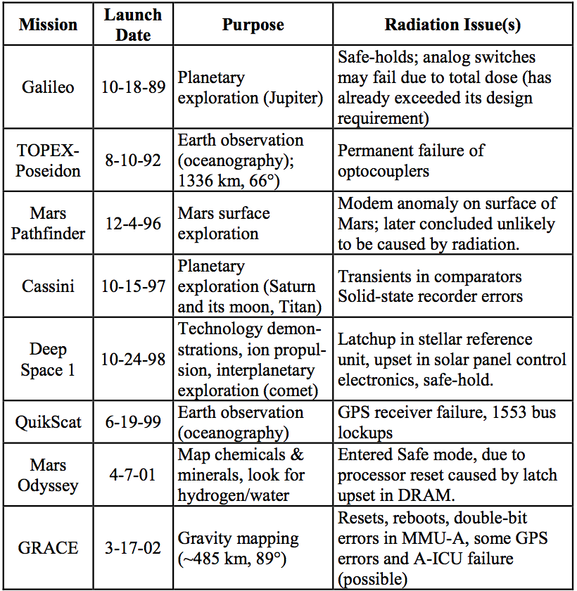

Figure 2.1 Missions with
radiation issues \[25\]

### Radiation effects

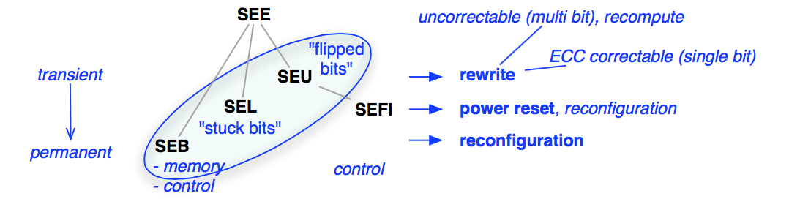

Figure 2.2 SEE
classification \[49\]

Radiation effects can be split in 2 categories:

-   Total Ionisation Dose.

-   Single Event Effects.

Total Ionisation Dose (TID) refers to the cumulative effects of
radiation in space, resulting in gradual degradation in operational
parameters in electronics \[52\]. This affects missions with longer
duration than a typical CubeSat in LEO.

SEEs are separated into different groups and it can be transient or
permanent:

-   Single Event Upset.

-   Single Event Latch-up.

-   Single Event Transients.

-   Single Event Functional Interrupt.

-   Single Event Burnout.

A SEU usually affects memory (SRAM, DRAM) and usual toggles a single bit
or a larger area (more bits). SEUs are not destructive and usually dealt
with a rewrite in the memory. The key issue is it need to be detected it
before it leads to failure \[49\].

A SEL and a SEB could lead to permanent damage to part if the current is
not limited quick enough \[52\], SEL is usually dealt with protection
circuits \[52\] when possible. Sometimes a bit could be stuck in a
specific state. This could lead to failure if the bit is changed in
sensitive areas. Latch-ups though are not common events in CubeSats and
it usually affects mission with longer duration \[25\]

A SET can affect logic gates and can also appear in analog to digital
converters. SET are usually harmless

A SEE could lead to a SEFI, if the SEE affects a microcontroller or an
equivalent device and put it to an unrecoverable mode \[52. By res but
it could have devastating results e.g. if the SEE affects the flash
memory that stores the program of the OBC resulting in a bricked device.

### Protection from radiation effects

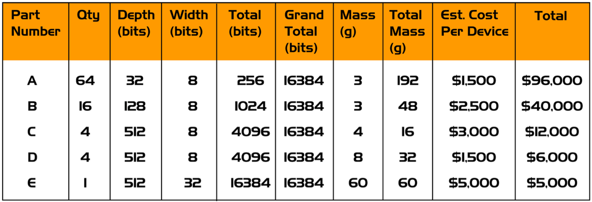

Figure 2.3 Cost of
2Mbytes rad-hard SRAM \[30\]

Some traditional ways to protect a satellite from radiation is:

-   Shielding.

-   Radiation hardened processors.

-   EDAC memories.

Shielding is not the best way for a CubeSat, since it adds weight and it
doesn't fully protect from SEEs \[49\]. In \[42\] the mechanical
structure can be used to shield sensitive components by placing them in
less affected areas.

Rad-hard processors are typical most costly, have less performance, the
components available are limited, more power consumption and are at
least a generation older than COTS processors \[30\].

EDAC memory which is ram with error correction in the hardware are also
costly.

Moreover, even if rad-hard CPUs offer protection from SEUs, they are not
totally immune to SEUs \[43\].

Due to the cost and the disadvantages stated above, associated with
rad-hard components, there is a trend moving from rad-hard to COTS and
from hardware protection to software \[49\] \[30\] \[50\] \[56\].
Reliability issues can be improved by using fault tolerant techniques
and redundancy \[50\].

As already proven by PhoneSat \[22\] and SwissCube \[45\], rad-hard
components, EDAC memories and other techniques for SEE mitigation, are
not necessary for a CubeSat to work.

  -------------------------------------------------------------------------------------------------------------------------------------------------------------------------------------------------
  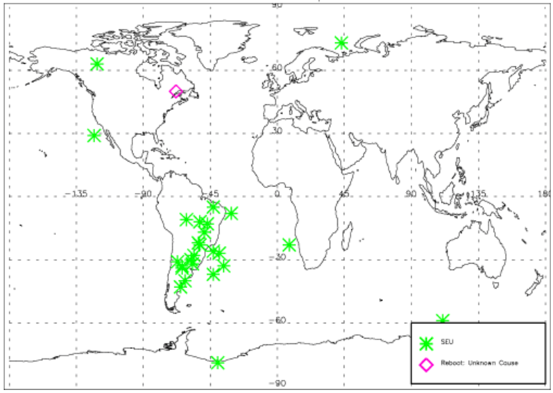              
  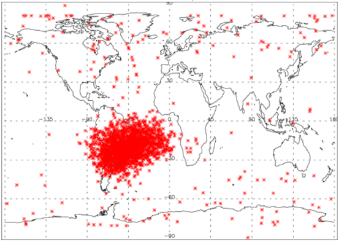
                                                                                                    
  Figure 2.4 Argos testbed rad-hard board SEU \[43   Figure 2.5 Argos testbed COTS board SEU \[43\]

State of the art 
----------------

Almost the first thing that was researched, in order to draw
inspiration, was other CubeSats. The most heavily influences were: the
first swiss CubeSat \[45\] and ZA-Aerosat of the ESL Stellenbosch
university \[36\]. Due to the time restrictions of project, the time
allotted in the research was minimal.

### NASA state of the art

In "small spacecraft technology state of the art” \[19\]. from power,
communication to integration, launch and deployment, NASA lists all of
the state of the art technologies needed in a CubeSat. As software isn't
mature enough and lacks behind hardware as stated, it doesn't provide
much info in software frameworks etc.

### ZA-Aerosat

In Heunis \[36\], It describes the design and implementation of a QB-50
CubeSat named ZA-Aerosat. Since it is a master thesis, it provides a lot
of information about the design that is found in papers.

In the early phase of the project it provided valuable information about
SEE's, fault tolerance and modular programming. Moreover, it gave high
level overview of the software about the ECSS and services, memory
management and fault tolerance implementation.

### SwissCube

This is a great paper \[45\], even though it doesn't use up to date
technology, it gives valuable lessons, not only in the design but also
in factors that are usually underestimated like the management of people
and communication.

One interesting design feature is that the Swiss cube has a very simple
CW RF beacon that is almost independent from the rest of the design.
That is an excellent fault tolerant design

The Swiss cube team scheduled end of phase reviews, with reviewers from
the space industry. That allowed them to have good advices that made
them reconsider some parts of the design.

Swiss cube software is analyzed in Flight software architecture \[24\].

SwissCube uses a distributed architecture, this gives the advantage of
isolated design, implementation, testing and allows each team to work
independently.

For command and control SwissCube uses the ECSS-E-70-41 \[54\]. It uses
the telecommand verification, housekeeping, function management and a
custom service used for payload management.

Finally, the suggestion that has the most impact was that we should aim
for design simplicity. In my personal I couldn't agree more with that
advice.

A summary of interesting point is listed below:

-   The EPS is designed to operate without a microcontroller, also it
    can lose one battery without failing.

-   During the environmental tests, they did radiation tests, which
    provided interesting information.

-   Swiss cube uses radiations Shields.

-   Implement and test the communication bus as it has critical
    implications in the whole design.

-   Plan big flight software tests.

-   Implement the ground station software early as possible for testing.

-   Add remote software updates.

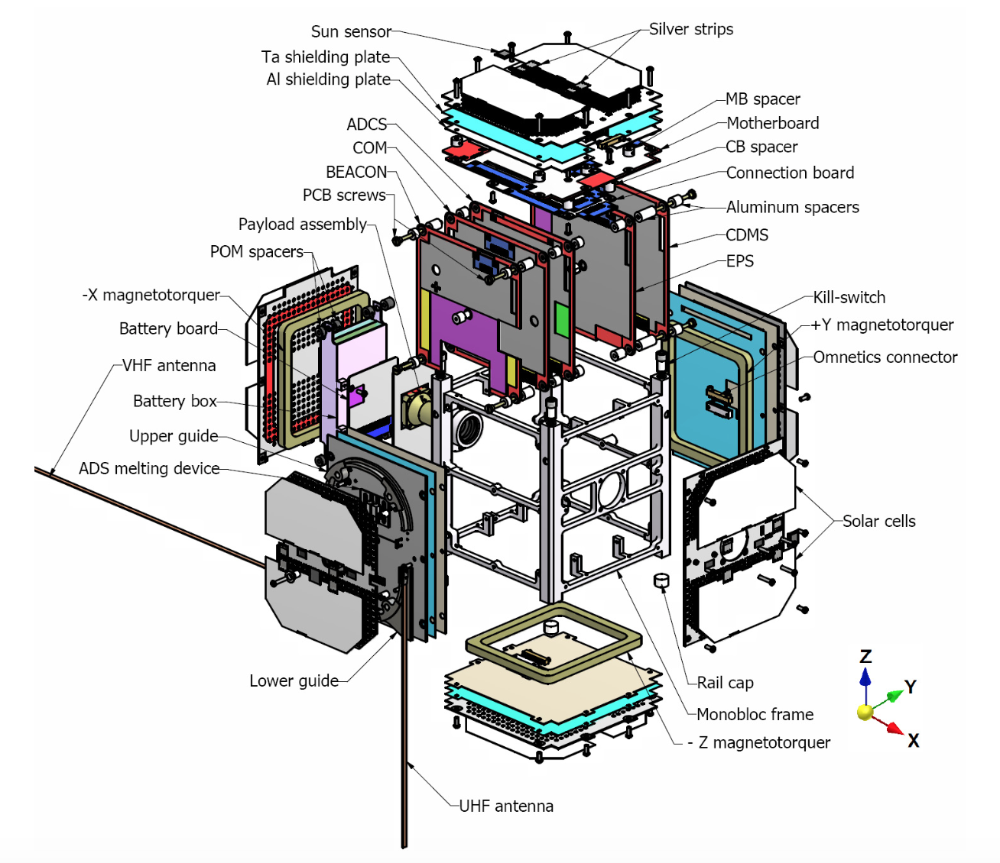

Figure 2.6 SwissCube
exploded view \[45\]

### Phonesat

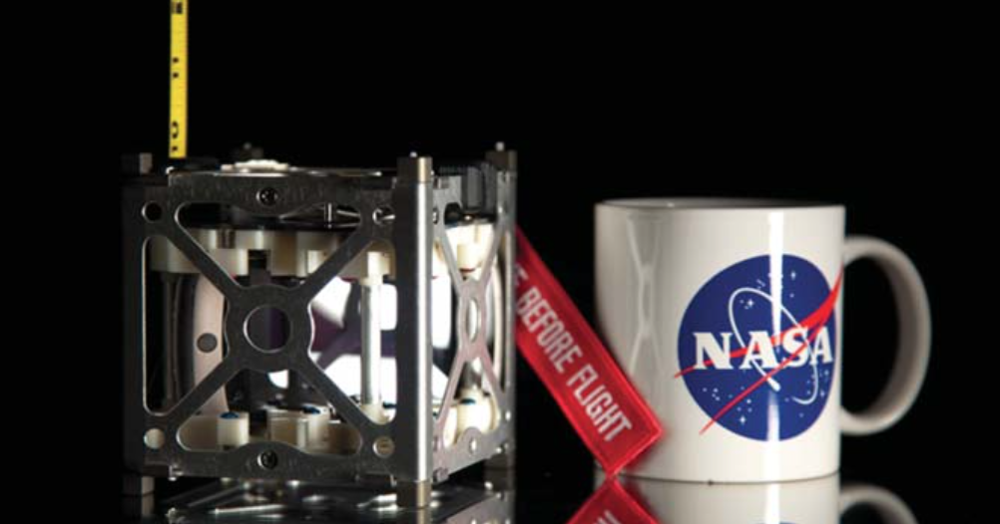

Image 2.1 PhoneSat v1.0

PhoneSat \[22\] is a CubeSat and as the name suggests, is based on an
android phone.

Even though we can't borrow software and hardware ideas due to
completely different design and mission goals, it's main mission
objective apply directly to UPSat.

The PhoneSat project long term goal as stated in \[22\] is to
"democratize space by making accessible to more people", also it states
that "The PhoneSat approach to lowering the cost of access to space
consist of using off–the-shelf consumer technology, building and testing
a spacecraft in a rapid way and validating the design mainly through
testing".

Derived from the successful mission results, it proves that a CubeSat
doesn't need complicated fault tolerant techniques or special hardware,
in order to work.

The PhoneSat project consists of 2 versions, both of the versions have a
Nexus smart phone, as the main computer.

PhoneSat v1.0 is a very simple design, with the mission goal to prove
that such a design is feasible. It has a nexus smart phone, Lion
batteries that weren't rechargeable from solar panels, an external
beacon radio and an Arduino that is used as a watchdog timer, resetting
the smart phone in a case something went wrong. Also, the smart phones
camera was used to take photos of the earth.

PhoneSat v2.0 is building up on the first design by adding solar panels
and rechargeable batteries, an ADCS and 2-way communication module
(earth to PhoneSat) along with the first version beacon. It also uses
more Arduinos to handle the extra tasks. This design is more similar to
mainstream CubeSat.

The main software runs on android and in Java programming language. For
that reason, it has little value to the UPSat design.

2 PhoneSats v1.0 and 1 v2.0 were launched in 2013, all PhoneSats were
operational and operated as expected.

  ----------------------------------------------------------------------------------------------------------------------------------------------------------------------------------------------
  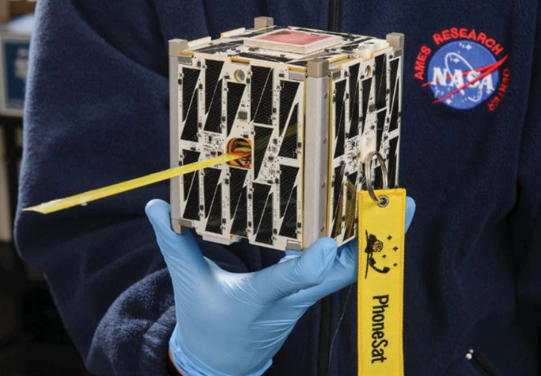   
  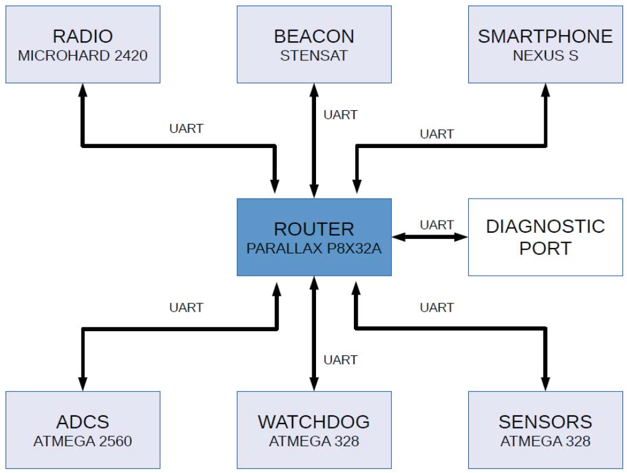
                                                                                         
  Image 2.2 PhoneSat v2.5                 Figure 2.7 PhoneSat 2.0 data distribution architecture
 
### CKUTEX

The software development for CKUTEX \[55\] didn't provide value for our
design probably because the design is different from UPSat. It uses CAN
bus for communication.

### i-INSPIRE II

  ----------------------------------------------------------------------------------------------------------------------------------------------------------------------------------------------
  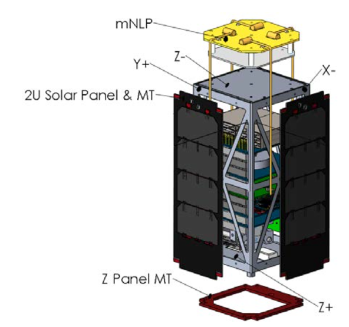      
  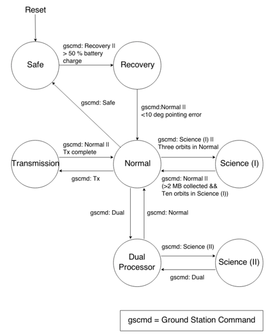
                                                                                          
  Figure 2.8 i-INSPIRE II CubeSat \[47\]   Figure 2.9 i-INSPIRE II software state machine \[47\]
  
The CubeSat design overview report of the i-INSPIRE II CubeSat \[47\]
which is part of the QB50 program, was found online. The report doesn't
offer too much information for the software implementation but offer
some information about the hardware used.

INSPIRE uses a msp430 for primary OBC and a spartan 6 FPGA for secondary
processor and experimentation. It has I^2^C buses for sensor and command
and control. An interesting fact is that the main processor board is a
CTOS provided from Olimex and is not designed in house. The OBC and the
ground station communicate with an ASCII protocol.

Command and control module 
--------------------------

The CnC (command and control) module, defines the protocol for earth to
satellite (and vice versa) communication and inter subsystem
communication. It consists of the packet format, header and data
definition. Operations are grouped into services, defined by the
protocol.

There were two choices concerning the CnC protocol: design a custom
protocol or adopt an existing.

There were 2 protocols found ECSS and CSP, I couldn't find any other.
Even if there are other protocols used in CubeSats, for example in
PhoneSat \[22\] but the specification is either not published as a
specification or there are highly specific for that mission.

A custom protocol could have been developed but due to time
restrictions, also due to the availability and quality of CSP and ECSS,
it was decided not to reinvent the wheel.

### Requirements

The following requirements were set in order to evaluate CSP and ECSS:

-   Low protocol overhead.

-   Lightweight.

-   Highly modular and customized.

Since all interactions to subsystems and earth uses the protocol, if the
protocol overhead isn't efficient, it leads to power waste and added
data traffic.

The CnC module will be used with microcontrollers that have limited
processing power and resources, so it need to be lightweight.

The protocol should be designed in way that allows some degree of
customization, so the implementation will be tailored on the resources
available and be efficient.

### CSP

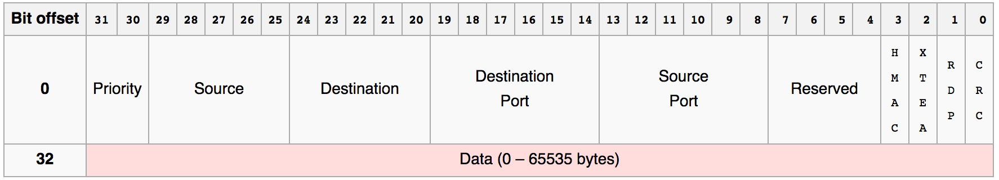

Figure 2.10 CSP header

CSP was developed by students in Aalborg University and is currently
maintained by the students and the spin-off company GomSpace \[35\].

CSP at first stood for CAN Space Protocol since it used CAN bus but
later as implementations for other buses were developed, it changed to
CubeSat Space Protocol.

It is something like a lightweight IP. The header size is 32 bits which
is small without sacrificing functionality. The data in the header is
not framed in 8 bit which could lead in performance issues in 8 bit
microcontrollers. CSP has a nice feature that ECSS lacks, configuration
bits that allow to change the frame configuration at run time.

CSP has open source code available with the code ported to FreeRTOS.

In the Wikipedia entry, it says that specific ports are bound to
services such as ping but the description of the services couldn't be
found.

CSP uses RPD or UDP depending on the user needs, guarantying reliability
or not.

### ECSS

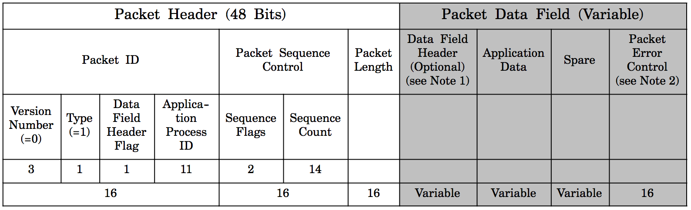

Figure 2.11 ECSS TC frame
header

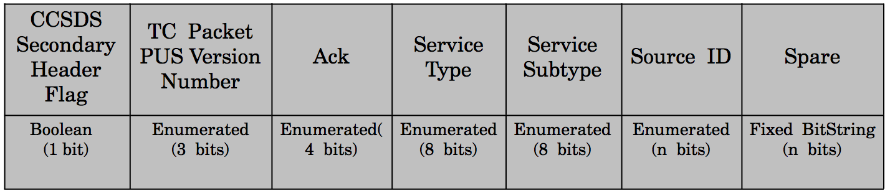

Figure 2.12 ECSS TC data
header

The ECSS-E-70-41A specification is a work of European Cooperation for
Space Standardization and is based in previous experiences. For
simplicity ECSS-E-70-41A would be refereed as ECSS in this document.

ECSS is a well-defined protocol and the specification is clear and well
written. ECSS describes the frame header and a set of services. The
header has a lot of optional parameters that makes it easily adapted to
the application needs. The services listed are all optional and it's up
to the user to implement them. Moreover, each service has a list of
standard and additional features depending again to the application
needs.

The header has 2 parts: a) the packet header, which is standard, and is
6 bytes. b) the data field header, which is variable due to different
options available. The options are: packet error control (Checksum
\[27\]), timestamp, destination id and spare bits (so the that the frame
is in octet intervals).

Depending on the application and the number of distinct application ids,
the user can select to have only 1 set of application ids, defining both
the source and destination in one byte, If the number of application ids
is large than a separate source/destination has to be used.

The header implemented was 12 bytes versus the 4 bytes of CSP. The
switch between TC/TM and source/destination can be confusing. One
feature that the protocol lacks is that it doesn't have a mechanism for
different configurations on runtime like the configuration bits of CSP,
having configuration bits denoting different configurations, such as the
existence of a timestamp or a checksum in the packet, would have made
the protocol a lot more versatile.

ECSS is packet oriented e.g. mass storage service use of store packets,
even though it's not a huge disadvantage, it can a bit tedious and could
lead to inefficiency on the implementation.

In my personal opinion, it was a delight working with such clear and
well-defined document. While reading the specification, I could sense
the accumulated experienced from previous designs. Also, the
specification was more like targeted in microprocessors with more
resources than a microcontroller, for example, an indication is the
large data service: the implementation in order to be efficient and
uncoupled from other modules needs the whole large data packet stored in
RAM. In order to work efficient, the large data packet need to be
several times larger than a usual packet, this could be an issue with
resources available in microcontrollers but usually not an issue in
microprocessors that have large amount of memory.

### Comparison

In this subsection, a comparison between CSP and ECSS is performed:

ECSS is more versatile, in the other hand the CSP advantage is its
simplicity.

The data overhead is larger in ECSS but the implementation of the same
functionality in CSP could lead to similar sizes or even larger.

One important issue is that, the time the research took place, the
formal specifications couldn't be found online.

-   CSP and ECSS have a similar source, destination port and
    application id.

-   Both of them are in binary format.

-   \~12 bytes (ECSS) versus 4 bytes (CSP).

-   ECSS doesn't have a reliability mechanism for delivering packets.

-   32 bits (CSP) versus 8 bits (ECSS) oriented.

-   Dynamic configuration on runtime (CSP) versus variable options but
    static on runtime (ECSS).

-   Open source code available (CSP).

    1.  ### Result

For the following reasons, it was decided to use the ECSS protocol. It
was an easy decision, primarily for the CSP lack of formal specification
and the modular design of the ECSS.

-   ECSS was recommend by QB50.

-   ECSS is used by many other cubesats.

-   The formal CSP specifications was not found.

-   ECSS is based on experience on previous protocol designs, as a
    result the protocol is highly refined.

-   ECSS is highly flexible on the actual implementation and it allowed
    to customize it according to our needs.

    1.  Safety critical software 
        ------------------------

C is the language of choice for UPSat. ADA was never really embraced
from the community, Rust is too young and both of them lack the
ecosystem to quickly use them with the STM32 microcontroller. C though
was primary designed for system programming and not for safe critical
code, leading to a lot of different issues when used in that field.
Developers confusion about the C language use, along with the growing
complexity of the design \[34\] \[38\] the state of uncertainty \[21\].
In addition, as compilers is software itself, any bugs they have may
introduce bugs to the application. In order to achieve a good level of
safety, different techniques have been developed, such as the use of
coding standards, software that checks the use of the coding standard
and static analyzers that check the code for bugs \[38\] \[21\].

### Undefined behavior

C by design has a lot of undefined behaviors. This happens because c is
primary designed for systems programming and it uses undefined behaviors
as a way for compilers to be optimized for specific hardware. A great
example is in \[63\] with the case of division by zero and how different
architectures handles them.

Unexpected behavior in C could lead to bugs especially as most engineers
aren't aware of them (I was one of them) \[64\]. One interesting website
\[2\] that questions your knowledge of C and uncovers misinformation.

From it can be seen that different compilers produce different code.
This was Also it complicates testing. Even different versions of the
same compiler may introduce bugs \[64\].

As it can been seen from a lot of failures are introduced from compiler
optimizations \[63\] \[64\]. For that reason, all of the development
went with optimizations disabled.

### Coding standards

With the use of coding standard in the project, we try to improve code
clarity \[37\] and prevent bugs, which are introduced by not fully
understand or misuse C.

The most widely known coding standard is the misra-c \[18\] which is
developed from MISRA. The standard was introduced in order to improve
code safety and security. The next is the standard \[23\] developed by
Michael Barr a known expert in code safety. Another 2 was found,
designed from ESA \[31\] and NASA \[46\].

The main problem with the above coding standards was that they have many
rules which that makes it difficult for a human to remember and use.
Usually software that check for the rules and enforce them is used
\[38\]. For the above reasons Gerard J. Holzmann at JPL introduced the
power of 10 rules \[39\]. By having only 10 simple rules Holzmann
managed to improve the usage of a coding standard by a developer. The
rules are simple, specific, easy to understand and easily remembered. At
first the rules seem to be draconian but as soon as someone gets a
better understanding, can see the benefits in code clarity and safety
\[39\]. After the introduction of the 10 rules the JPL coding standard
\[17\] was created. The coding standard uses the 10 rules and most of
the times add more specific rules \[44\]. In addition to the JPL's 10
rules, the 17 steps \[40\] were consider as well.

Fault tolerance 
---------------

Fault tolerance is "Fault tolerance is the property that enables a
system to continue operating properly in the event of the failure of (or
one or more faults within) some of its components" \[59\], in our case
the ability of the UPSat to tolerate errors or failures, generated by
either bugs in the design, implementation or radiation inducted, without
leading to catastrophic events. Fault tolerance design is mostly based
in adding redundancy in software, hardware or both.

Careful fault tolerant design allows to use COTS components that gives
great advantages in reducing cost and achieving better performance
\[29\].

There are 2 separate planes in which fault tolerant techniques can be
applied, hardware and software, with a clear trend to migrate to ta
later \[56\], for cost reducing reasons of course. Having a historical
look, we can see that trend in NASA's missions \[29\].

Unfortunately, the time available and the already designed hardware
didn't allowed to add fault tolerance in the hardware in the form of
redundant hardware and voting mechanisms. Most of the fault tolerant
designs had to be Incorporated in the software.

### Fault tolerant mechanisms

There are up to 8 different types of error recovery mechanisms, below
the 4 most important are listed \[26\] \[29\].

-   Fault masking.

-   Fault detection.

-   Recovery.

-   Reconfiguration.

Fault containment is the most important mechanism, since it contains the
error before leading to permanent damage.

Fault detection is the ability of the systems to understand that error
has occurred. Even if fault masking manages to contain the issue, fault
detection is crucial in order to evaluate the systems behavior.
Diagnosis happens if with fault detection, the nature of the failure is
not clear enough.

Recovery makes the system recover from and error and behave as normal.

Reconfiguration as the name states is the process of reconfiguring in
the event of permanent damage.

Fault containment and recovery are the most important mechanism in
systems, since it allows the system to continue working in the event of
error. Fault detection and diagnosis allows the ground crew to identify
the issue and maybe give correctional procedures and afterwards the
study of the failure information will lead in to better future missions.
Reconfiguration is limited used in UPSat, mostly because the hardware
design doesn't allow it.

### Built in tests

Build in tests are usually automatic tests B.I.T. that run and help to
determine if the state of the system is correct, they can run on startup
- power on BIT or when the system is idle - continuous BIT \[26\]. FPGAs
have the advantage that they can run BIT on circuit level BIT referred
as BIST. For an example, a BIST can feed components with patterns that
are pre-calculated and check if the output is the same as the one
expected.

### Single point of failure

The single point of failure is a very important concept in fault
tolerance: it denotes a part in the system that if that part fails, the
whole system fails. As one can imagine it is highly undesirable in
safety-critical systems and great measures has to be taken in order to
avoid such parts in the design.

For example, in SwissCube \[45\] a single point of failure is a RF
switch that alternates the RF modules responsible for communication and
the RF beacon.

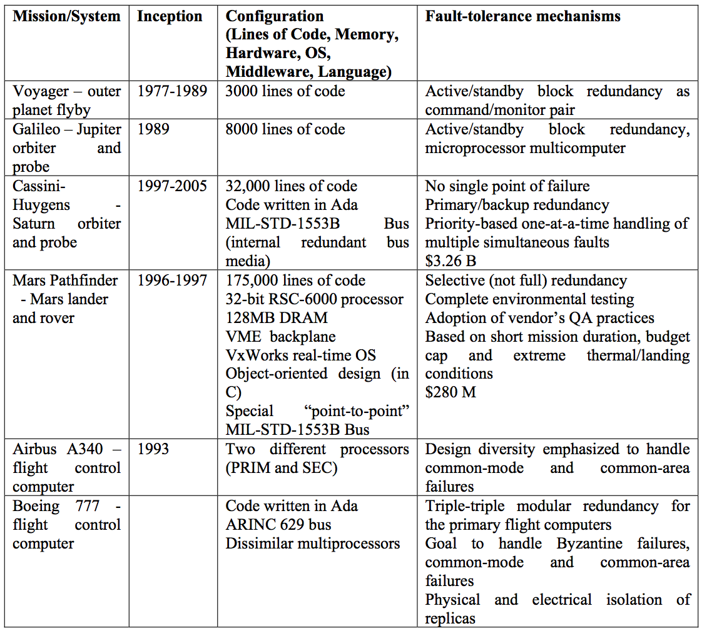

Figure 2.13 Fault
tolerance mechanisms \[29\]

### State of the art fault tolerance

Most of the state of the art systems for fault tolerance, incorporate
FPGAs in their designs. FPGA have the advantage that they can
reconfigure so a damaged area in the IC due to SEEs can be avoided.

JPL used radiation-tolerant FPGAs in the Mars exploration mission
\[51\].

ZA-Aerosat \[36\] uses a hybrid FPGA - microcontroller approach, where
the FPGA acts in an intermediate layer between the microcontroller and
the memory. The FPGA houses custom logic that with the memory, emulates
an EDAC memory.

CNES MYRIADE uses a FPGA for safe against SEEs issues storage \[50\].

ISAS-JAXA REIMEI uses a FPGA as voting mechanism \[50\].

### Fault tolerance in hardware

Hardware fault tolerance is induced by adding redundant hardware and
usually having hardware acting as a voter deciding which of the
redundant hardware is correct. The configuration of the redundant
hardware and voter design is correlated to the application and the
budget.

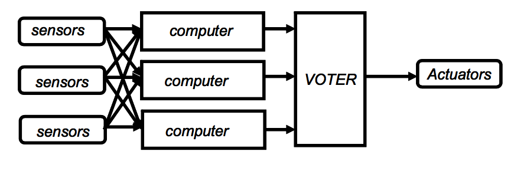

Figure 2.14 Hardware
fault tolerance \[26\]

A voter which is a hardware specifically added for fault tolerance. It
doesn't mean that is immune to errors and extra caution should be taken
in the design. A voter adds to the complexity of the design and it can
even lead to the liability of the design. An example is the airplane of
the Malaysia Airlines Flight 124 where the ADIRU due to a software
error, used a faulted sensor for flight data, leading to a serious
incident \[58\].

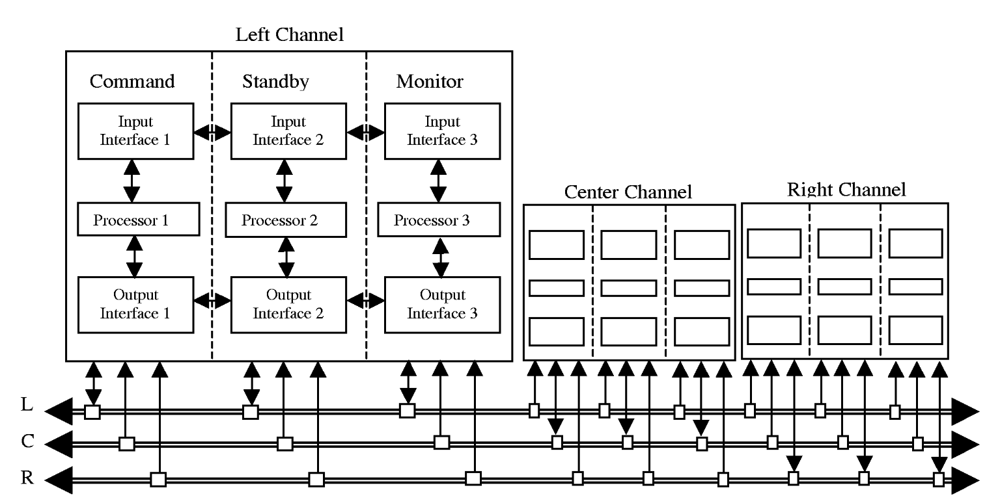

Figure 2.15 B777 flight
computer \[57\]

Two interesting designs are Boeing's 777 flight computer and the AIRBUS
A320-40 flight computer \[57\]. The B777 has a "triple-triple
configuration of three identical channels, each composed of three
redundant computation lanes. Each channel transmits on a preassigned
data bus and receives on all the busses" \[57\]. AIRBUS's flight
computer has the same specification as the B777 but follows a different
approach, a shadow-master technique, where the boards and software is
designed by different manufactures.

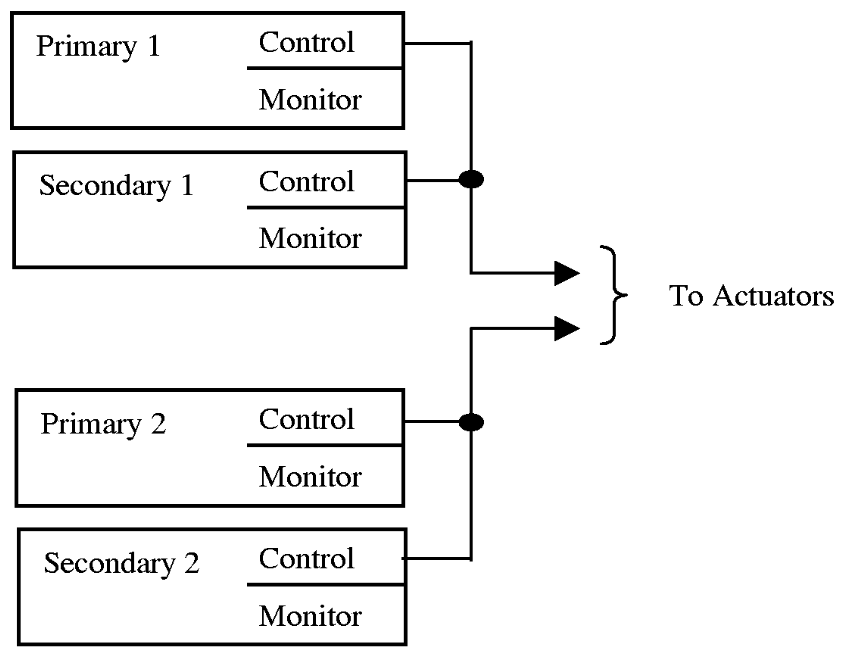

Figure 2.16 AIRBUS
A320-40 flight computer \[57\]

### Fault tolerance in software

The first basic technique is called partitioning. By writing modular
software with clear boundaries, partitions: areas that contained are
created.

Adding recovery on partitioning with the use of Checkpoints \[48\]
\[57\] add recovery to the partitioning technique, by adding points in
modular software, where the state can be saved and revert back in the
case of an error and resume from that point.

By integrating the fault tolerant techniques in a framework, the
software development and the fault tolerance can be uncoupled, thus
reducing the complexity of the software. That allows the developer to
focus on the implementation of the software and not in fault tolerance
\[57\].

Dynamic assertions is an interesting technique used for runtime
evaluation of objects \[48\]. Even though the concept described is for
object oriented languages doesn't mean that we can't use some aspects of
the concept.

A very common approach to software fault tolerance is the technique of
multi-version software. Two software teams develop the same application
with different approach, sometimes with different tools or restrictions
and both of the software runs on different processors in voting scheme
\[57\]. This approach shows no great advantages and it is not cost
effective. A better approach uses the same software and the difference
is that is compiled from different compilers \[57\]

Finally testing the software with Software Fault Injection can lead to
bugs discovery, when with traditional testing techniques would be very
difficult to find \[57\].

DESIGN
======

In this chapter, the various design choices and the reasons behind are
discussed.

Coding standards on UPSat 
-------------------------

 

There wasn't enough time to setup the tools needed to enforce and use
properly a specific coding standard, for that reason the JPL's 10 rules
\[39\] and the 17 steps to safer C code \[40\] were primary used as
guidelines.

### 10 rules

Rules 1, 2, 3, 5, 8, 9 were followed religiously and in no accounts,
there were allowed not to be followed.

Rule 4: 60 lines of code per function wasn't strictly followed as some
flexibility was needed but in any case, it wasn't allowed to

Rule 5: The suggestion was to cover as more cases of assertion as
possible, especially to the beginning of a function but without having a
minimum.

Rule 6: The rule was followed in general except when code clarity was an
issue the rule was allowed to be broken.

Rule 10: Couldn't be used since the code generated from cubeMX broke the
rule.

Finally, the rules weren’t enforced automatically as there wasn't time
to setup a tool to check them and it was left to the developer's good
will to use them.

### 17 steps

The 17 steps to safer C code provide some very good guidelines, with
some complimentary to the 10 rules even if most of them they seem like
common sense to an experienced programmer.

The most important step was step 2. Using enumerations not only as error
types but as state variables and always defining the last enumerations
allowed to make easy range checks with assertions.

Step 15 might seem obvious to most programmers but in my opinion, is the
essence of safety-critical code, simplicity improves clarity and clear
code is easier understood and

Steps 1, 3, 5 suggests something that is a basic concept for programming
but sometimes when working too much hours can be forgotten

Steps 4, 6, 11, 12, 14 are critical for a correct software design and
lies within the idea of modular and fault tolerant software.

Step 8 wasn't applicable to our project since the requirements were
already defined. Also steps 9, 10 due to the nature of the project.

Step 13 is about the volatile keyword in C that it is rarely used in
non-embedded projects. The concept of volatile can be quite critical in
embedded and the incorrect or no usage can lead to very subtle and
difficult bugs.

As seen in chapter 1, static code analyzing described in step 16 is an
absolutely must.

Using the right tools can save a lot of trouble and time (step 7).

Fault tolerance on UPSat 
------------------------

The main techniques used for fault tolerance in software was:

-   Error detection.

-   Error containment.

Due to mission timing constraints, implementing fault tolerance on
hardware and other techniques was impossible.

Software was designed as modular and uncoupled as possible, in order to
ac hive error containment. Further techniques that was used were:

-   Assertions.

-   Watchdog.

-   Heartbeat.

-   Multiple variables.

    1.  ### Assertions

The first line of defense was the use of assertions. Assertions check in
real time for null pointers, correct range of parameters and correct
parameters. If the assertion catches an error, most of the times it
cancels the operation and returns to normal state. In order for
assertions to be effective, they need to be used regularly.

### Watchdog

The next technique is the watchdog timer. Watchdog timers are a very
common peripheral in microcontrollers and a widely used technique
against software bugs. The watchdog resets the microcontroller if the
timer it shelf is not reset in a specific time interval. This way if a
task has entered a blocked state due to an error, the microcontroller
resets and returns to its starting state.

There are two techniques that the watchdog is used: The OBC and the EPS,
clear the timer only if certain tasks have happened. In particular for
the OBC it is required that all tasks had run at least once. Every time
a task runs, it clears a flag, if all flags have been cleared then the
timer gets cleared. In addition to that, ADCS and COMMS check for errors
in sensor reading and RF communications, accordingly. The same technique
could have been used in the OBC but time constraints didn't allow for
proper design and test.

Table 3.1 10 rules for
developing safety critical code \[39\]

  Rule Num   Description
  ---------- -----------------------------------------------------------------------------------------------------------------------------------------------------------------------------------------------------------------------------------------------------------------------------------------------------------------------------------------------------------------------------------------------------------------------------------------------------------------------------------------------------------------------------------------------------------------------------------------------------------------------------------------------------------------------------------------------------------
  1          Restrict all code to very simple control flow constructs - do not use goto statements, setjmp or longjmp constructs, and direct or indirect recursion.
  2          All loops must have a fixed upper-bound. It must be trivially possible for a checking tool to prove statically that a preset upper-bound on the number of iterations of a loop cannot be exceeded. If the loop-bound cannot be proven statically, the rule is considered violated.
  3          Do not use dynamic memory allocation after initialization.
  4          No function should be longer than what can be printed on a single sheet of paper in a standard reference format with one line per statement and one line per declaration. Typically, this means no more than about 60 lines of code per function.
  5          The assertion density of the code should average to a minimum of two assertions per function. Assertions are used to check for anomalous conditions that should never happen in real-life executions. Assertions must always be side-effect free and should be defined as Boolean tests. When an assertion fails, an explicit recovery action must be taken, e.g., by returning an error condition to the caller of the function that executes the failing assertion. Any assertion for which a static checking tool can prove that it can never fail or never hold violates this rule.
  6          Data objects must be declared at the smallest possible level of scope.
  7          The return value of non-void functions must be checked by each calling function, and the validity of parameters must be checked inside each function.
  8          The use of the preprocessor must be limited to the inclusion of header files and simple macro definitions. Token pasting, variable argument lists (ellipses), and recursive macro calls are not allowed. All macros must expand into complete syntactic units. The use of conditional compilation directives is often also dubious, but cannot always be avoided. This means that there should rarely be justification for more than one or two conditional compilation directives even in large software development efforts, beyond the standard boilerplate that avoids multiple inclusion of the same header file. Each such use should be flagged by a tool-based checker and justified in the code.
  9          The use of pointers should be restricted. Specifically, no more than one level of dereferencing is allowed. Pointer dereference operations may not be hidden in macro definitions or inside typedef declarations. Function pointers are not permitted.
  10         All code must be compiled, from the first day of development, with all compiler warnings enabled at the compiler’s most pedantic setting. All code must compile with these setting without any warnings. All code must be checked daily with at least one, but preferably more than one, state-of-the-art static source code analyzer and should pass the analyses with zero warnings.

Table 3.2 17 steps to
safer C code \[40\]

  Step   Description
  ------ -------------------------------------------------
  1      Follow the rules you've read a hundred times
  2      Use enumerations as error types
  3      Expect to fail
  4      Check input values: never trust a stranger
  5      Write once, read many times
  6      When in doubt, leave it out
  7      Use the right tools
  8      Define the software requirements first
  9      During boot phase, dump all available versions
  10     Use a software version string for every release
  11     Design for reuse: use standards
  12     Expose only what is needed
  13     Make sure you've used “volatile" correctly
  14     Don't start with optimization as the goal
  15     Don't write complex code
  16     Use a static code checker
  17     Myths and sagas

### Heartbeat

The last check is the subsystem health check performed by the EPS or
heartbeat as we call it. EPS was chosen for this role because it handles
the subsystem power.

Each subsystem sends a heartbeat packet (ECSS test service) to the EPS
every 2 minutes. When the packet is received from the EPS, it updates a
timestamp variable. If that timestamp minus the current time is longer
than 20 minutes then the subsystem is reset. It doesn't have to be a
heartbeat packet by any packet will update the timestamp. The heartbeat
is used because in normal circumstances, the ADCS and COMMS don't
communicate with the EPS.

Since the OBC does the packet routing, if the OBC fails, the heartbeat
packets from ADCS and COMMS destined to EPS won't be delivered. For that
reason, the EPS checks if the OBC has an updated timestamp and then
checks for the other subsystems. OBC and EPS have communication every 30
seconds for housekeeping needs, so it should be clear if the OBC works.
Otherwise the OBC is reset and all subsystems timestamps are updated
(ADCS, COMMS, OBC). This happens so the other subsystems are not reset
in case of an error of the OBC.

The heartbeat is intended as the last in line of error checking
techniques, the choice of 2 minutes for refresh and 20 minutes for reset
reflect this. Having a 2 minutes refresh interval in a 20 minutes window
has very good possibilities to be received from the EPS, without
generating too much traffic. The 20-minute window is used, in case there
an error in the heartbeat mechanism or the OBC routing and the subsystem
operate correct, the 20 minutes give enough time to subsystems to
perform adequate.

### Multiple checks

The EPS and COMMS store in multiple locations the critical data. The
data hold critical states of the CubeSat. The state values are generated
with random number generator. More over the states have multiple values.
These are used for protection against SEEs.

OBC 
---

In the following sections the design choices about the OBC will be
analyzed.

### OBC-ADCS schism

The hardware design that was initially designed delivered, had the OBC
and ADCS on the same PCB and microcontroller. There were concerns if the
same microcontroller could handle both of the software, in terms of
processing power and the added complexity of the software design. For
that reason, it was decided to split the OBC and ADCS to different into
2 separate subsystems. The disadvantages of that design were: increased
power consumption and crucial man hours spend into partial redesigning
the PCBs.

Without having a good understanding of the processing requirements and
the processing power of the microcontroller, having a bottleneck at a
later phase of the project, which changes would had been more difficult
to make or even impossible. Having both subsystems into one hardware
seemed a far greater risk than spending the resources to split and
redesign the hardware.

In practice, the OBC uses almost no processing power and the ADCS use
only the processor periodically, meaning that that the processing needs
of the subsystems could fit into one microcontroller. The decision to
separate the subsystems, as it seems wrong at first, it allowed to
uncouple the software development and testing, saving precious time
during the integration and testing phase of the project.

### OBC real time constraints

In UPSat there are certain operations that are critical and they should
happen in strict timeframes. For that reason, the real-time requirements
in such critical tasks were defined.

Real time constraints are grouped into 3 general categories \[62\]:

-   Hard – "missing a deadline is a total system failure".

-   Firm – "infrequent deadline misses are tolerable, but may degrade
    the system's quality of service. The usefulness of a result is zero
    after its deadline".

-   Soft – "the usefulness of a result degrades after its deadline,
    thereby degrading the system's quality of service".

The real time constrains in OBC and command and control derived from
analyzing specifications, the overall design and finally from past
experience with embedded devices.

The first priority and hard real-time constraint, is to process an
incoming packet before the next one comes so there aren’t lost packets.
This especially critical for the OBC since it does all the packet
routing.

At 9600 baud rate, with minimum 12 bytes per packet, plus minimum 2
bytes for HLDLC framing. In the worst-case scenario, a packet needs to
be processed in 14.5msec. The OBC is connected to 3 subsystems so it can
take 3 packets simultaneously, leading to 14.5/3 = 4.8msec.

The next hard real-time constraint is to send Housekeeping packets every
30 seconds with 500 msec accuracy. This is a huge time frame for an
embedded system, so normally it wouldn't be a problem.

The SU script engine had to be able to run within 1 second of the
scripts run time.

The schedule service had to release TC within 1 second of the commands
release time.

Finally, all OBC's tasks must run at least once within 30 seconds time
frame.

-   Packets processing, hard real-time constraint.

-   Housekeeping, hard real-time constraint.

-   SU engine, hard real-time constraint.

-   Scheduling service, hard real-time constraint.

-   OBC tasks, hard real-time constraint.

    1.  ### RTOS Vs baremetal and FreeRTOS

For the OBC there are 2 choices regarding the software, either run bare
metal on the microcontroller and design a custom scheduler from scratch
or use a RTOS.

A bare metal solution offers to make unique customized and optimized
code that the developer team understand (as they wrote it), but has the
disadvantages of limited review, it carries a greater risk in case of a
design flaw and finally another key part of the software has to be
designed and implemented.

The RTOS has code that is already tested and proven working on
applications but it won’t be bug free. Working with a RTOS would require
evaluation of different RTOSes in order to choose the most suitable and
afterwards careful examination of the RTOS in order to understand key
concepts for the working and for future debugging.

The choice of a RTOS instead of bare metal was obvious, due to the
nature of the tasks of the OBC: different tasks with different timings
and a mix of synchronous and asynchronous events in comparison of e.g.
the ADCS which has synchronous linear tasks that would be easier and
simpler to implement when used a RTOS.

-   RTOS suits better the OBC tasks.

-   RTOS is well tested and used.

-   Time needed to study the RTOS is far less than developing
    the scheduler.

-   Need extra time to familiarize with the RTOS concepts.

There are numerous candidates for a RTOS such as FreeRTOS, embOS \[12\],
vxworks \[9\], RIOT \[16\] and mC/OS \[7\] but none of them except
FreeRTOS, had met the requirements of the project. FreeRTOS is very
simple with only 3 files with basic functionality, has been already
ported by ST, it is open source and has already been used in many
projects plus it is supported from all major companies.

-   Simple.

-   Minimum time for integration.

-   Open source.

-   Mature.

    1.  ### FreeRTOS concepts

As the choice for the OBC's RTOS, FreeRTOS concepts and design needed to
be studied. Besides the primary reason which was to identify if FreeRTOS
was suited for the OBC, a better understanding would lead to following:

-   Optimized design and implementation.

-   Having a better understanding of the FreeRTOS limitations.

-   Detecting design intricacies that might lead to bugs.

-   Solving bugs.

The basic concepts were described in FreeRTOS documentation. Finally
\[41\] and a combination of source code examination, step by step
debugging, and systemview was used to get an in depth understanding of
FreeRTOS. Finding information besides the basic concepts was extremely
difficult.

### Introduction to FreeRTOS

FreeRTOS was by Richard Barry in 2003 and it has become an industry de
facto standard RTOS for microcontrollers. It is open source and the
licensing allows proprietary applications to not reveal the source code.

FreeRTOS has been ported in over than 35 microcontrollers and has
partners all the major microcontroller companies.

FreeRTOS has been already used in many CubeSat missions \[36\] \[41\]
and is available in most COTS vendors for use in their boards \[35\].

FreeRTOS is very simple, it basically is a priority scheduler for
threads, called tasks in FreeRTOS terminology, along with supporting
mechanisms such as mutex, semaphores queues etc.

### Tasks

Threads are called tasks in FreeRTOS terminology. Tasks are created by
using the taskCreate function. Also, tasks can be deleted but it's not
used in the project. A task has 4 different states:

-   Ready.

-   Running.

-   Suspended.

-   Blocked.

Tasks that are in the ready list are waiting to execute, in the running
state are the current task working and in the blocked state when a task
wait for a resource to become available or the delay time to be
completed.

Each task has a priority, that is defined at the task's creation. A task
that has the lowest priority called idle and must always exist in a
FreeRTOS project.

FreeRTOS has a support for semaphores and mutexes. In addition, there
are queues that are used for thread safe intertask communication.

The scheduler checks in every tick if a task of a higher priority is
ready to run and makes the context switch accordingly. If the task has
the same priority the tasks share running time round robin.

The scheduler runs in an ISR every tick of the RTOS timer. Usually in
ARM cortex M cores the timer used is the systick. The timer’s resolution
defines the quantum of (minimum) running time of a task. The timer’s
resolution and configuration affects the max delay possible from the
freeRTOS delay function.

If a FreeRTOS API function needs to be used from an ISR has different
set of functions specific for ISR use, usually the function has the ISR
added in the function name.

### Critical sections

If an action needs to finish without an interruption there are 2
mechanisms that can be used. The first option is to disable all
interrupts and thus disable the scheduler but has the major drawback
that it also disables interrupts that are created from peripherals. The
second option is to disable the scheduler and thus remove the chance of
a possible context switch.

  ---------------------------------------------------------------------------------------------------------------------------------------------------------------------------
  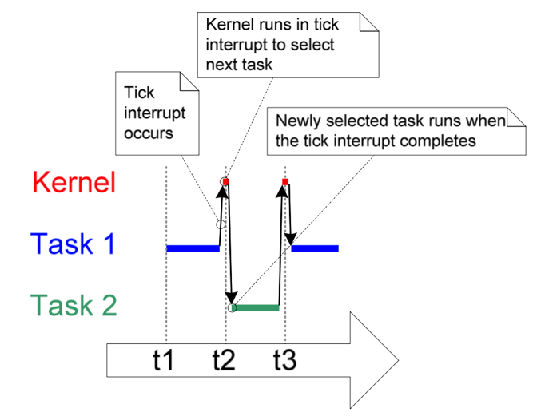   
  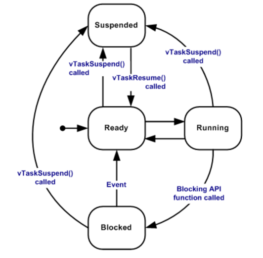
                                                                                        
  Figure 3.1 Tasks \[12\]                Figure 3.2 tasks life cycle \[12\]
   
  

### Stack overflow detection

FreeRTOS has 2 methods for detecting stack overflows. In the first
method, the bottom of stack has been filled with known values and in
every context, switch those values are checked if there are overwritten.
The second method checks in every context switch if the stack pointer
remains in valid values.

### Heap modes

FreeRTOS has 5 models for the heap memory management that allows
different levels of memory allocation with heap 1 that doesn't allow any
memory to be freed after they were allocated and to heap 5 that the
maximum freedom. Since memory allocation after the initialization is
prohibited in JPL's 10 rules the only suitable model for UPSat is heap
1.

### Advanced concepts

A task's information used from the FreeRTOS are stored in a Task Control
Block (TCB) structure. For every state of a task FreeRTOS has lists that
store each task that is in that state. Every time a task changes state
it is added to the corresponding list. The scheduler in every tick,
checks the ready list for a task waiting to run and compares the
priorities with the currently running.

In each context switch the scheduler stores the registers value and the
stack pointer which is also a register and loads the registers of the
task that is about to run. This code is specific to the architecture and
usually is implemented in assembly.

### Logging and file system

One of the basic functions of the OBC was to uplink and use SU scripts,
store various logs (WOD etc.) and download them into the ground station.
A SD card connected to the microcontrollers SDIO peripheral was used for
primary storage and an external flash for secondary.

Chan's FatFS \[32\] was the one-way choice for the file system because
it was already ported and working with support for SD cards from ST's
cubeMX, requiring minimum configuration.

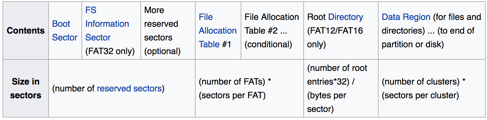

Figure 3.3 FAT file
system structure \[60\]

The other considerations were using the SD card without file system but
the major issue was that the SDIO peripheral code had to be developed.

FAT in general is not suitable for safety-critical systems, failure
during operation could lead to corrupted files and even corrupted file
system without the possibility of recovery \[33\].

Moreover, as the FAT file system is structured it leads to inefficiency
requiring traversing the file system in order to find where a file is in
the data region and in read/write operations checking the FAT table. All
of these locations are usually in not adjacent sectors leading in
performance degradation.

The file system is separate into different regions such as the boot
sector, file allocation table, the root directory and the data region.

Directories are special files that provide information for the records
such as the type (directory, file), name and starting cluster. There are
stored in the data region, except the root directory. The root directory
is found in a known location and provides the starting point for
traversing the file system.

An entry in the File Allocation Table is allocated for each cluster in
the data region. The number in the entry points to the next cluster that
the data continuous or the end of the file.

The data area is divided in parts called clusters with each cluster
being a multiple of a sector, the sectors are usually 512 bytes. A
sector is the minimum data transfer from or to the SD.

Chan's implementation of FAT file systems is orientated towards
microcontrollers and systems with low resources. It has a small API
consisting of the basic commands such open, write, read file. The only
issue is that the documentation is not very detailed with some errors
returned from the commands are too general to make use.

Since a sector is the minimum data transfer, for optimized reads and
writes, the data should align with a sector. better if the data fit into
a sector only, leading to more efficient reads and writes, because the
file system doesn't ensure the next cluster is after the current one.

In figure 3.4 the critical operations of FatFS is listed. If a failure
or interruptions occur between commands with yellow or red could result
in data loss or even file system corruption. Minimizing the time, a file
is opened the risk of failure is minimized as well. Figure 3.5 shows
optimized code with the use of sync.

  ---------------------------------------------------------------------------------------------------------------------------------------------------------------------------------------------------
  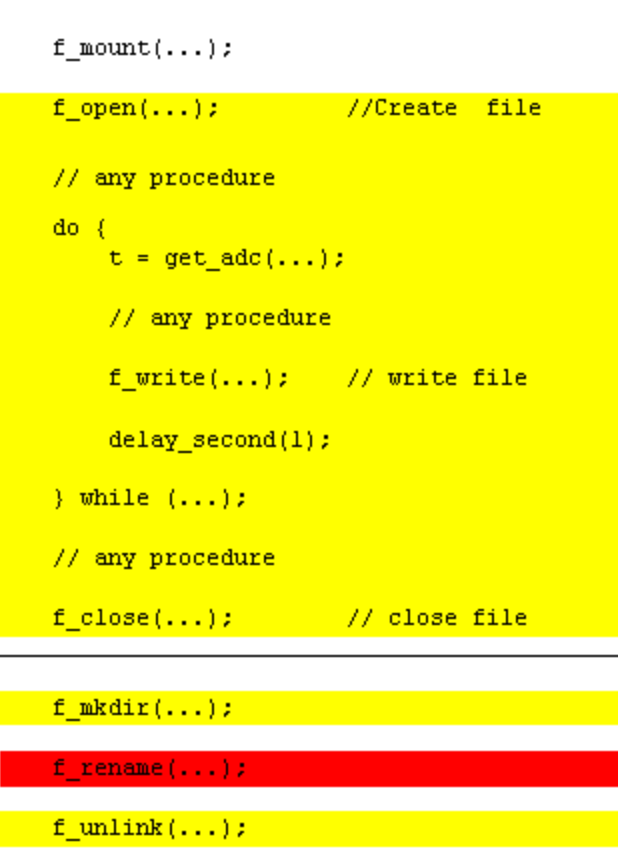          
  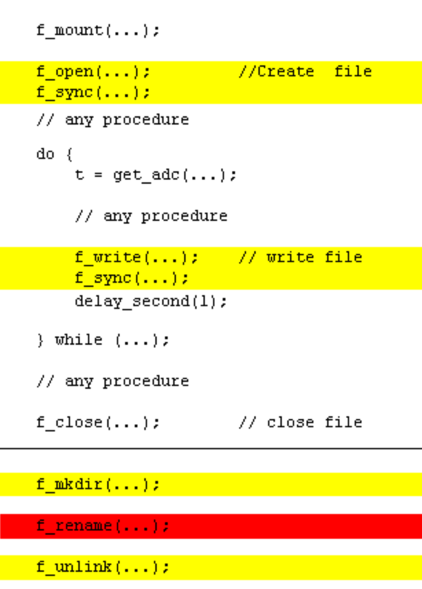
                                                                                               
  Figure 3.4 FatFS critical operations \[32\]   Figure 3.5 FatFS optimized critical operations \[32\]
   
  

ECSS services 
-------------

The ECSS standard is highly adaptive and provides many different
choices. In this section, the design choices for UPSat are analyzed.

### Services

The first choice that came up was: which services were going to be used
in UPSat. Even though all services provide necessary there wasn't enough
time to implement them all.

The telecommand verification service provide a way to receive a response
about the successful or not outcome of a telecommand's operation. This
service is required since for some operations it is critical to know the
outcome of the operation.

The housekeeping & diagnostic data reporting service provide a way to
transmit and receive information (housekeeping) that denote the status
of the CubeSat. The housekeeping operation is standard in CubeSats.

The function management service is used for operations that aren't part
for other services operations. In UPSat the service is used mainly for
controlling the power in subsystems and devices and setting
configuration parameters in different modules.

The time management service is providing a way to synchronize time
between subsystems and the ground station. This service was added later
when the need to synchronize time between ADCS and OBC and the ability
to change the time from the ground came up.

The on-board operations scheduling service provide a way for to trigger
events in specific times or continuously with specific intervals with
the release of telecommands. This service allows to perform events
without having connection with the ground station.

The large data transfer service provides a way to exchange packets that
are larger than the size that is allowed by cutting the original packet
in chunks that their size is allowed. In UPSat it is used for
transferring large files such as the SU scripts.

The on-board storage and retrieval service provide a way to store and
retrieve information in mass storage devices. In UPSat it is used to
store various logs, SU scripts and configuration parameters in the SD
card of the OBC.

The test service provides a simple way to verify that a subsystem is
working. It is very similar to the ping program used in IP networks.

The event reporting service provides a way for a subsystem to report
events. It was originally designed for subsystems that didn't have
storage devices to report events that were critical to the UPSat's
operation to the OBC so that it would store them for later review from a
human operator. Time restrictions didn't allow for correct
implementation and testing so it was removed.

Event-action service uses the event service to generate action when a
particular event takes place. Since the event service was removed there
wasn't a way to use the event-action service.

The device command distribution service is not applicable to the UPSat
design.

The parameter statistics reporting service provide a way to report
statistics about specific parameters when there isn't ground coverage.
In ideal conditions this service would have been used in conjunction
with housekeeping service in order to provide a better understanding of
the UPSat's status. For cases that statistics were needed the were added
in the housekeeping report and the specifics of the implementation were
left to the discretion of the software engineer.

The memory management service provides a way to read or write memory
regions in subsystems and mass storage devices. Even though it could be
helpful, there wasn't a urgent need to implement it.

The on-board monitoring service monitors parameters and checks if there
are changes that need to be reported in the ground. Again, for this
service there isn't a urgent need.

The packet forwarding control service provides a way to forward a packet
to different application id than it was intended. There was the thought
of using the service in order to forward specific packets to a software
module that captures these packets and stores them as events in mass
storage but time limitations didn't allow to implement it.

The on-board operations procedure service allows for the ground station
to store and manipulate functions in subsystems in UPSat. That service
provides a way to extend and or change software functionality in a
CubeSat without resorting in complex firmware updates. Unfortunately,
even if this service is important, once again there wasn't enough time
to implement it.

From the 16 services only 8 were decided to with the time management
service added later and the event reporting services removed during the
implementation phase.

Since On-board operations scheduling service was designed and
implemented from Apostolos Masiakos and Time management service from
Apostolos Masiakos and Agis Zisimatos, the services won't be analyzed
further.

The specification states that any custom services or services subtypes
should have an number larger than 128. In UPSat's design this rule
wasn't followed and the custom could have any number that it's not used
from the specification. This happens because there is a a large lookup
table for every subsystem which defines which services are used, the way
it was implemented having 128 service number and above would create a
huge lookup table that wouldn't fit in the microcontroller's memory.

Table 3.3 ECSS services

  Service Type   Service Name
  -------------- --------------------------------------------------
                 
  1              Telecommand verification service
  2              Device command distribution service
  3              Housekeeping & diagnostic data reporting service
  4              Parameter statistics reporting service
  5              Event reporting service
  6              Memory management service
  7              Not used
  8              Function management service
  9              Time management service
  10             Not used
  11             On-board operations scheduling service
  12             On-board monitoring service
  13             Large data transfer service
  14             Packet forwarding control service
  15             On-board storage and retrieval service
  16             Not used
  17             Test service
  18             On-board operations procedure service
  19             Event-action service

Table 3.4 ECSS services
implemented by UPSat

  Service Type   Service Name
  -------------- --------------------------------------------------
                 
  1              Telecommand verification service
  3              Housekeeping & diagnostic data reporting service
  8              Function management service
  9              Time management service
  11             On-board operations scheduling service
  13             Large data transfer service
  15             On-board storage and retrieval service
  17             Test service

### Application ids

Application ids are a core concept in ECSS, it is the address of a
module that the packet is heading towards, it is very similar to the IP
address concept. Using 11 bits for application ids a total of 2047
address can be achieved. Application ids are not confounded only in
hardware subsystems but software modules can be given an id.

In UPSat a total of 7 application ids were used: 5 for each subsystem
and 2 for the ground station. The 2 application ids used for the ground
station is because there are 2 different paths available and there was a
need to differentiate them. The first is the serial connection through
the umbilical connector and was used only during testing. The second was
through the RF communication and the COMMS subsystem. The software is
design of UPSat is simple enough so there wasn't a need for more
application ids.

Table 3.5 UPSat
application ids

  Sybsystem   app id
  ----------- --------
  OBC         1
  EPS         2
  ADCS        3
  COMMS       4
  IAC         5
  GND         6
  DBG         7

### Packet frame

Even if the ECSS standard treats the telecommand and telemetry as
packets with different frame structure, the design intention of the
packet frame in UPSat was that both of frames could be as identical as
possible. The reason behind that was that the software remains as simple
as possible, using the same code for manipulating telecommand and
telemetry frames. The simpler design in software would lead in less
developing the code and testing it. Hello if you, are reading this send
a mail at nchronas at gmail dot com and say hi, I would be glad to hear
from you.

The packet header and packet error control are identical in telecommands
and telemetry packets. The data field header is designed to be identical
with source ID in telecommands and destination ID in telemetry packets
and without the optional fields of packet sub-counter and time in
telemetry that don't exist in a telecommand packet.

For routing purposes the source and destination application ID was added
in telecommand and telemetry packets. When the packet is a telecommand
the application ID in packet id denotes the subsystem destination and in
the data header field the subsystem that the packet originated and vice
versa in a telemetry packet. Without the source ID, it would be
impossible to know to which subsystem a possible response should be send
and without the destination ID where to route the telemetry packet. It
was possible to only use the application ID by having application IDs
would denote both the source and destination ID but that design would be
more obscure leading to confusion during testing.

The maximum length of a normal frame is 210 bytes, by subtracting the
headers and error correction it leaves with 198 bytes for application
data. This number derives from restrictions in RF communication with the
Earth. Because the COMMS subsystem doesn't use error correction
algorithms, if the size is larger than 210 bytes the probability that
the packet is received correctly from the ground station, quickly
deteriorates.

For the case of handling large files the normal packet size is
inefficient and restrictive. For that reason and for subsystem
communication only, the length of a packet can be extended to a maximum
of 2050 bytes. The 2050 bytes is calculated from the maximum file
transaction of a SU script with 2048 bytes size plus the 12 bytes of
packet header. This transaction happens only for OBC-COMMS communication
only. For RF communications if the size is larger than normal, the large
data service is used.

The version number and data field header flag of the packet ID have the
default values of 0 and 1.

The type equals to 1 if the packet is a telecommand and 0 if it is a
telemetry packet.

The application ID uses only the 8 bits for efficiency but for
compatibility reasons 11 bits are used in the frame.

The Sequence flags in telecommands or Grouping flag in telemetry packets
are used only in standalone mode with default value equal to 3.

Table 3.6 Telecommand
Data header

  CCSDS Secondary Header Flag   TC Packet PUS Version Number   Ack      Service Type   Service Sub- type   Source ID
  ----------------------------- ------------------------------ -------- -------------- ------------------- -----------
  1 Bit                         3 Bits                         4 Bits   8 Bits         8 Bits              8 Bits

The sequence count is a counter that counts the packets that the
subsystem has transmitted to another subsystem, there is a different
counter for each application id. If a subsystem routes the packet to its
indented destination it doesn't modify the counter. The counter is uses
8 bits instead 14 bits as the standard for efficiency reasons. For
compatibility reasons for the packet frame remains 14 bits. Every system
that transmits packets frames needs to implement the counter. Moreover,
the counter in UPSat is not stored in mass storage memory and it is
reset to zero in each subsystem reset. By observing when the counter
resets to zero in a subsystem it can be deduced that a reset happened to
that subsystem.

The packet length is calculated by subtracting from the actual packet
size the size of the packet header which is 6 bytes and subtracting 1.

*Packet length = Packet size (bytes) - 6 (packet header) - 1*

The data field header varies in a telecommand and a telemetry packet.
The CCSDS Secondary Header Flag has a default value of 0 in a
telecommand and it's used as padding in a telemetry packet. The Ack is
used in a telecommand from the verification service and as padding in a
telemetry since the verification service doesn't work with telemetry
packets.

In both telecommand and telemetry packets the Packet PUS Version Number
has a default value of 1.

The service type and subtype denote the functionality of the packet and
the service associated with the packet.

In a telecommand the source ID denotes the application ID of the
subsystem that the packet originates from and in a telemetry packet the
destination ID denotes the destined subsystem. Both the source and
destination ID reside in the same position in a telecommand and
telemetry packet.

The Packet error control is implemented as a CRC8 algorithm that
occupies 8 bits but for compatibility reasons the frame has 16 bits with
the first 8 bits are unused.

The packet sub-counter and time fields in a telemetry packet are not
used because there wasn't any need for them in UPSat.

Finally, no optional spare fields were added in both telecommand and
telemetry packets.

Table 3.7 Telemetry Data
header

  Spare   TM Packet PUS Version Number   Spare    Service Type   Service Subtype   Destination ID
  ------- ------------------------------ -------- -------------- ----------------- ----------------
  1 Bit   3 Bits                         4 Bits   8 Bits         8 Bits            8 Bits

Table 3.8 Command and
control packet frame

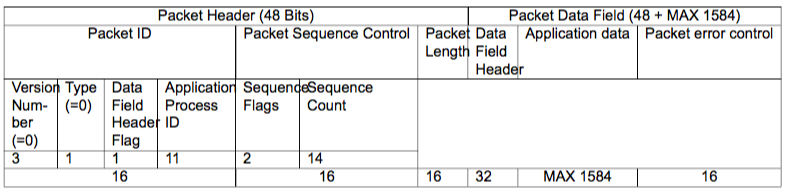

### Services in subsystems

The table 3.9 provide information about which service is implemented in
each subsystem.

Verification, housekeeping, function and test service are basic services
needed in all subsystems.

Time management is only used in ADCS and OBC since only them require
precision time keeping, OBC for the SU and ADCS for the control
calculations.

On-board scheduling and On-board storage services are only used in OBC
since they require a mass storage device.

Finally, large data transfer is only implemented in COMMS since it is
the only capable for RF communications.

Table 3.9 Services
implemented in each subsystem.

                                             OBC   EPS   ADCS   COMMS
  ------------------------------------------ ----- ----- ------ -------
  Telecommand verification                   v     v     v      v
  Housekeeping & diagnostic data reporting   v     v     v      v
  Function management                        v     v     v      v
  Time management                            v     x     v      x
  On-board operations scheduling             v     x     x      x
  Large data transfer                        x     x     x      v
  On-board storage and retrieval             v     x     x      x
  Test                                       v     v     v      v

### Software reuse

One of the first software design decisions was that since the ECSS
software is generic and could be used in future missions, the software
modules should be designed to be agnostic to the hardware used. For that
reason, direct call functions that were hardware related was prohibited
and a HAL layer that was a essentially a wrapper for the STM libraries
was used.

### Telecommand verification service

The Telecommand verification service is the 1. In table 3.11 are shown
the minimum and additional capabilities offered by the services. The
service is used when a telecommand has the values shown in table 3.10
The service doesn't support telemetry packets.

For UPSat it was decided that only the minimum capabilities would be
used, even if the additional would be definitely helpful they would also
complicate the software design. For that reason, only values of 0 and 1
are valid in the ACK field, if other values are present the packet is
flagged as invalid and dropped.

Since most of the telecommands are usually finished immediately, the
acceptance report means also the competition of the telecommand but the
semantics of the acceptance should be considered to be a telecommand.

If the telecommand results in failure, the frame has an error code
field. By checking the error code, the ground station operators could
find the reason for the failure and make correcting procedures
accordingly. The ECSS standard provides some error codes about packet
decoding failure listed in table 3.10.

One particular idiosyncrasy of the service is found in the table 3.14
where are listed errors about packet decoding such as error 2 incorrect
checksum, that leads reporting acceptance failure about a packet that
could have corrupted information including the ACK field.

Table 3.10 Telecommand
packet data ACK field settings

  Value   meaning
  ------- -------------------------------------
  0       none
  1       Acknowledge acceptance
  2       Acknowledge start of execution
  4       Acknowledge progress of execution
  8       Acknowledge completion of execution

Table 3.11 Telecommand
verification service subtypes

  minimum capabilities
  -------------------------------------------------- -------
  Telecommand acceptance report - success
  Telecommand acceptance report - failure
  Additional capabilities
  Telecommand execution started report - success
  Telecommand execution started report - failure
  Telecommand execution progress report - success
  Telecommand execution progress report - failure
  Telecommand execution completed report - success
  Telecommand execution completed report - failure

Table 3.12 Telecommand
verification service acceptance report frame

  Telecommand Packet ID   Packet sequence control
  ----------------------- -------------------------
  16 bits                 16 bits

Table 3.13 Telecommand
verification service acceptance failure frame.

  Telecommand Packet ID   Packet sequence control   Error
  ----------------------- ------------------------- --------
  16 bits                 16 bits                   8 bits

Table 3.14 Telecommand
verification service error codes

  Value   meaning
  ------- ------------------------------------------
  0       illegal APID
  1       incomplete or invalid length packet
  2       incorrect
  3       illegal packet type
  4       illegal packet subtype
  5       illegal or inconsistent application data

### Housekeeping

Information indicating the status of the CubeSat, are broadcasted to
earth, in specific intervals. WOD is transmitted automatically, so it
can be easily gathered by ground stations that don't have transmit
capabilities.

UPSat has 3 different WODs and each is used for different purposes:

-   QB50 WOD.

-   Extended WOD.

-   CW WOD.

The QB50, extended and CW WOD, is used for understanding the state of
UPSat. It is the last line of defense in the case there isn't a
communication link between ground stations and UPSat. It is going to be
the first indication if UPSat works correctly or not. The CW WOD is
crucial during the first days of operation, in order to track and verify
the operation of UPSat. Since HAM operators around the globe could
listen for CW WOD, a global coverage can be obtained.

### WOD

In the QB50 requirements, there is WOD. In the frame, it provides
historical information. The dataset provides general information. For
compatibility with the rest of the missions in QB50, WOD is not
encapsulated in ECSS.

Table 3.15 WOD packet
format

Table 3.16 WOD dataset

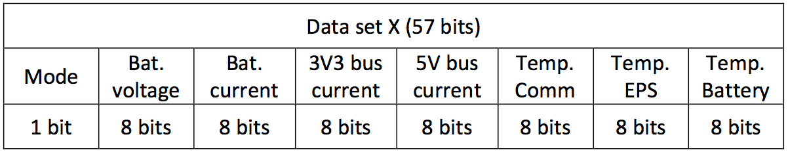

### Extended WOD

Since WOD offers only basic information, it was decided to add an
independent extended WOD. That would provide more information about the
state of UPSat. It was asked of all engineers to supply a set of
variables, that would help them understand what happens in the
subsystems. A small refactored happened in order to fit all data in a
single frame. Extended WOD is encapsulated in a ECSS frame.

### CW WOD

In addition to WOD and extended WOD, a CW WOD was added. The reason was
that CW has better chances of receiving it from the ground than the FSK
modulated WOD and extended WOD. Moreover, in CW there isn't a need for
complicated demodulation hardware, even a human with proper training can
understand it. The disadvantage of CW and the reason that it hosts
minimal information, is that it has far lower data rate than FSK and
higher consumption due to lower data rate.

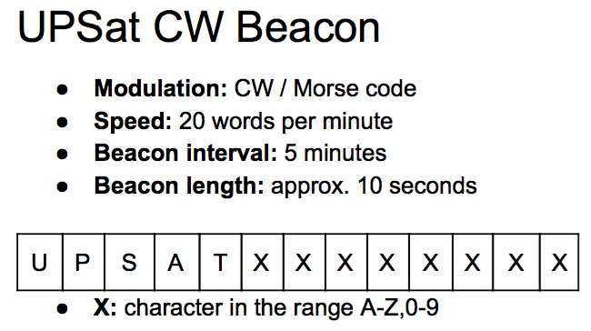

Figure 3.6 CW WOD frame

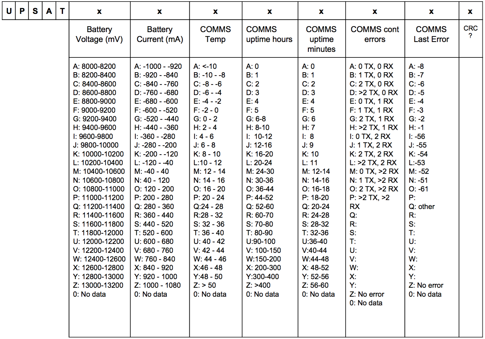

Figure 3.7 CW WOD dataset

### Housekeeping & diagnostic data reporting service

In this service, the design has deviated a lot from the specification.
In the specification, each housekeeping structure send a report in
specific intervals. There are also functions that implement new
structures and modify the intervals that the reports are generated.

For the UPSat, a different, simpler design was followed: OBC would send
a telecommand report parameters request (3,21) and the subsystem would
respond with a telemetry parameters report (3,23). OBC handles all the
timing and not the service. In the request, there is the structure ID
that the OBC wants. The structure ID is most of the times general and
the parameters in report are in conjunction with the subsystem that
reports it. For WOD variants the OBC gathers the health and extended
health reports, forms the WOD variant structures and then transmits it
to earth. Some subsystems have structure IDs that are specific to them.
Finally. the ground station could also send a request for a parameter
report and receive the response.

Even though the request/response mechanism works well, a design that
uses intervals as specified in the ECSS standard would have been a
better solution for 3 reasons:

-   It removes the task of sending requests.

-   Minimizes traffic.

-   Easier to change intervals.

Table 3.17 Housekeeping
service structure IDs

  Structure ID name   Structure ID   Meaning
  ------------------- -------------- ----------------------------------
  HEALTH\_REP         1              Health report
  EX\_HEALTH\_REP     2              Extended health report
  EVENTS\_REP         3              Events report
  WOD\_REP            4              WOD report
  EXT\_WOD\_REP       5              Extended WOD report
  SU\_SCI\_HDR\_REP   6              SU science header report
  ADCS\_TLE\_REP      7              ADCS TLE report
  EPS\_FLS\_REP       8              EPS flash memory contents report
  ECSS\_STATS\_REP    9              ECSS statistics report

Table 3.18 Housekeeping
service request structure id frame

  Structure ID
  --------------
  8 bits

Table 3.19 Housekeeping
service report structure id frame

  Structure ID   Data
  -------------- ---------------
  8 bits         1 - 1584 bits

### Function management service

The Function management service has service type 8 and only one service
subtype called perform function (8,1) which is a telecommand.

Each subsystem performs different functions, each device ID is
associated with on/off or set value action and a subsystem

Table 3.20 provide the data frame structure. There are 2 groups of
actions: power control which turns on and off a device and a set value
which configures the device ID parameters. Since set value is specific
to each device ID the values following is specified with the device ID,
the power control doesn't need a value. Table 3.21 show which subsystems
implement each device IDs and what action is associated with.

Table 3.20 Function
management service data frame

  Function ID   Device ID   Data
  ------------- ----------- --------------
  8 bits        8 bits      0 - 640 bits

Table 3.21 Function
management services in each subsystem

  Name            Sybsystem   Function ID    Device ID
  --------------- ----------- -------------- -------------------
  Power control   EPS         0: off 1: on   OBC ADCS COMMS SU
                  ADCS        0: off 1: on   GPS Sensors
                  OBC         0: off 1: on   IAC
                  ADCS        3: Set value   Magnetorquers
                  ADCS        3: Set value   Spintorguers
                  ADCS        3: Set value   TLE
                  ADCS        3: Set value   Control gains
                  ADCS        3: Set value   Setpoint
                  COMMS       3: Set value   WOD pattern
                  EPS         3: Set value   Write flash

### Large data transfer service

The specification has 2 ways for ensuring that a transfer has been
completed successfully. In the first one, every time packet that is
successfully received sends an acknowledgement. In order to send the
next one, an acknowledgement should have been received for the previous
one. The second technique uses a sliding window, where multiple parts
are send and the acknowledgement verifies the packets up to the part. In
UPSat, for uplink an acknowledgement for each packet is required and for
downlink a modified sliding window is used.

The Large data transfer service have 2 different parts: the software
running in UPSat and the one running in the ground station. Since UPSat
has less resources, is more difficult to write code for UPSat and after
a point the software won't be able to change, it was decided that the
operation complexity should be handled from the ground station's
software, whenever that was possible. For that reason, there was a
different approach for the service design if the transfer was initiated
from UPSat (downlink) or from the ground station (uplink).

For downlink, UPSat sends all the parts with 1ms delay in each transfer
and waits for a specific timeout period. The first part is denoted as,
all intermediates with and the final part with. During that period, the
ground station should send for a packet retransmission if it didn't
receive it properly or that all packets were successfully received. If
that time period expires without an acknowledgement, the service aborts
the transfer.

When the ground station receives large data transfer packets, checks if
there any packets missing and asks for retransmission. If there aren't
any packets missing, it sends that the transfer finished successful. In
the case that the last part hasn't been received, the ground station
requests the next part, until the last one is send.

For uplink, the ground station initiates a new transfer by sending the
first part, if UPSat receives it, it sends an acknowledgement. If the
ground station doesn't receive the acknowledgement, it retransmits the
packet. This continues till the last part or if the operation timeouts.

For both of transfers uplink and downlink, the ground station is
responsible of retransmitting a packet in a time frame that is less than
the time of UPSat's timeout, if the ground station hasn't got a proper
response, either a acknowledgment in the case of uplink or the part that
ground station requested in a downlink.

For keeping the design simple enough, it was decided to allow only one
transfer at the time for both of the uplink and downlink. For the case,
it was decided in the future to allow multiple transfers, a large data
unit ID was added in the data frame, that ID shows which transfer that
packet belongs to. For the current design if a packet arrives that has
different ID than current transfer, it drops the packet.

The sequence number shows where the data should be placed when the
original packet is reconstructed. For uplink if a packet arrives that
has a larger sequence number than the one expected, the packet is
dropped, that simplifies the design and it doesn't allow broken packets.
For the current design a maximum of 11 parts are allowed.

Each part should have the max size of 196 bytes from max data size of
198 bytes minus the 2 bytes of the large data transfer service header,
except the last part.

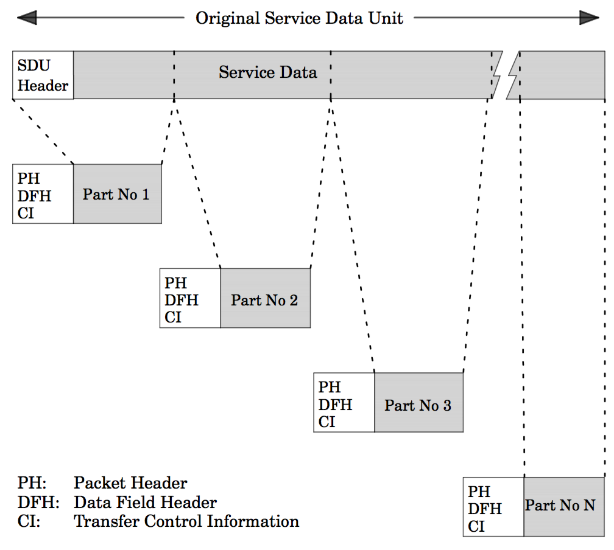

Figure 3.8 Large data
transfer split of the original packet

Table 3.22 Large data
transfer service transfer data frame.

  Large data unit ID   Sequence number   Service data unit part
  -------------------- ----------------- ------------------------
  8 bits               8 bits            1 - 1568 bits

Table 3.23 Large data
transfer service acknowledgement frame

  Large data unit ID   Sequence number
  -------------------- -----------------
  8 bits               8 bits

Table 3.24 Large data
transfer service repeat part frame

  Large data unit ID   Sequence number
  -------------------- -----------------
  8 bits               8 bits

Table 3.25 Large data
transfer service abort transfer frame

  Large data unit ID   Abort reason
  -------------------- --------------
  8 bits               8 bits

### On-board storage and retrieval service

The first design choice was that the file names for the logs should only
be numbers and not characters. That has the advantage of lower size
overhead when there is ground to UPSat communication e.g. the file name
as a string could be 8 characters long meaning 8 bytes as string when
the equivalent number 99999999 only uses 4 bytes. Moreover, file
operation could be performed with simple mathematics e.g. The next file
name could be found by adding 1 to the current file name.

For the logs storage design, it was decided to use one file per log
entry. This approach adds great size overhead since the minimum size a
file occupies is 512 bytes but simplifies the actions needed to operate
(retrieve, delete, store) with a log entry. A maximum file number of
5000 is defined, that way it is ensured that logs can't consume all the
disk size.

For the logs, on top of the file system an extra layer was added. A
circular buffer was used with the head and tail pointers pointing into
files. All logs must be placed in sequential manner into files. Using
that mechanism, the logs operation is simplified: First when a log entry
is deleted it doesn't actual delete the file, leaving the data intact in
case there is a need to retrieve it and saves time by not calling the
delete function of the file system. Secondly when a downlink operation
happens there is no need to know the actual file name, only the log
number should be specified and the file name is found by adding the head
pointer file name number and the log number e.g. if the head points to a
file with a name 5 the 3rd log that is stored is found by adding 5 and 3
resulting in the file name 8.

Service subtype Enable (15,1) and Disable (15,2) control the power of
the SD card, there is no data used. Instead of using the function
management for power control of the SD it was decided to use the
specification's mechanism.

Service subtype Downlink (15,9) and the response Content (13,8) provide
a way to download a file from UPSat. The telecommand downlink provides
the storage ID, the file name and if batch download is needed, the
number of files. Batch download is used for logs only. For batch
download, the files are sequential to the file name specified in the
telecommand. The response has the storage id, the file name and the file
content and if batch download is used, the next file name and file
content.

Service subtype Delete (15,11) has multiple functionality. The first
field is the storage ID that the delete function should act. Second
field is the mode. Depending on the mode the delete has different
functionality. When the storage ID is SU script 1-7 the script is
deleted, with mode to be irrelevant. The mode FS reset with a logs
storage ID, resets the file system, this is used in the case there is an
issue with the file system. The hard delete mode is used with the logs
storage ID and deletes all the files in storage ID. Also, when the hard
delete is used with the SRAM storage ID, it initializes the static
memory region on the OBC to zero. The hard delete mode should be only
used when there is an issue with file system. The delete all mode used
with logs clears the pointers used and finally the delete to mode used
again with logs removes entry logs from the pointers.

Service subtype Report (15,12) and the response Catalogue Report (15,13)
provide a report about the state of the storage. The report is separated
in 2 parts. The first parts provide the information about the 7 SU
scripts: if there is a valid script, the scripts file size and time
modified. The second part provide the information about the WOD,
extended WOD and SU logs storage: The number of files, The last log size
and timestamp and the firsts log size and timestamp.

Service subtype Uplink (15,14) uploads files in the storage that is
defined in the frame. It only used for SU script files but for debugging
purposes it is possible upload to other storage IDs.

Custom service subtype 15 uses the FatFS format function and formats the
SD card. This was added in the case the file system gets corrupted and
it's unusable from the OBC.

Custom service subtype List (15,16) and the response Catalogue List
(15,17) provide information for the underlying file system. It is used
only for logs since the SU script files information are properly shown
in the Report. This is subtype is complimentary to the report
functionality and it should be used only for debugging purposes because
in the presence of many files it could use a lot of resources. It is
highly probable that all the files information can't fit into a single
packet and multiple packets have to be used. For that reason, the List
telecommand has a field that if it's not zero it denotes the file name
that it should continue the listing. In the response, there is the field
that contains 0 if all files are listed or the name of the file that
should access in the next packet iteration.

### Test service

The test service is very simple. It has the 17 service type and only 2
subtypes: perform test (17,1) and report test (17,2). The service
doesn't use any application data.

Table 3.26 On-board
storage and retrieval service uplink subtype frame

  Store ID   File      File data
  ---------- --------- ----------------
  8 bits     16 bits   1 - 16384 bits

Table 3.27 On-board
storage and retrieval service downlink subtype frame

  Store ID   File      Number of files
  ---------- --------- -----------------
  8 bits     16 bits   16 bits

Table 3.28 On-board
storage and retrieval service downlink content subtype frame

  Store ID   File      File data
  ---------- --------- -----------
  8 bits     16 bits   1- 16384

Table 3.29 On-board
storage and retrieval service subtypes used on UPSat

  Name   Service subtype   Explanation
  ----------------------------------------------------- ----------------- ------------------------------------------------
  ENABLE                                                1                 Turns on the SD card
  DISABLE                                               2                 Turns off the SD card
  CONTENT                                               8                 File contents
  DOWNLINK                                              9                 Download a file request
  DELETE                                                11                Delete files
  REPORT                                                12                Storage status report request
  CATALOGUE REPORT                                      13                Storage status report response
  UPLINK                                                14                File upload
  FORMAT                                                15                Formats the SD card, custom service
  LIST                                                  16                List file information request, custom service
  CATALOGUE LIST                                        17                List file information response, custom service

Table 3.30 On-board
storage and retrieval service delete subtype frame

  Store ID          mode          to
  ----------------- ------------- ---------
  SU script 1 - 7   None          None
  SRAM              hard delete   None
  Logs              hard delete   None
  Logs              FatFS reset   None
  Logs              Delete all    to
  Logs              \*            to
  8 bits            8 bits        16 bits

Table 3.31 Store IDs

  Name          ID
  ------------- ----
  SU NOSCRIPT   0
  SU SCRIPT 1   1
  SU SCRIPT 2   2
  SU SCRIPT 3   3
  SU SCRIPT 4   4
  SU SCRIPT 5   5
  SU SCRIPT 6   6
  SU SCRIPT 7   7
  SU LOG        8
  WOD LOG       9
  EXT WOD LOG   10
  EVENT LOG     11
  FOTOS         12
  SCHS          13
  SRAM          14

Table 3.32 On-board
storage and retrieval service catalogue list subtype frame

  Store ID information   File information   
  ---------------------- ------------------ ----------- ----------- ----------- ------------------ -------------
  Store ID               Starting file      Next file
  8 bits                 16 bits            16 bits

Table 3.33 On-board
storage and retrieval service catalogue report subtype frame

  Type   Store ID information
  ------------------------------------------------------- ---------------------- --------------- -------------------- ---------------- ---------------------
  SU script 1-7                                           Valid SU script
                                                          8 bits
  WOD, EXT WOD, SU Logs                                   Number of logs
                                                          16 bits

Implementation
==============

In this chapter, the implementation of the ECSS services and the OBC
software is discussed.

ST cubeMX 
---------

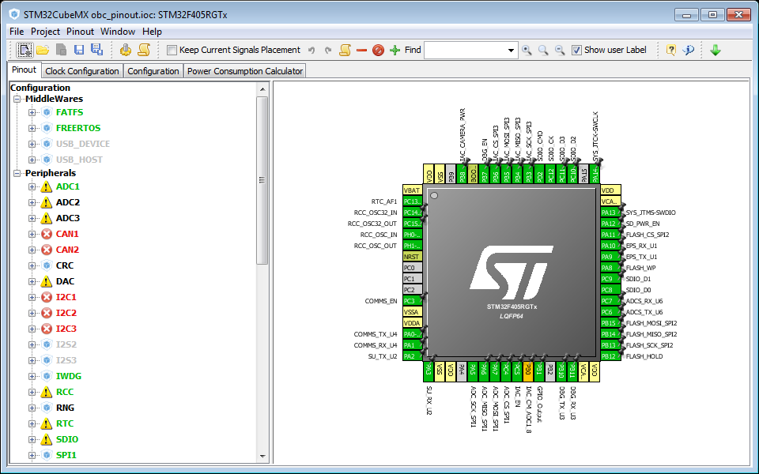

Figure 4.1 OBC's CubeMX
project

Most of the ARM cores are quite complex, with datasheets spanning most
of the time more that 1000 pages. For that reason, most of the
semiconductor companies provide libraries that facilitate the use of the
ARM core and the microcontrollers peripheral for the developer.

ST offers a graphical software called STMCube that generates code
according to the user's configuration. Before that had the standard
peripheral library, which is similar to the libraries other ARM
semiconductor companies offer.

CubeMX libraries design differ from standard library and other libraries
used in different ARM cores, thus it required more time initial to
understand the designer's intent.

Project folder organization 
---------------------------

Figure 4.2 Project
organization

ECSS services reside in a separate repository. Code that it is not in
the specification but is generic and used from a number of subsystems is
in the core directory along with code that is used for ECSS handling but
is not defined in the standard. The services folder holds all the
services implementation that is in specification. In the platform folder
is the code that is specific to each subsystem, in their folder
respectively. Inside each subsystem's folder there is a HAL/STM32 folder
that has the subsystem's HAL. In the core subfolder, there are functions

GPS 
---

The GPS connect to the ADCS provides with critical information about the
UPSats position and UTC time reference. The NMEA parsing algorithm used
in was co-developed from Agis Zisimatos.

It is worth noting that the GPS during the boot, transmits the company's
logo through the UART in a non-standard format. This led to buffer
overflows that were easily fixed but valuable time was lost in the
process. Even though this a common practice for commercial GPS this
wasn't expected from a GPS used in space.

The GPS transmits information into using the NMEA protocol. The NMEA
uses the '\\\$' character for a starting delimiter, the next 3-5
characters indicate the information the sentence holds, the data fields
are separated by a comma delimiter, the 2 characters after the '\*'
character denote the checksum of the sentence in hexadecimal and finally
the stop delimiter of the sentence '\\cr\\nl'. For an example the GSA
sentence providing the satellite status
"\\\$GPGSA,M,3,31,32,22,24,19,11,17,14,20,,,,1.6,0.9,1.3\*3E".

The parsing algorithm works into 2 steps. First the gps\_parse\_fields
function takes as input a buffer holding the NMEA sentence and the size
of the buffer, performs the necessary checks and populates an array with
the fields of the sentence. Next the gps\_parse\_logic function takes
the array with the fields, checks if the sentence has information that
is needed from UPSat and if that's the case it updates the GPS state
structure.

Listing 4.1 GPS module functions

  ---------------------------------------------------------------------------------
  SAT\_returnState gps\_parse\_fields(uint8\_t \*buf, const uint8\_t size,

  uint8\_t (\*res)\[NMEA\_MAX\_FIELDS\]);

  SAT\_returnState gps\_parse\_logic(const uint8\_t (\*res)\[NMEA\_MAX\_FIELDS\],

  \_gps\_state \*state);

HLDLC 
-----

Protocols like SPI and \$I\^2C\$ it is possible to transfer multiple
byte with one transaction. That way a transaction signifies a packet
transfer. UART on the other hand transfers a byte at the time thus
leaving no way to know when a packet starts or stops. For that reason,
for UART subsystem communication, there are 3 options to pass the ECSS
frames:

-   ASCII characters.

-   Binary protocol with length.

-   HLDLC algorithm.

Use ASCII and have unique in the frame delimiters like ',' and newline
for frame endings. The use of ASCII is a good choice because it is
easier to implement, it is easier for a human to debug since the data
can be read. Unfortunately, ASCII requires more processing power in
order to convert strings to numbers, requires more time to transfer and
need more memory than a binary protocol. A good example for an ASCII
protocol is the NMEA, which is used in all modern GPS receivers.

Use common delimiters but have a length field with the number of bytes
in the packet, in the beginning of each packet and use that to calculate
when the packet ends. This approach would require a timeout to discern
different packets in the case there is an error. The advantage of that
approach is that the implementation is easy and quick. The main
disadvantage is the error handling is very poor in the case there are
failures in the transfer.

The method that was eventually used, uses an algorithm that modifies the
original data so there are unique delimiters. The disadvantage it has is
that it could add up 2x times size overhead of the original data and it
cannot be used when a fixed packet length is required. The main
advantages are that is fairly easy to implement, it doesn't use much
processing resources, O(n) time is needed and makes fault tolerant
mechanisms easy to implement. A similar mechanism is used for CSP when
the transfer is over UART. During testing the overhead that was observed
in most packets was minimum.

The HLDLC is very easy: There is the frame boundary byte, which is 0x7E
that signifies the start and stop of every packet and the control escape
byte 0x7D. In the case there is the frame boundary byte or the control
escape byte inside the data frame, a control escape byte is inserted and
the 5th bit is inverted e.g. if there is the 0x14 0x7E 0x55 0x7D 0x14
byte frame the frame is modified into 0x7E 0x14 0x7D 0x5E 0x55 0x7D 0x5D
0x14 0x7E \[61\].

The HLDLC module is very simple, it has 2 functions: one for adding
HLDLC in a packet and one to deframe the HLDLC. The functions only need
the buffer that has the data and the buffer that stores the modified
data, plus the size of the original buffer that returns the size of the
modified data. The deframe function checks for HLDLC integrity. The
return code is SATR-EOT when it was successful or SATR-ERROR when there
was an error.

Listing 4.2 HLDLC module functionsh

  ---------------------------------------------------------------------------------------------
  SAT\_returnState HLDLC\_deframe(uint8\_t \*buf\_in, uint8\_t \*buf\_out, uint16\_t \*size);

  SAT\_returnState HLDLC\_frame(uint8\_t \*buf\_in, uint8\_t \*buf\_out, uint16\_t \*size);
  
  

Packet Pool 
-----------

Table 4.1 Number of
packets and data payload sizes in each subsystem

                        OBC     EPS    ADCS   COMMS
  --------------------- ------- ------ ------ -------
  Normal 210 bytes      16      10     16     16
  Extended 2050 bytes   4       0      0      4
  Total                 20      10     16     20
  Total bytes           11560   2100   3360   11560

Since malloc is prohibited, there was a need for a memory storing
mechanism for ECSS packets.

A fixed array of the packet structure was used. An array with the same
number of elements denotes the status of the corresponding packet, a
status of free or active.

There are 4 operations for the packet pool:

-   Initialize.

-   get packet.

-   free packet.

-   idle.

The initialize function must be called before the packet pool can be
used. It initializes all packet structures payload data pointers with
the data arrays allocated. If any other operation is performed before
the Initialize function is called, will result in error.

The get packet function returns a free packet from the packet pool. The
function iterates the array until a free packet is found, changes the
flag to active and returns the address of the structure. If there isn't
a free packet it returns NULL. The software module calling the get
packet function should check for a NULL pointer. It takes the size
needed for a parameter.

The free packet function returns a packet to the pool. It takes the
address of the packet that it frees as a parameter, iterates the packet
array and when the address is found, the status changed to free. If the
address is not found in the array nothing happens.

The idle function is used for fault tolerance. In case there is an error
or a bug in the code and packets are not freed when after their use had
ended, it would end filling all pool after a time. For that reason, a
timestamp field was added and every time a new packet became active the
systick's time was copied. If the current systick time minus the
timestamp is larger than a threshold it assumed that the packet was not
active and freed the packet. The threshold was set to 2 minutes which
was far greater than the time that a packet stays active observed during
testing. Since this behavior is not expected to happen frequent, this
function is intended to run on the idle time of the CPU.

Since this code is used in all subsystems that have different memory
constraints, preprocessor statements are used to modify the number of
packets and their data size.

The maximum size of a data payload is around 2k bytes which is the
maximum file size of a SU script. The maximum packet that can be
transferred through COMMS is 210 bytes, for more than that the large
transfer data service is used.

There are 3 groups of data sizes that can be distinguished:

-   Telecommands that are up to 80 data bytes.

-   Housekeeping packets that can reach the maximum of 210 bytes.

-   Mass storage service operations that can reach to 2kbytes.

Since only COMMS and OBC is using the 2k data sizes and EPS has strict
memory constraints, it was decided to have 2 types of packets: one
normal with maximum size of 210 bytes and the extended that reaches 2k
bytes of data payload. For simplification 2 types are used instead of 3.

A more elaborate scheme for the packet pool memory model was considered,
with allocated data blocks of 210 bytes and for an extended data the
packet would occupy the blocks required but it has 2 main disadvantages:

-   Possible fragmentation would slow packet processing.

-   The algorithm for handling of the block allocation would be more
    complex and would require more time for testing and development.

A note about thread safe implementation: the free function doesn't
require mutex protection because each packet can be freed once and the
operation is atomic. The get packet was a candidate but there isn't a
problem for all subsystems since the function is not used in ISRs and on
the OBC the function is only used in the serial task.

Listing 4.3 packet pool module functions

  ------------------------------------------------
  tc\_tm\_pkt \* get\_pkt(uint16\_t size);

  SAT\_returnState free\_pkt(tc\_tm\_pkt \*pkt);

  uint8\_t is\_free\_pkt(tc\_tm\_pkt \*pkt);

  SAT\_returnState pkt\_pool\_INIT();

  void pkt\_pool\_IDLE(uint32\_t tmp\_time);
  
  

Queues 
------

When a packet is about to be shipped in another subsystem, the pointer
of the packet structure is pushed in a queue according to the destined
subsystem. The OBC has 4 queues responding to to each subsystem the OBC
connects. The other subsystems have only 1 queue since they connect only
to the OBC. The export packet function checks if the queue is not empty
and if the UART peripheral is available and if that's the case, it pops
the structure's pointer and then sends it.

There are 2 queue implementations: the first one is exclusively used
from the OBC and utilizes the queue mechanism of the FreeRTOS which is
thread safe. Since the other subsystems don't use FreeRTOS there is no
need for the added complexity so a simple queue implementation is used.

The queue functions are defined in the core folder. Since the OBC uses
the FreeRTOS queues, the API calls have been placed in HAL wrapper
functions in order to sustain compatibility with the other codebase. The
queue module functions are the basic used in queues: with push a packet
structure is added in the queue, pop gets a packet from the queue if it
has one, size returns the number of packets in the queue and the peak
gets a packet with removing it from the queue and finally the idle was
developed for fault tolerance but it wasn't used.

Listing 4.4 Queue module functions

  -------------------------------------------------------------------------
  SAT\_returnState queuePush(tc\_tm\_pkt \*pkt, TC\_TM\_app\_id app\_id);

  tc\_tm\_pkt \* queuePop(TC\_TM\_app\_id app\_id);

  uint8\_t queueSize(TC\_TM\_app\_id app\_id);

  tc\_tm\_pkt \* queuePeak(TC\_TM\_app\_id app\_id);

  void queue\_IDLE(TC\_TM\_app\_id app\_id);

Hardware abstraction layer 
--------------------------

The hardware abstraction layer (HAL) provides a way for the ECSS
services to remain pure from the hardware thus making it easier for
swapping to different hardware. Moreover, since there are different
types of microcontrollers in each subsystem, plus each subsystem could
use different version of the libraries.

From the beginning the coding rule was that: hardware specific code
could only exist in the HAL directories of the ECSS repository.

Most of the functions, simply wrap the cubeMX libraries calls.

Most of the code is similiar in all subsystems, except for the OBC's
UART related code which resides in the uart-hal module.

A good example for the usefulness of the HAL layer is the delay and get
tick functions. Using a HAL layer and wrapping the delay enables to use
different functions for time delays, in the OBC which has needs to call
the FreeRTOS delay and in the other subsystems were the cubeMX bare
metal delay is called. The get tick HAL function allows to easily change
a timer providing different tick resolutions if it is needed.

Listing 4.5 ADCS HAL function example

  ----------------------------------------
  void HAL\_sys\_delay (uint32\_t sec) {

  HAL\_Delay(sec);

  }

  uint32\_t HAL\_sys\_GetTick() {

  return HAL\_GetTick();

  }
  
  

Listing 4.6 OBC HAL function example

  ----------------------------------------
  void HAL\_sys\_delay(uint32\_t msec) {

  osDelay(msec);

  }

  uint32\_t HAL\_sys\_GetTick() {

  return HAL\_GetTick();

  }
  
  

Peripheral modes 
----------------

In this section, the operation modes of the microcontroller's peripheral
will be discussed while focusing in the UART. Peripherals like SPI and
I^2^C have similar functionality. The UART and most of the STM32F4's
peripherals have 3 modes of operation:

-   blocking.

-   interrupt.

-   DMA.

The first mode is very simple, the function constantly checks a flag,
probably a SFR bit. When the bit changes state, it signals an event like
a new character is received or a character has finished transmission.

The interrupt mode uses the built-in hardware functions in order to free
the CPU from constantly checking a SFR. When an event happens, the CPU
stop the normal operation and jumps to an ISR function that handles the
event. That way CPU cycles are only used for the processing of the
event.

Finally, when the DMA mode is used, the events are processed without the
use of the CPU. In particular usually a buffer address is configured
along with the size of the data. During receive the buffer is filled
automatically and in transmission the data are taken from the buffer.
When the transmission is finished or when the data received are reached
the size defined an ISR is triggered signaling the events end.

The blocking mode has simpler operation but it wastes CPU cycles for
constantly checking the SFR. This is great reduced with the interrupt
mode but there is some overhead. The DMA mode is the most efficient mode
of operation with no overhead but while the other modes don't have a
restriction on the number of characters, the DMA is only efficient when
used with a predefined fixed number of characters.

Listing 4.7 UART cubeMX HAL peripheral modes function examples

  ---------------------------------------------------------------------------------------------------------------------------
  HAL\_StatusTypeDef HAL\_UART\_Transmit(UART\_HandleTypeDef \*huart, uint8\_t \*pData, uint16\_t Size, uint32\_t Timeout);

  HAL\_StatusTypeDef HAL\_UART\_Receive(UART\_HandleTypeDef \*huart, uint8\_t \*pData, uint16\_t Size, uint32\_t Timeout);

  HAL\_StatusTypeDef HAL\_UART\_Transmit\_IT(UART\_HandleTypeDef \*huart, uint8\_t \*pData, uint16\_t Size);

  HAL\_StatusTypeDef HAL\_UART\_Receive\_IT(UART\_HandleTypeDef \*huart, uint8\_t \*pData, uint16\_t Size);

  HAL\_StatusTypeDef HAL\_UART\_Transmit\_DMA(UART\_HandleTypeDef \*huart, uint8\_t \*pData, uint16\_t Size);

  HAL\_StatusTypeDef HAL\_UART\_Receive\_DMA(UART\_HandleTypeDef \*huart, uint8\_t \*pData, uint16\_t Size);
  
  

The cubeMX HAL provide 3 set of functions: blocking, interrupt and DMA.
The only difference in the provided functions is in the blocking mode
where a timeout parameter is added. It is worth noting that in all 3
different types of microcontrollers used in UPSat have the almost the
same implementation. This simplifies and reduces the time needed for the
implementation of the ECSS handling.

While the blocking and DMA functionality is as expected, the interrupt
mode for reception is not. The interrupt mode reception requires a
predefined number of characters which doesn't work well with the
non-fixed packet length. For that reason, custom handlers were written
for the reception.

The UART is used for 3 different operations in UPSat:

-   Science unit handling.

-   GPS reception.

-   ECSS packet handling.

In all cases, for transmission since the size of the data is known
beforehand the DMA mode is used.

Listing 4.8 UART 1 peripheral IRQ function example

  ----------------------------------------
  void USART1\_IRQHandler(void)

  {

  /\* USER CODE BEGIN USART1\_IRQn 0 \*/

  SEGGER\_SYSVIEW\_RecordEnterISR();

  HAL\_OBC\_UART\_IRQHandler(&huart1);

  /\* USER CODE END USART1\_IRQn 0 \*/

  HAL\_UART\_IRQHandler(&huart1);

  /\* USER CODE BEGIN USART1\_IRQn 1 \*/

  SEGGER\_SYSVIEW\_RecordExitISR();

  /\* USER CODE END USART1\_IRQn 1 \*/

  }
  
  

When the interrupt mode is used and when an interrupt occurs, the ISR
handler USARTn-IRQHandler is called that is in stm32f4xx-it.c file.
Inside the handler the HAL-UART-IRQHandler is called. That function has
check flags that show what event happened, calls the corresponding event
handler and clears the flags.

In order to make the custom handler the ISR handler HAL-UART-IRQHandler
was copied and striped of all functionality that wasn't related in UART
reception. The HAL-subsystem-UART-IRQHandler function is placed before
the USARTn-IRQHandler in order to intercept the received character.
Inside the HAL-subsystem-UART-IRQHandler the modified UART-Receive-IT is
called. This function holds the processing algorithm and it's different
for the 3 cases. The existing huart structures of the cubeMX HAL were
used for the UART processing.

The SU sends data in fixed packet length of 180 bytes. In this case the
DMA mode could had been used but the interrupt mode is used instead
because error checks are performed and in the event of successful
reception the OBC UART task is called.

For the GPS handling, the ISR function stores the incoming bytes into
the GPS buffer when the '\$' start character is received, finishes when
the stop bits arrive and switches buffer location in order to store the
next sentence,

The UART-subsystem-Receive-IT function handles incoming ECSS packets
encapsulated in a HLDLC frame. The function stores the packet in a
temporary buffer with the HLDLC encapsulation while performing error
checking of the HLDLC frame. At first the intention was that the HLDLC
decapsulation should be performed in the ISR but after the initial tests
that design was abandoned because it made the ISR more complex than
wanted, instead the decapsulation happens after the whole packet
reception in the import function. The error checks performed are for the
HLDLC packet validity: start and stop flag and if the packet length
exceeds the minimum or maximum size of an ECSS packet.

Listing 4.9 UART IRQ function ECSS packet handler

  ----------------------------------------------------------------------------------------------------------------
  void UART\_OBC\_Receive\_IT(UART\_HandleTypeDef \*huart)

  {

  uint8\_t c;

  c = (uint8\_t)(huart-&gt;Instance-&gt;DR & (uint8\_t)0x00FFU);

  if(huart-&gt;RxXferSize == huart-&gt;RxXferCount && c == HLDLC\_START\_FLAG) {

  \*huart-&gt;pRxBuffPtr++ = c;

  huart-&gt;RxXferCount--;

  uart\_timeout\_start(huart);

  } else if(c == HLDLC\_START\_FLAG && (huart-&gt;RxXferSize - huart-&gt;RxXferCount) &lt; TC\_MIN\_PKT\_SIZE) {

  err++;

  huart-&gt;pRxBuffPtr -= huart-&gt;RxXferSize - huart-&gt;RxXferCount;

  huart-&gt;RxXferCount = huart-&gt;RxXferSize - 1;

  \*huart-&gt;pRxBuffPtr++ = c;

  uart\_timeout\_start(huart);

  } else if(c == HLDLC\_START\_FLAG) {

  \*huart-&gt;pRxBuffPtr++ = c;

  huart-&gt;RxXferCount--;

  uart\_timeout\_stop(huart);

  /\* Disable the UART Parity Error Interrupt and RXNE interrupt\*/

  CLEAR\_BIT(huart-&gt;Instance-&gt;CR1, (USART\_CR1\_RXNEIE | USART\_CR1\_PEIE));

  /\* Disable the UART Error Interrupt: (Frame error, noise error, overrun error) \*/

  CLEAR\_BIT(huart-&gt;Instance-&gt;CR3, USART\_CR3\_EIE);

  /\* Rx process is completed, restore huart-&gt;RxState to Ready \*/

  huart-&gt;RxState = HAL\_UART\_STATE\_READY;

  BaseType\_t xHigherPriorityTaskWoken = pdFALSE;

  vTaskNotifyGiveFromISR(xTask\_UART, &xHigherPriorityTaskWoken);

  portYIELD\_FROM\_ISR(xHigherPriorityTaskWoken);

  } else if(huart-&gt;RxXferSize &gt; huart-&gt;RxXferCount) {

  \*huart-&gt;pRxBuffPtr++ = c;

  huart-&gt;RxXferCount--;

  } else {

  err++;

  }

  if(huart-&gt;RxXferCount == 0U) // errror

  {

  huart-&gt;pRxBuffPtr -= huart-&gt;RxXferSize - huart-&gt;RxXferCount;

  huart-&gt;RxXferCount = huart-&gt;RxXferSize;

  err++;

  }

  }
  
  

ECSS services
-------------

The services folder contains all the code related to the services
implemented in the ECSS document. Each service is implemented in a
module that is uncoupled with each other, The services module contains
all the configuration parameters for the services. The service utilities
contain functions that are helpful for the ECSS services. If a service
need information that is specific to a subsystem it uses the function
that is defined in the platform folder in the respective file e.g.
housekeeping for the housekeeping service. The subsystem-id file has all
the application ids of UPSat.

A single-entry point for all incoming packets is used for a better
modular design and is denoted by the -app. Each function that belongs to
a module start with the service name e.g. mass-storage-app. The function
must end with -api if that function could be used from another module
but that rule was later discharged due to project time limitations.

upsat module
------------

The upsat module has a collection of functions that are used from all
subsystems together with with the ECSS services.

Listing 4.10 upsat module functions

  ----------------------------------------------------------------------------------
  void sys\_refresh();

  SAT\_returnState import\_pkt(TC\_TM\_app\_id app\_id, struct uart\_data \*data);

  SAT\_returnState export\_pkt(TC\_TM\_app\_id app\_id, struct uart\_data \*data);

  SAT\_returnState sys\_data\_INIT();

  SAT\_returnState test\_crt\_heartbeat(tc\_tm\_pkt \*\*pkt);

  SAT\_returnState firewall(tc\_tm\_pkt \*pkt);
  
  

The import and export packet functions are used for processing incoming
packets and transmitting packets through the UART to their corresponding
subsystem.

The import and export packet function takes the application ID that the
function operates for and the respectively data that are packed into the
uart-data structure.

The import packet functions check if there is a new packet, it is
deframed from HLDCL encapsulation, unpacket into a packet taken from the
packet pool and if those process are finished without error the packet
is routed into the respectively services handler or forwarded to another
subsystem. The verification service handler is called then and finally
if the packet is for that subsystem it is returned to the packet pool
since all processing is finished. If the packet is for another subsystem
the packet is freed when the export packet function finishes.

The export packet function checks if the UART peripheral is not
transmitting another packet which in that case isn't anything more to do
until the packet is finished transmitting. After that it checks if there
is any packet in the queue, if there is the packet is packed from the
packet structure into a temporary buffer array, HLDLC encapsulation,
transmit ion from the UART and finally the packet is returned to the
packet pool.

At first the export packet was called directly when a new packet was
created and needed to forward it to its destination. That created 2
issues: First in the case the export packet was used inside the import
packet e.g. for a telecommand response, the import had to wait for the
export function to send it. If the UART was already used from another
packet, it had to wait for that operation to finish as well. That could
lead in packet loss if a new packet arrived while the import function
was in use. Also it created unwanted coupling between the import and
export module. Secondly for the OBC which is multithreaded, it created
race conditions.

The solution of this problem was the use of queues. Each time a new
packet is generated the pointer to the structure is pushed in the queue
of the destined subsystem. When the export packet is called, the packet
pointer is retrieved from the the queue. This uncouples the 2 functions.
The race conditions is solved by the way that the export function is
called from only one place, so the pop function of the queue is atomic.
The push function which can be used from all the threads is solved
through the use of FreeRTOS queues that have build in mechanisms for
thread safety protection.

Listing 4.11 import function

  ------------------------------------------------------------------------------------------
  SAT\_returnState import\_pkt(TC\_TM\_app\_id app\_id, struct uart\_data \*data) {

  tc\_tm\_pkt \*pkt;

  uint16\_t size = 0;

  SAT\_returnState res;

  SAT\_returnState res\_deframe;

  res = HAL\_uart\_rx(app\_id, data);

  if( res == SATR\_EOT ) {

  size = data-&gt;uart\_size;

  res\_deframe = HLDLC\_deframe(data-&gt;uart\_unpkt\_buf, data-&gt;deframed\_buf, &size);

  if(res\_deframe == SATR\_EOT) {

  pkt = get\_pkt(size);

  if(!C\_ASSERT(pkt != NULL) == true) { return SATR\_ERROR; }

  if((res = unpack\_pkt(data-&gt;deframed\_buf, pkt, size)) == SATR\_OK) {

  route\_pkt(pkt); }

  else {

  pkt-&gt;verification\_state = res;

  }

  verification\_app(pkt);

  TC\_TM\_app\_id dest = 0;

  if(pkt-&gt;type == TC) { dest = pkt-&gt;app\_id; }

  else if(pkt-&gt;type == TM) { dest = pkt-&gt;dest\_id; }

  if(dest == SYSTEM\_APP\_ID) {

  free\_pkt(pkt);

  }

  }

  }

  return SATR\_OK;

  }
  
  

Listing 4.12 export function

  ---------------------------------------------------------------------------------------
  SAT\_returnState export\_pkt(TC\_TM\_app\_id app\_id, struct uart\_data \*data) {

  tc\_tm\_pkt \*pkt = 0;

  uint16\_t size = 0;

  SAT\_returnState res = SATR\_ERROR;

  /\* Checks if the tx is busy \*/

  if((res = HAL\_uart\_tx\_check(app\_id)) == SATR\_ALREADY\_SERVICING) { return res; }

  /\* Checks if that the pkt that was transmitted is still in the queue \*/

  if((pkt = queuePop(app\_id)) == NULL) { return SATR\_OK; }

  pack\_pkt(data-&gt;uart\_pkted\_buf, pkt, &size);

  res = HLDLC\_frame(data-&gt;uart\_pkted\_buf, data-&gt;framed\_buf, &size);

  if(res == SATR\_ERROR) { return SATR\_ERROR; }

  if(!C\_ASSERT(size &gt; 0) == true) { return SATR\_ERROR; }

  HAL\_uart\_tx(app\_id, data-&gt;framed\_buf, size);

  free\_pkt(pkt);

  return SATR\_OK;

The function firewall is used on COMMS subsystem and it blocks services
that are harmful to the operation of the CubeSat. The actions filtered
are function management services that is directed to the EPS with
commands to turn off major subsystems.

The sys-refresh is used from the ADCS and COMMS subsystems in order to
send a test service packet to the EPS for the heartbeat fault detection
mechanism. The function calls the test-crt-heartbeat that creates the
service test packet.

Service module
--------------

The service module provides most of the information related to the ECSS
services. Here all significant definitions of the ECSS specification
used by software are found: services types and subtypes names are
defined, the SAT-returnState that holds all states of the software,
supporting type definitions of each service, definitions, packet
structure and assertion macro definition along with configuration
definitions like the maximum size of a packet.

The supporting type definitions of each service could had been define in
each service module and maybe that design was better in terms of
software separation design but it was decided to be in the service
module in one place as a way for the developer or used to quickly find
information about the service inputs. Moreover, a global definition file
that holds the most important definitions would save the developer from
searching in multiple files for key parameters.

### Error codes

The ECSS module are using one enumeration for status codes that could
happen during the process of a packet. The status codes are used for
debugging, logging and in the verification service in the case of a
telecommand failure. The enumeration plays a key part in error handling,
since all functions in the ECSS module return the enumeration. The
design intend was to have 1 status code for all the failures in order to
easily identify the source of error, this happened in the most part but
unfortunately not in the extend that was wished for.

There are status codes used for different modules. The first 6 (0-5) are
defined in the ECSS standard. The 6th OK means that everything happened
as planned. ERROR provides a generic name for failure. Scheduling
service uses the 16-29 codes. The status codes of the FatFS are shifted
between number 30-50. The final 5 provide specific errors.

### ECSS packet structure

The ECSS packet structure holds packets in that form when they are
process, this structure plays the prime role since most all
functionality in the ECSS module revolves to a packet. Most of the field
of the structure are named after the counterparts in the ECSS
specification and hold the same amount of information in bytes. The only
difference is the source or destination ID which the name is different
according the type of the packet but it was decided to both share the
same field and the structure member was named dest-id from destination
ID since most of the times that it was used in the code was when the
variable held the destination ID and it was easier to remember.

The only structure member that doesn't belong to the ECSS specification
is the verification-state that is a supporting variable for the
verification service and holds the verification state that the packet is
in. If the state was in another variable it would only make the code
more complicated.

Listing 4.13 Assertion preprocessor macro definition and calling example

  ----------------------------------------------------------------------------------------------
  \#define C\_ASSERT(e) ((e) ? (true) : (tst\_debugging(\_\_FILE\_ID\_\_, \_\_LINE\_\_, \#e)))

  if(!C\_ASSERT(\*size &lt;= UART\_BUF\_SIZE) == true) { return SATR\_ERROR; }

Table 4.2 ECSS status
codes

  Name                                    Value   meaning
  --------------------------------------- ------- ---------------------------------------------------------------------------------------------
  Packet ILLEGAL application ID           0       
  Packet invalid lenght                   1       
  Packet invalid CRC                      2       
  Packet ILLEGAL Packet service type      3       
  Packet ILLEGAL Packet service subtype   4       
  Packet ILLEGAL application data         5       
  OK                                      6       This is not an error
  ERROR                                   7       Generic error
  EOT                                     8       
  CRC ERROR                               9       
  Packet ILLEGAL ACK                      10      
  ALREADY SERVICING                       11      
  MS MAX FILES                            12      
  Packet INIT                             13      
  INV STORE ID                            14      
  INV DATA LEN                            15      
  Scheduling Service Error State Codes
  SCHS FULL                               16      Schedule array is full
  SCHS ID INVALID                         17      Sub-schedule ID invalid
  SCHS NMR OF TC INVLD                    18      Number of telecommands invalid
  SCHS INTRL ID INVLD                     19      Interlock ID invalid
  SCHS ASS INTRL ID INVLD                 20      Assess Interlock ID invalid
  SCHS ASS TP ID INVLD                    21      Assessment type id invalid
  SCHS RLS TT ID INVLD                    22      Release time type ID invalid
  SCHS DST APID INVLD                     23      Destination APID in embedded TC is invalid
  SCHS TIM INVLD                          24      Release time of TC is invalid
  QBTIME INVALID                          25      Time management reported erroneous time
  SCHS TIM SPEC INVLD                     26      Release time of TC is specified in a invalid representation
  SCHS INTRL LGC ERR                      27      The release time of telecommand is in the execution window of its interlocking telecommand.
  SCHS DISABLED                           28      
  SCHS NOT IMLP                           29      Not implemented function of scheduling service
  FatFs
  F OK                                    30      \(0) Succeeded
  F DISK ERR                              31      \(1) A hard error occurred in the low-level disk I/O layer
  F INT ERR                               32      \(2) Assertion failed
  F NOT READY                             33      \(3) The physical drive cannot work
  F NO FILE                               34      \(4) Could not find the file
  F NO PATH                               35      \(5) Could not find the path
  F INVALID NAME                          36      \(6) The path name format is invalid
  F DENIED                                37      \(7) Access denied due to prohibited access or directory full
  F EXIST                                 38      \(8) Access denied due to prohibited access
  F INVALID OBJECT                        39      \(9) The file/directory object is invalid
  F WRITE PROTECTED                       40      \(10) The physical drive is write protected
  F INVALID DRIVE                         41      \(11) The logical drive number is invalid
  F NOT ENABLED                           42      \(12) The volume has no work area
  F NO FILESYSTEM                         43      \(13) There is no valid FAT volume
  F MKFS ABORTED                          44      \(14) The f mkfs() aborted due to any parameter error
  F TIMEOUT                               45      \(15) Could not get a grant to access the volume within defined period
  F LOCKED                                46      \(16) The operation is rejected according to the file sharing policy
  F NOT ENOUGH CORE                       47      \(17) LFN working buffer could not be allocated
  F TOO MANY OPEN FILES                   48      \(18) Number of open files &gt; FS SHARE
  F INVALID PARAMETER                     49      \(19) Given parameter is invalid
  F DIR ERROR                             50      
  SD DISABLED                             51      
  QUEUE FULL                              52      
  WRONG DOWNLINK OFFSET                   53      
  VER ERROR                               54      
  FIREWALLED                              55      

Listing 4.14 ECSS module packet structure definition

  ------------------------------------------------------------------------------------------------------------------------------------------------------------------
  typedef struct {

  /\* packet id \*/

  //uint8\_t ver; /\* 3 bits, should be equal to 0 \*/

  //uint8\_t data\_field\_hdr; /\* 1 bit, data\_field\_hdr exists in data = 1 \*/

  TC\_TM\_app\_id app\_id; /\* TM: app id = 0 for time packets, = 0xff for idle packets. should be 11 bits only 8 are used though \*/

  uint8\_t type; /\* 1 bit, tm = 0, tc = 1 \*/

  /\* packet sequence control \*/

  uint8\_t seq\_flags; /\* 3 bits, definition in TC\_SEQ\_xPACKET \*/

  uint16\_t seq\_count; /\* 14 bits, packet counter, should be unique for each app id \*/

  uint16\_t len; /\* 16 bits, C = (Number of octets in packet data field) - 1, on struct is the size of data without the headers. on array is with the headers \*/

  uint8\_t ack; /\* 4 bits, definition in TC\_ACK\_xxxx 0 if its a TM \*/

  uint8\_t ser\_type; /\* 8 bit, service type \*/

  uint8\_t ser\_subtype; /\* 8 bit, service subtype \*/

  /\*optional\*/

  //uint8\_t pckt\_sub\_cnt; /\* 8 bits\*/

  TC\_TM\_app\_id dest\_id; /\*on TC is the source id, on TM its the destination id\*/

  uint8\_t \*data; /\* pkt data \*/

  /\*this is not part of the header. it is used from the software and the verification service,

  \*when the packet wants ACK.

  \*the type is SAT\_returnState and it either stores R\_OK or has the error code (failure reason).

  \*it is initialized as R\_ERROR and the service should be responsible to make it R\_OK or put the corresponding error.

  \*/

  SAT\_returnState verification\_state;

  }tc\_tm\_pkt;

### Assertions

Used directly from the JPL's 10 rules \[39\], assertions are used
whenever possible. It is defined as a preprocessor macro definition that
calls the test-debugging function.

Most checks are for NULL pointers and wrong ranges in parameters. The
checks that are using assertions are only for parameters that are
invalid and denote wrong behavior. There are also used for fault
containment.

Assertions are defined as a preprocessor macro, when the e expression is
false the tst-debugging is called which takes the filename, the line in
the file that the assertions is placed and finally the expression. These
parameters help to identify where the error happened. The assertion code
is taken directly from the JPL 10 rules.

Service utilities module
------------------------

The service utilities module contains a collection of functions that
complementary to the use of the ECSS modules.

The cnv functions converts from an uint8-t to the corresponding type (16
- 32 bits) and vice versa. Using that functions all subsystem share the
same endianness type. It was designed for packet conversion from the
structure to the 8-bit array used for transmission and from the raw
8-bit array to the packet structure.

There are 2 ways for converting a variable in C language to 8 bits and
vice versa:

-   Using unions.

-   Using shifts and bit masking operations.

The union approach has the advantage of better code clarity.

The checksum is used for calculating the error checking byte of the ECSS
packet. It is used when the packet is received for error checking and
for calculating it when its for transmission. The checksum is a simple
XOR based algorithm.

The STM32 that is used in all subsystems have a hardware peripheral for
calculating the checksum but a software implementations was preferred
even though the hardware peripheral would be more efficient. This was
primary for fault tolerance issues, in the case the hardware was
destroyed from the space radiation, it would render all subsystem
communications useless since the checksum would fail. If there is a
hardware failure in the ALU of the microcontroller that would be used
from the software checksum, all operations on the microcontroller would
fail, disabling the microcontroller. A hybrid solution that would check
the checksum peripheral for errors and then switch to a software
solution, would be ideal but the project's time restrictions didn't
allow for the implementation.

The sys-data-init is used in initialization and initializes the state of
the ECSS packet sequence counters for all the application IDs.

The create packet functions crt-pkt initializes a packet structure.

The unpack packet function gets a packet in a raw 8-bit array and it
fills a packet structure while making the necessary checks. The pack
packet function gets the information in a packet structure and fills a 8
bit array in order to transmit the data through the UART.

Listing 4.15 Service utilities module functions

  --------------------------------------------------------------------------------------------------------------------------------------------------------------------------
  SAT\_returnState checkSum(const uint8\_t \*data, const uint16\_t size, uint8\_t \*res\_crc);

  SAT\_returnState unpack\_pkt(const uint8\_t \*buf, tc\_tm\_pkt \*pkt, const uint16\_t size);

  SAT\_returnState pack\_pkt(uint8\_t \*buf, tc\_tm\_pkt \*pkt, uint16\_t \*size);

  SAT\_returnState crt\_pkt(tc\_tm\_pkt \*pkt, TC\_TM\_app\_id app\_id, uint8\_t type, uint8\_t ack, uint8\_t ser\_type, uint8\_t ser\_subtype, TC\_TM\_app\_id dest\_id);

  void cnv32\_8(const uint32\_t from, uint8\_t \*to);

  void cnv16\_8(const uint16\_t from, uint8\_t \*to);

  void cnv8\_32(uint8\_t \*from, uint32\_t \*to);

  void cnv8\_16(uint8\_t \*from, uint16\_t \*to);

  void cnv8\_16LE(uint8\_t \*from, uint16\_t \*to);

  void cnvF\_8(const float from, uint8\_t \*to);

  void cnv8\_F(uint8\_t \*from, float \*to);

  void cnvD\_8(const double from, uint8\_t \*to);

  void cnv8\_D(uint8\_t \*from, double \*to);

Test service module
-------------------

The implementation of the test service module is very simple, making the
perfect candidate for a more through code examination. When a
telecommand is received with (17,1) it replies with a telemetry packet
of (17,2) with no data.

The test-app function serves as an entry point for the packet in the
route. Most of the function's code has to do with checks. The
test-crt-pkt is a complimentary function

Listing 4.16 Test service module functions

  -------------------------------------------------------------------------------------------------------
  SAT\_returnState test\_app(tc\_tm\_pkt \*pkt) {

  tc\_tm\_pkt \*temp\_pkt = 0;

  if(!C\_ASSERT(pkt != NULL && pkt-&gt;data != NULL) == true) { return SATR\_ERROR; }

  if(!C\_ASSERT(pkt-&gt;ser\_subtype == TC\_CT\_PERFORM\_TEST) == true) { return SATR\_ERROR; }

  test\_crt\_pkt(&temp\_pkt, pkt-&gt;dest\_id);

  if(!C\_ASSERT(temp\_pkt != NULL) == true) { return SATR\_ERROR; }

  route\_pkt(temp\_pkt);

  return SATR\_OK;

  }

  SAT\_returnState test\_crt\_pkt(tc\_tm\_pkt \*\*pkt, TC\_TM\_app\_id dest\_id) {

  \*pkt = get\_pkt(PKT\_NORMAL);

  if(!C\_ASSERT(\*pkt != NULL) == true) { return SATR\_ERROR; }

  crt\_pkt(\*pkt, SYSTEM\_APP\_ID, TM, TC\_ACK\_NO, TC\_TEST\_SERVICE, TM\_CT\_REPORT\_TEST, dest\_id);

  (\*pkt)-&gt;len = 0;

  return SATR\_OK;

  }
  

Telecommand verification service module
---------------------------------------

The telecommand verification service allows to see the outcome of a
telecommand operation. If the operation is critical or the operator
wants confirmation the acknowledgement flags are set in the packet
header.

The implementation in order to be simple and efficient was
straightforward. The verification state was added in the packet
structure. There each service is responsible to place the state of the
operation. During the packet's allocation from the packet pool the state
is set to initialized, in order to differentiate from other states.

After the processing of the telecommand is finished, the
verification-app is called. It checks the acknowledgment flags in the
telecommand frame and if a verification flag exists, it sends the
corresponding telemetry packet. If the verification state in the
telecommand flag indicates a failure, the verification state is used for
the failure reason.

Using the verification service a TCP like mechanism, that insures the
delivery of critical packets could had been created if there was enough
time available.

Moreover, the use of the verification state could be used to store more
information for the status of the packet. The use of preprocessor macros
that automatically add an error or a general state in the process could
simplify the development.

During the implementation, the first design of export packet made the
inline processing of the verification and the implementation of extra
stages impossible without adding overhead that could interrupt the
primary process. With the later addition of queues the design could have
been simpler. One different design would have a table with all packets
needing verification and the verification service module residing in a
different or in the idle task, checking for a change in the state. That
way more verification states could have been used.

The implementation follows more or less the same scheme as the test
service module.

Event reporting service module
------------------------------

Table 4.3 Event service
frame

  Subsystem ID   Event ID   Event time   Data
  -------------- ---------- ------------ ---------
  8 bits         8 bits     32 bits      32 bits

The event report service was originally designed to be used but time
didn't allow for full implementing and testing so eventually wasn't
used.

Since the only storage medium is on the OBC, there wasn't a way to store
event logs in other subsystems. For that reason, it was decided that all
events are to be sent to the OBC for storage. There is always the issue
that some events won't be stored for various reasons like power resets
or packet loss but it is better to have more information and lose some
than the opposite. An implication of using the OBC for event storage is
that only the most critical events are send in order not to create too
much traffic for the OBC to handle.

At first the UART was used for displaying debug messages. After the
subsystems integration and since only ECSS packets could be forwarded to
the umbilical UART, the debug messages were encapsulated in event
service packets. The ASCII messages were used only for early debugging
and there were replaced later.

The next design had a fixed packet format. For the implementation, each
event had it's own function and the subsystem's developer was
responsible for defining the subsystem's events.

For design simplicity, the event-app had a preprocessor ifdef that
checked the subsystem and if it was the OBC, it stored the event, in all
subsystems it forwarded the packet to the OBC.

Listing 4.17 Event service module boot event example function

  ---------------------------------------------------------------------------------------------
  SAT\_returnState event\_boot(const uint8\_t reset\_source, const uint32\_t boot\_counter) {

  tc\_tm\_pkt \*temp\_pkt = 0;

  if(event\_crt\_pkt(&temp\_pkt, EV\_sys\_boot) != SATR\_OK) { return SATR\_ERROR; }

  temp\_pkt-&gt;data\[10\] = reset\_source;

  cnv32\_8(boot\_counter, &(temp\_pkt-&gt;data\[11\]));

  for(uint8\_t i = 15; i &lt; EV\_DATA\_SIZE; i++) { temp\_pkt-&gt;data\[i\] = 0; }

  if(SYSTEM\_APP\_ID == OBC\_APP\_ID) {

  event\_log(temp\_pkt-&gt;data, EV\_DATA\_SIZE);

  } else {

  route\_pkt(temp\_pkt);

  }

  return SATR\_OK;

  }
  

Listing 4.18 Event service module COMMS debug message function

  --------------------------------------------------------------------------------
  \#define LOG\_UART\_DBG(huart, M, ...) \\

  if(dbg\_msg == 1 || dbg\_msg == 2) { \\

  snprintf(\_log\_uart\_buffer, COMMS\_UART\_BUF\_LEN, \\

  "\[DEBUG\] \\%s:\\%d: " M "\\n", \\

  \_\_FILE\_\_, \_\_LINE\_\_, \#\#\_\_VA\_ARGS\_\_); \\

  event\_dbg\_api (\_ecss\_dbg\_buffer, \_log\_uart\_buffer, \\

  &\_ecss\_dbg\_buffer\_len); \\

  HAL\_uart\_tx (DBG\_APP\_ID, \_ecss\_dbg\_buffer, \_ecss\_dbg\_buffer\_len); }
  

Housekeeping & diagnostic data reporting service module
-------------------------------------------------------

The most common task for a cubesat is housekeeping: in regular intervals
data from each subsystem is gathered, stored and transmitted to earth.
The data provide an insight to the state of the cubesat. For UPSat there
are 2 housekeeping functions, WOD and extended WOD.

The mechanism for WOD formation is that the OBC sends a telecommand
request in each subsystem with the structure ID, the subsystems respond
with the data, the OBC gathers all the data, stores it and forwards it
to the COMMS subsystem, in order to transmit them to Earth. Each
structure ID and application ID form a unique set of data.

There are 2 distinct functions of the housekeeping service:

-   Requesting and retrieving data.

-   Storing housekeeping data (OBC).

Since each subsystem has its own set of data related to different
structure IDs, the housekeeping service calls the subsystem dependent
functions that are in the platform folder. The functions in the module
are used only for checking input parameters and calling the functions in
the platform folder.

### OBC Housekeeping

OBC sends the WOD and extended WOD in 1 minute interval. First it sends
the requests to EPS and COMMS with 1 second delay between them and with
the health report structure ID. When a response arrives, the data are
temporary stored in memory. If a response doesn't come the respective
data are left with 0 value. A mechanism for re-requesting the data
wasn't implemented. After 29 seconds OBC forms the WOD report with the
responses from the subsystems, stores it and it sends it to COMMS for
transmission. After the WOD comes the extended WOD. The same mechanism
is used, only this time requests are send to all 3 subsystems and the
structure ID is extended health.

Since the WOD requires 31 historic values resulting in data logged 31
minutes ago, the persistent RAM region of the OBC was used. The SRAM was
used instead of the SD card because it minimizes the data access time
and improves reliability since the delete function of the FatFS is not
invoked. For storage, a circular buffer was implemented in the SRAM
containing 32 sets of values.

Function management service module
----------------------------------

Each subsystem has its own set of control variables related to different
function and device IDs, the service calls the subsystem dependent
functions that are in the platform folder. The functions in the module
are used only for checking input parameters and calling the functions in
the platform folder.

There are 4 function IDs used to turn on, off and reset devices. The 4th
set values in subsystem parameters. At first the service was designed
for controlling power in devices and subsystems thus the functions and
files were named power control. The service was later expanded in
setting parameters and the naming scheme should had changed but there
wasn't enough time.

In the above listing the OBC platform function that controls the SD
card's power is taken as example. First in the assertions the input
parameters are checked for correct values and after that depending on
the action, the respectively HAL function that perform the actual action
is called.

Listing 4.19 Function management service module OBC SD card power
control example

  --------------------------------------------------------------------------------------------------
  SAT\_returnState power\_control\_api(FM\_dev\_id did, FM\_fun\_id fid, uint8\_t \*state) {

  if(!C\_ASSERT(did == OBC\_SD\_DEV\_ID) == true) { return SATR\_ERROR; }

  if(!C\_ASSERT(fid == P\_OFF || fid == P\_ON || fid == P\_RESET) == true) { return SATR\_ERROR; }

  if(did == OBC\_SD\_DEV\_ID && fid == P\_ON) { HAL\_obc\_SD\_ON(); }

  else if(did == OBC\_SD\_DEV\_ID && fid == P\_OFF) { HAL\_obc\_SD\_OFF(); }

  return SATR\_OK;

  }
  

Time management service module
------------------------------

I was partial involved in the design and implementation of this service
therefore I will only discuss the parts I was involved.

OBC and later the ADCS use the internal RTC peripheral for timekeeping.
The OBC has the timekeeping of UPSat and has a coin battery that
preserves the timekeeping when the power is down. ADCS uses it for the
position calculation and in every reset, it requests the time from the
OBC. The QB50 specifications define the QB50 epoch which is the seconds
from 2000.

The service provides a set of functions that get and set the time in the
RTC of the ADCS and OBC. Moreover, it has functions that manipulate the
QB50 epoch and the UTC time format. The QB50 to UTC conversion function
wasn't implemented because it wasn't used.

The implementation used lookup tables with precalculated values for UTC
to QB50 epoch conversion. The tables are stored in flash memory which
the OBC and ADCS has a lot available in contrast with RAM. The
algorithms used for calculating the similar UNIX epoch were examined but
the conclusion was that they were not suited for microcontrollers with
limited resources. Having a single table would require too much space so
they were separated in to 3 arrays: the first is a 2D array with the
year and month, a 1D array for the 31 days and finally an array holding
the 23 hours. In order to find the epoch all 3 arrays are summed along
with the seconds. The lookup tables were automatically created from a
python script.

Listing 4.20 Python code generation script for populating the C look up
arrays

  -------------------------------------------------------------------------------------------------------------------------------------------------------------------------------------------------------------------------------------------------
  import datetime

  import sys

  tsecs = \[0 for x in range(32)\]

  print "const uint32\_t cnv\_QB50\_YM\[MAX\_YEAR\]\[13\] = { { 0, 0, 0, 0, 0, 0, 0, 0, 0, 0, 0, 0, 0 },"

  for yr in range(1, 21):

  for mt in range(1, 13):

  t = datetime.datetime(2000 + yr,mt,1)

  secs = (t-datetime.datetime(2000,1,1)).total\_seconds()

  tsecs\[mt\] = secs

  print " { 0, \\%d, \\%d, \\%d, \\%d, \\%d, \\%d, \\%d, \\%d, \\%d, \\%d, \\%d, \\%d }," \\% (tsecs\[1\], tsecs\[2\], tsecs\[3\], tsecs\[4\], tsecs\[5\], tsecs\[6\], tsecs\[7\], tsecs\[8\], tsecs\[9\], tsecs\[10\], tsecs\[11\], tsecs\[12\])

  print " }"

  print "const uint32\_t cnv\_QB50\_D\[32\] = { 0,"

  for d in range(1, 32):

  print " %d," % (d\*24\*60\*60)

  print " }"

  print "const uint32\_t cnv\_QB50\_H\[25\] = { 0,"

  for d in range(1, 25):

  print " \\%d," \\% (d\*60\*60)

  print " }"

Large data transfer service module
----------------------------------

Large data transfer is used when the data payload uses an extended
packet and it's transmitted through RF. The maximum data size that could
be used with RF in COMMS without data loss was defined by the COMMS team
to 210 bytes. The maximum size of a SU script is defined by QB50 to 2k
bytes. Large data transfer services is only used in mass storage service
interactions.

There are 2 distinct functions of the service:

-   Uplink.

-   Downlink.

Uplink is used for transferring files to UPSat from the ground station.
This is used only for SU script upload.

Downlink is used for getting logs that reside in the SD card.

Only one operation is allowed at a time. If a new operation tries to
start while another one takes place, it will result in error.

Listing 4.21 Large data transfer service entry function

  -------------------------------------------------------------------------------------------------------------------------------------------------
  SAT\_returnState large\_data\_app(tc\_tm\_pkt \*pkt) {

  if(pkt-&gt;ser\_type == TC\_LARGE\_DATA\_SERVICE && pkt-&gt;ser\_subtype == TC\_LD\_FIRST\_UPLINK) { large\_data\_firstRx\_api(pkt); }

  else if(pkt-&gt;ser\_type == TC\_LARGE\_DATA\_SERVICE && pkt-&gt;ser\_subtype == TC\_LD\_INT\_UPLINK) { large\_data\_intRx\_api(pkt); }

  else if(pkt-&gt;ser\_type == TC\_LARGE\_DATA\_SERVICE && pkt-&gt;ser\_subtype == TC\_LD\_LAST\_UPLINK) { large\_data\_lastRx\_api(pkt); }

  else if(pkt-&gt;ser\_type == TC\_LARGE\_DATA\_SERVICE && pkt-&gt;ser\_subtype == TC\_LD\_ABORT\_SE\_UPLINK) { large\_data\_abort\_api(pkt); }

  else if(pkt-&gt;ser\_type == TC\_LARGE\_DATA\_SERVICE && pkt-&gt;ser\_subtype == TC\_LD\_ACK\_DOWNLINK) { large\_data\_ackTx\_api(pkt); }

  else if(pkt-&gt;ser\_type == TC\_LARGE\_DATA\_SERVICE && pkt-&gt;ser\_subtype == TC\_LD\_REPEAT\_DOWNLINK) { large\_data\_retryTx\_api(pkt); }

  else if(pkt-&gt;ser\_type == TC\_LARGE\_DATA\_SERVICE && pkt-&gt;ser\_subtype == TC\_LD\_ABORT\_RE\_DOWNLINK) { large\_data\_abort\_api(pkt); }

  else {

  return SATR\_ERROR;

  }

  return SATR\_OK;

  }

Listing 4.22 Large data transfer service, structure with all necessary
information

  --------------------------------------------------------------------------------------------------------
  struct \_ld\_status {

  LD\_states state; /\*\*&lt; Service state machine, state variable\*/

  TC\_TM\_app\_id app\_id; /\*\*&lt; Destination app id \*/

  uint8\_t ld\_num; /\*\*&lt; Sequence number of last fragmented packet stored \*/

  uint32\_t timeout; /\*\*&lt; Time of last large data action \*/

  uint32\_t started; /\*\*&lt; Time that the large data transfer started \*/

  uint8\_t buf\[MAX\_PKT\_EXT\_DATA\]; /\*\*&lt; Buffer that holds the sequential fragmented packets \*/

  uint16\_t rx\_size; /\*\*&lt; The number of bytes stored already in the buffer \*/

  uint8\_t rx\_lid; /\*\*/

  uint8\_t tx\_lid; /\*\*/

  uint8\_t tx\_pkt; /\*\*/

  uint16\_t tx\_size; /\*\*/

  };

Table 4.4 Large data
transfer service, different states of the Large data state machine

  Large data state        State number   Description
  ----------------------- -------------- ----------------------------------------------------------------------------------------------------
  LD-STATE-FREE           1              No large data activity
  LD-STATE-RECEIVING      2              The service receives data
  LD-STATE-TRANSMITING    3              The service transmits data
  LD-STATE-TRANSMIT-FIN   4              The large data TX finished. The engine just waits for possible lost frame requests from the ground
  LD-STATE-RECV-OK        5              The service successfully received the last frame

Mass storage service module
---------------------------

The mass storage service was the most difficult and complex module in
UPSat. It has the most lines of code and functions in services. Even
though most modules didn't have the quality of design I wanted, due to
time constraints, in most parts it was more than ok, except the mass
storage module. Even though the service module works fine in terms of
reliability and efficiency, if I had the chance, I would definitely
major refactor it.

There are 2 main reasons that shaped the design of the module: the
restraints of data sizes send through the RF channel and the limitations
from the design and documentation of the FatFS library and the FAT file
system specification.

The mass storage module underwent 3 design iterations. The first one
changed due to highly coupling with the large data transfer module and
the second had issues with the data processing through the RF channel.
The 3rd design iteration is used in UPSat.

The module breaks the coding standard used in the services of not
directly calling library functions but there were significant time
constraints, plus the design was tightly coupled with the FatFS library
and UPSat specific constraints so it would be difficult to make it
abstract enough to be reused.

The specification for the mass storage service defines packet stores
that areas of storage for same group types.

There are 3 general types of storage in UPSat:

-   Logs.

-   Configuration files.

-   Unique large files.

Logs come from various sources like housekeeping and events. There are
implemented as a circular buffer so in the case of a overflow the newest
log overwrites the oldest one. The logs are stored for downloading when
there is link with the ground station. After the logs are downloaded
they should be deleted so in the next link, the operator doesn't re
download them. Configuration files are files that are unique and they
store values for parameters. Large unique files are the files that are
larger than the normal data size used in mass storage and unique, e.g.
photos from the IAC or SU scripts.

In UPSat there are 7 specific types:

-   SU logs.

-   Event logs.

-   WOD logs.

-   Extended WOD logs.

-   7 SU scripts.

-   IAC photos.

-   Scheduling service configuration files.

-   

It was decided that each type should have its own store ID and stores
should be implemented with folders. Each store has different set of
properties.

The 7 SU scripts reside in 7 different and dedicated store IDs and
respectively folders. Each script is unique and the only file in the
folder. For security reasons the SU folder must be empty before a new
script can be uploaded. The maximum size of each script is 2k bytes.

There are logs from the SU, event service and from housekeeping service
the normal and extended WOD. The logs share the same properties:

-   Fixed size of records.

-   Implemented as circular buffers.

-   Unique data in entries.

-   No need for modification after the log entry.

-   Able to search, download and deleted.

Each log is implemented as a separate file. This happens mainly due to
the FatFS and its limitations. The Filenames are implemented as numbers
only, stored in ASCII number characters. With the addition of folders,
it gives unique log entries. Numbers are used because it is easier and
more efficient for processing them in the microcontroller than ASCII
strings. e.g. the log 4916 occupies only 2 bytes in RAM as an integer in
contrast of using 5 bytes as an ASCII string. Again, with integers file
comparisons are a lot faster than as strings.

There was a though of using timestamps as the filenames of logs. The
timestamp would had been the time of the log creation. The unique file
name would have been achieved by using the correct time resolution. The
reason that it wasn't used was that with 1 millisecond resolution and 8
characters for the timestamp, the timer would rollover in \~51 days,
which was way lower than the mission specifications. When the timer
rolled over the result would had been to have logs that would be
impossible to figure if they were created before or after the roll over.
Moreover, it was difficult to guarantee that all the times the OBC would
had correct time.

The circular buffer mechanism was used because of the nature of the log
operations. First of all, having the circular buffer ensures that the
logs won't overrun and fill all the SD card. Moreover, since
communication with the ground is limited, makes the downlink of a very
large log number impossible.

### Note on mass storage and large data services

In the first design of the mass storage and large data transfer
services, the modules were highly coupled. This happened because the
large data transfer service is only used for mass storage service
operations. That gave the advantage that the number of frames and data
payload size aren't limited to the size of the extended packet.

When a new request for downlink happens in mass storage, the module
called the large data transfer function and started the operation. When
the next operation happened (next frame, retransmission of the frame)
the large data accessed the mass storage module in order to fetch the
data. Moreover, it needed to have information related to the mass
storage (files, store ID etc).

The result of this designs was ugly code that was difficult to
understand, test and modify. Also, the design violated the JPL's rule
about software modularization.

For that reasons the design was abandoned, the services were uncoupled
and the large data transfer service module used dedicated buffers in
memory that store the packet until the transaction finishes. That limits
the maximum transfer to 2k bytes but the design and the implementation
was drastically simplified. Also, it felt that this implementation was
more suitable and more to the original intentions of the specification's
designers.

### 2nd design

Each log associated with a store ID has a counter that holds the number
of the next log filename. Every time a new log is about to be written,
the number that is going to be used as a filename is requested from the
get-new-fileId function. The function returns the number and updates the
counter. If the counter reaches the log limit, it rolls back to 1. In
the case something happens and the log is not stored, the log counter is
not rolled back and the log is left empty. If the log has a past log
entry, it indicates that there was an error during the store.

All logs internally have unique timestamps: QB50 epoch in the case of
WOD and SU logs, multiple timestamps in the case of extended WOD and
boot time in log events.

### 3rd design

After the 2nd version finished and testing started, a major issue became
obvious. The usual sequence of actions for the ground station operator
regarding the mass storage would be to a) get a list of logs written to
the SD card b) downlink the wanted logs c) delete the logs that were
successful downloaded.

Retrieving the logs requires to have the filename, which is taken along
with other information from the logs list. The issue was that retrieving
the logs list would require a large portion of the earth to UPSat link
time. Especially if there is a large number of logs, the logs list
operation could even consume all the link.

For that reason, it was decided that the design was unacceptable.

The 3rd and final version used the previous design and added a layer of
functionality on top.

A head and tail pointer were added for each store ID. The head pointer
holds the filename to the newest log and the tail holds the filename to
oldest. It is assumed that the log filenames are continuous between head
and tail. Deleting can only happen by removing logs from the tail and
towards the head. The files are not actual deleted from the file system,
only the pointer is moved. This has the advantage of not using the
delete function of the FatFS which could lead to file system corruption.
If the buffer is full and the head reaches the tail, the oldest log is
removed by adding 1 to the tail, the head is increased by 1 and the
oldest log is overwritten with the new log entry.

With the new design, the log report is easier, only the number of files
is needed for each log store. By using the head and tail pointers, the
filenames become abstract. When the user asks for the first log file
(oldest), that is translated to the filename that the tail pointer
holds. The next log is found by simply adding 1 to the tail pointer and
so on until it reaches the head pointer which holds the newest log
entry. That way the issue of needing the filename from the file list is
resolved.

SatNOGS client command and control module
-----------------------------------------

The SatNOGS client command and control module was added in order to send
and receive ECSS packets containing telecommands and telemetry from
UPSat. The backend is in python while the front end in JavaScript, HTML
and CSS.

The operator in the UI selects the action from the various categories
and if it is needed, fills the necessary information and sends the
telecommand. The telecommand is send through an UART or RF depending the
user’s selection. JavaScript takes the users selections and accordingly
formulates the telecommand packet which is send to the python backend
for transmission through web sockets. When a telemetry packet is
received, the python takes the packet and depending the subsystem,
service type, subtype and any other information containing, a text
response is formed that is forwarded to the UI. A text response is used
instead of the packet information because it is easier for a human to
understand it.

I was involved in the development and testing of the module. My main
contributions were in the front end, regarding the operator’s actions
and the packet creation according to the selections. In the back end the
function handled telemetry packets and extracted the logic into text.

Life of a packet
----------------

After the analysis of each part it is imperative to give the reader an
overview of the work flow, the best way is by describing the life of an
incoming packet.

There are 4 steps for processing a incoming packet:

I.  First the packet is received byte per byte from the UART ISR. If the
    packet is encapsulated in a valid HLDLC frame, the packet is stored
    from the ISR to a temporary buffer.

II. When the import function is called or in the case of the OBC the
    task is signaled from the ISR, the packet goes through the HLDLC
    deframe, a new packet is allocated from the packet pool and then the
    ecss-unpack gets the packet from the array, performs all necessary
    checks and places it in the packet structure. If the unpack receives
    a valid packet then the route function is called. If there was a
    failure the verification service is called. Finally, if the packet
    was destined for that subsystem the packet's state returns to free
    and it is available for reuse from the packet pool.

III. Route directs the packet to the correct service or the correct
    queue if the packet is indented for another subsystem. It is highly
    probable that the service used, generates a response, then the route
    is called again and the packet is placed in the correct queue
    for transmission. If there was an error in the route the packet is
    freed and the function returns the error.

IV. The verification module checks if the incoming packet needed an
    acknowledgement and if that's the case, if the packet has all the
    necessary information the response is routed back.

The life of an outgoing packet is a lot simpler. The export function
checks the queue for packet, if the UART is available, the packet is
popped from the queue, it is packed to an 8-bit array from the packet
structure, then is encapsulated in a HLDLC frame and finally is
transmitted.

Figure 4.3 The life of a
packet

On-board computer
-----------------

In this section, the software implementation for the OBC will be
discussed.

### Discovery kit

At first, development was done using the STM32F4 discovery kit while
waiting for the OBC and ADCS PCBs. They included implementing software
for familiarizing ourselves with the development ecosystem: cubeMX
libraries, FatFS, FreeRTOS and various sensors and peripheral connection
and tests for correct operation. For the sensors and the SD card a
custom prototype board was created in order to connect the peripherals
to the discovery kit.

After the PCBs were ready for testing the code was ported for the PCBs.
The main difference being the crystal oscillator used, 12MHz for the
discovery kit and 8MHz for the PCBs.

### FreeRTOS

Figure 4.4 On-board
computer software diagram

The most important configuration is the use of preemption for the
scheduler, the memory management scheme set to heap 1, the use of stack
overflow checks at first for debugging and then for fault containment.

Queues are created for storing pointers of outgoing packet. The 4 queues
are named after the subsystems that store packets for: queueCOMMS,
queueADCS, queueDBG and queueEPS.

There are 5 tasks:

-   UART task.

-   Scheduling task.

-   SU task.

-   Housekeeping task.

-   Idle task.

First with the highest priority is the UART task. It handles incoming
and outgoing packets. This task has the highest priority since the first
hard real-time requirement is to handle as soon as possible incoming
packets so there aren't any packet losses.

The task checks for new packets and process them. If there isn't any new
outgoing packet waiting in the queues, the task has a delay for 10
seconds. If there are packets in the queue the task sleeps for 100
milliseconds which is plenty of time for the previous packet to finish
transmitting. In the case of an incoming packet, the task is notified
from the UART ISR and wakes up.

Moreover, the UART task is responsible for all initializations in the
OBC and it is imperative for all the other tasks to wait before all
initializations are finished or otherwise it is possible to have hard
faults.

There is a 5 second delay during boot. The delay happens before
SystemCallConfig() but after HAL-init() so the clocks are not configured
and power consumption is optimal ( 5mAh versus 50mAh). The cause for the
delay is that the EPS in each reset opens all subsystems for a few
milliseconds by hardware design. It was designed that way if there is an
issue with the EPS microcontroller the other subsystems will continue
working. The delay ensures that there isn't any operation performed by
the subsystems and power consumption is limited before EPS finds the
state of the batteries and decides which subsystems will remain open or
they must close. There are 2 reasons for closing the subsystems: UPSat
is in the 30-minute launch sequence so all subsystems must remain closed
and finally battery has low power so subsystems should remain closed for
power conservation.

The housekeeping task handles all the housekeeping activities. First the
housekeeping service module initialization is called which sets the
buffer that is allocated for the reserved outgoing housekeeping packet.
Then the task calls continuously the hk-sch function which sends
housekeeping requests to the subsystems that form the normal and
extended WOD. After each packet request is put in the queues, the UART
task is notified and switched in order to send the requests. Since the
operations are not that time critical, it was given the lowest priority
before the idle task.

The SU and scheduling task are below the serial task an above the
housekeeping. I wasn't involved in the design and the implementation.

The idle task is the task with the lowest priority and has all the
functions that are not time critical:

-   Check the sanity of the packet pool.

-   Check the sanity of the queues.

-   Start and get the results of the A/D converter that is connected to
    the OBC battery.

There is a delay of 1 second at the end of the while loop. This happens
in order the idle task doesn't run the checks all the time.

In the idle task, it was thought to run BIT techniques, the event buffer
writes to the SD and memory scrubbing. Unfortunately, there wasn't
enough time to implement them. Also, it should have been implemented
sleep of the microcontroller core for reducing the power consumption.
FreeRTOS requires to have an idle task with the lowest priority.

### Real time clock

The OBC has a coin li-on battery that supplies the RTC peripheral and
4kbytes of the SRAM when the main power is off. The RTC is part of the
STM43F4 microcontroller but runs independently.

The RTC peripheral is used for storing the time without the need for the
microcontroller running. It has a time drift that is larger than what
the mission profile requires. For that reason, the time needs to be
regular updated either from the ground station or from the GPS in the
ADCS subsystem. Using the RTC simplifies the design. the other options
would be to have the on-board GPS running continuously or to power up
every time the OBC is reset.

The battery also powers a 4K bytes portion of the SRAM. This part stores
configuration parameters of the OBC. Having the battery, the data remain
after a reset.

This data is not stored in the SD or the flash memory because storing
the data would take more time, that could lead to normal operation
interaction. Moreover, continuous writing of the data could lead to file
system corruption.

The event buffer was intended to be temporary stored in this portion of
the memory and write the events in the SD when there was enough data,
during the idle time of the CPU.

### FatFS

FatFS is configured to have dynamic timestamps every time a file is
modified. FatFS has the get-fattime function that returns the current
timestamp. The implementation that is the application specific takes the
time from the RTC and compress it according to the FatFS specification
so that it if in 32 bits. Using that the user can have information om
the time that a file is modified. This is used in the mass storage
report. The RTC time is taken by accessing the get-time-UTC HAL
function.

The most important part of the config is the use of MKFS for formatting
the SD in the case there is a problem with the file system, the use of
short filenames, the default size of 512 bytes sector size and the
FS-LOCK set as 1, the number of files opened is restricted to 1.

### Generic

Besides the various peripheral configurations, the most important was
the clock settings in the clock configuration and in RCC, the SYS setup
for SWD and ADC channel 1 for Vbat.

Listing 4.23 FatFS get-fattime function implementation

  --------------------------------------------
  DWORD get\_fattime(void)

  {

  struct time\_utc tmp;

  get\_time\_UTC(&tmp);

  return (((tmp.year + 20) &lt;&lt; 25) | \\

  ((tmp.month) &lt;&lt; 21) | \\

  ((tmp.day) &lt;&lt; 16) | \\

  ((tmp.hour) &lt;&lt; 11) | \\

  ((tmp.min) &lt;&lt; 5) | \\

  ((tmp.sec) &gt;&gt; 1));

  }

Testing
=======

In this chapter, the testing campaign is going to be described, along
with the results and issues that were found.

OBC/ADCS PCB tests
------------------

The first task was to test the existing OBC PCB and look for design
issues.

For the I^2^C and SPI connected devices, the test was to get the device
signature. Most devices have a SFR that contains a signature specified
from the manufacturer.

If the SFR is read and it has the correct signature, it is safe to say
that the device and the device's connection to the microcontroller works
fine. Even though the device signature tests, show that a device works
in a first level, more tests are needed, in order to conclude the device
correct operation e.g. if the sensors output are correct.

The UARTs were tested, using an USB to UARTs converter connected to a
computer and by checking if the data received are same as the one sends
and vice versa.

SD was checked by writing files and verifying the files on the SD from a
computer.

Also, the correct crystal and PLL parameters were tested by connecting a
GPIO to an oscilloscope and having it toggle at specific timings. If the
timing in the software and in the oscilloscope matched then the
parameters were fine.

To test some functionality before having the actual PCBs, some handmade
prototypes were made.

After the OBC-ADCS schism, the same code was ported, in order to test
the new boards.

  -----------------------------------------------------------------------------------------------------------------------------------------------------------------------------
  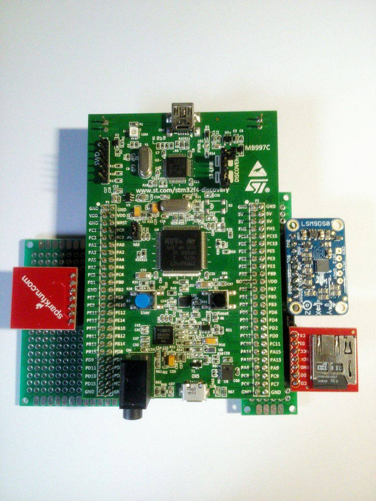   
  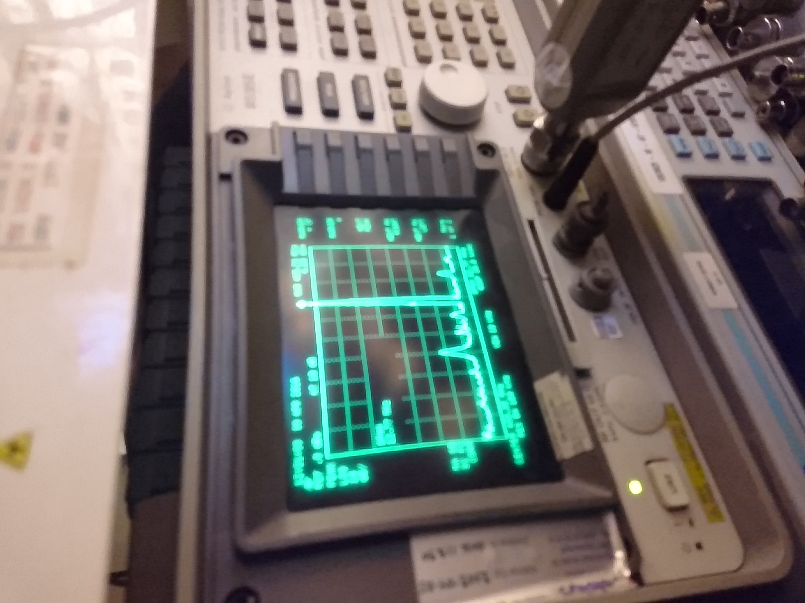
                                                                                       
  Image 5.1 OBC prototype board         Image 5.2 COMMS power amplifier testing

COMMS testing
-------------

After the COMMS PCB was designed and manufactured, there was a need for
testing, in order to verify that the board was functioning properly.

At first the datasheet and example code for MSP430 were examined. A
discovery kit was connected to a CC1120 \[15\] developers kit node,
while the other node was connected to a laptop. After a lot of
experimentation and more careful examination of the example codes, the
correct parameters for the CC1120 were found. After the successfully
communication using the developer’s kits, the actual PCB was tested,
with the same results.

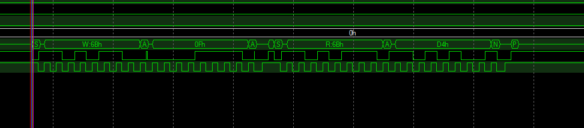

Figure 5.1 ADCS IMU
communication debugging in a logic analyzer

Listing 5.1 Unit test for HLDLC

  ---------------------------------------------------------------------------
  \#include &lt;stdio.h&gt;

  \#include "../hldlc.h"

  \#define TEST\_ARRAY 20

  int main() {

  uint8\_t in\[TEST\_ARRAY\], out\[TEST\_ARRAY\*2\], res\[TEST\_ARRAY\*2\];

  uint16\_t cnt\_in, cnt\_out, size, res\_size;

  uint8\_t c;

  printf("Starting Unit tests\\n");

  for(int i = 0; i &lt; 10; i++ ) {

  in\[i\] = i + 0x12;

  }

  res\[0\] = 0x7E;

  res\[11\] = 0x7E;

  for(int i = 1; i &lt; 11; i++ ) {

  res\[i\] = i + 0x12;

  }

  cnt\_in = 0;

  cnt\_out = 0;

  size = 10;

  res\_size = 12;

  uint8\_t check;

  printf("%d\\n", in\[0\]);

  do {

  check = HLDLC\_frame( &c, in, &cnt\_in, size);

  out\[cnt\_out++\] = c;

  } while( check != SATR\_EOT);

  for(int i = 0; i &lt; res\_size; i++ ) {

  if( out\[i\] == res\[i\] ) {

  continue;

  } else {

  printf("error\\n");

  break;

  }

  }

  return 0;

  }

Unit testing
------------

During the start of the CnC service development, it became apparent that
there was a need for testing the code without having the whole design
implemented yet.

The first tests were made by writing test programs that used the modules
functions and by simply including the modules, using t some functions
were quickly tested. Using that testing strategy some functions were
quickly tested. Soon that design came to its limitations. There was a
need to simulate functions on the same module in order to make more
elaborate tests.

Two unit testing frameworks, for C programming language were found:

-   Cmocka.

-   Unity.

Cmocka \[28\] was the first framework that was found and it initially
become the first choice. With more careful examination, the framework
has limitations that affected the correct testing of the modules.

Unity \[14\] on the other hand, was more suitable for the module design.

Unfortunately, due to time constraints, only one unit test was used from
unity framework. That test though unveiled some bugs in the code.

Static analysis
---------------

There was an effort to perform static analysis on the OBC and the
command \\& control, unfortunately the various frameworks that were used
had issues with ST's cubeMX code. The eclipse's static analyzer was used
and it uncovered some errors.

Command and control testing software
------------------------------------

After the services implementation became more mature and there was a
prototype with limited functionality, there was a need for a software to
send TC/TM commands, simulating the ground station software, which
wasn't ready at that time.

The first attempt was a quick python script. It was used for testing the
test and function management service. The discovery kit run a testing
version of the FM module, that was connected with a led. Sending on/off
commands turned the led on/off.

The python script used a serial communication and simply send a
predefined array. That array had a pre-calculated ECSS packet,
encapsulated in a HLDLC frame. Depending on the command that was wanted
to be send, the user had to uncomment that array and comment the others.
After the script send the array through the UART, it simply read
character from the UART, until the user terminated the program. It was
up to the user to decode the returned strings and to understand if the
response was correct.

Packetcraft \[1\] was the second attempt, it was written in Ruby, had a
CLI that allowed a user to send command of his choice. The commands were
implemented in YAML scripts, the user had to fill the data by hand. ECSS
and HLDLC packets were made by the packetcraft. More over response
packets was displayed in multiple formats that allowed the user to
identify the data (ascii, hexadecimal and decimal). In the latest
versions, it even allowed to add dynamic data in the packet e.g. the
current time. Using packetcraft allowed to further test the services but
after a while, it reached its limitations. The need to dynamic create
packets, the CLI was full after 50-60 commands, plus that it was written
in ruby.

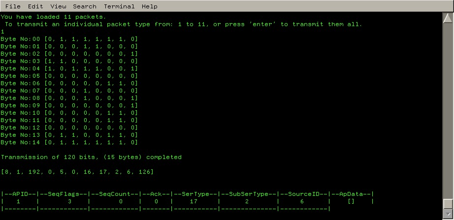

Figure 5.2 Packetcraft

Listing 5.2 Python test script

  --------------------------------------------------------------------------------------------------------
  import serial

  import array

  import time

  port = serial.Serial("/dev/tty.usbserial", baudrate=9600, timeout=1.0)

  t = array.array('B', \[126,24,1,192,185,0,5,16,17,1,6,0,99,126\]).tostring() \#test service

  t = array.array('B', \[126,24,1,192,185,0,10,16,8,1,6,1,0,0,0,8,0,124,126\]).tostring() \#led on

  \#t = array.array('B', \[126,24,1,192,185,0,10,16,8,1,6,0,0,0,0,8,0,125,93,126\]).tostring() \#led off

  port.write(t)

  while True:

  rcv = port.read(30)

  print rcv.encode('hex')

  print rcv

  time.sleep(0.1)
    
SatNOGS client, command and control module
------------------------------------------

SatNOGS client was intended to be used as the default command and
control software from the beginning. Due to the time pressure, it was
left to be built after the completion of UPSat since there will be more
available time then. But as soon as the limitations of packetcraft were
reached, it was clear that the command and control part of the client
needed to happen as soon as possible.

The backend is in python, UI with HTML, CSS and JavaScript. The service
utilities unpack, pack function was ported from C to python. The packet
format was dynamic created from the UI and is send to the backend to be
encapsulated in a ECSS services packet and then in a HLDLC frame, in the
case the packet was using the UART. The development of the CnC part of
the SatNOGS gave a further push to the testing. The user could send
commands dynamic formed from the UI and see the response as a text
processed from the client. Finally, the used of storing logs gave the
opportunity to left UPSat several days working and then examine the logs
for incorrect behavior.

  ------------------------------------------------------------------------------------------------------------------------------------------------------------------------------
  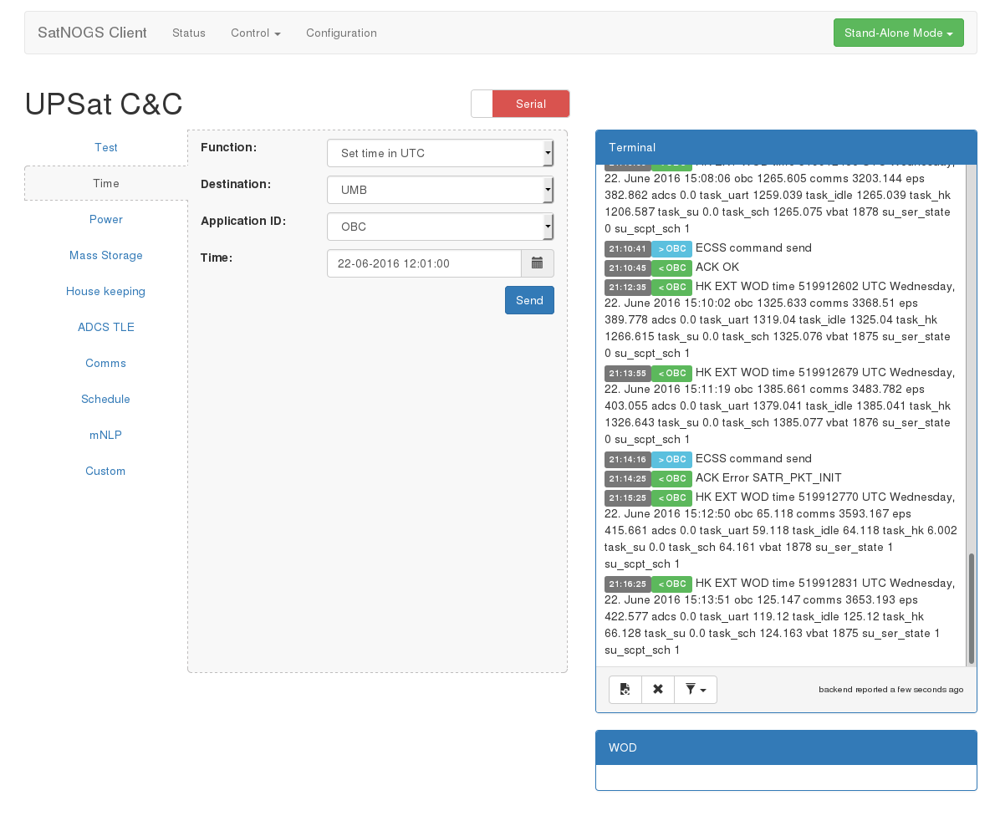   
  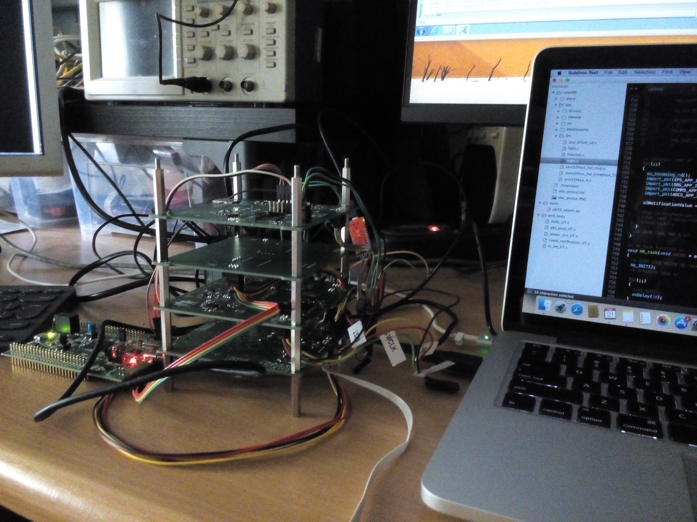
                                                                                         
  Figure 5.3 UPSat command and control    Image 5.3 UPSat stack prototype boards

Debug tools, techniques
-----------------------

In this section, the techniques and the tools that was used are
discussed.

Listing 5.3 UART debugging macro used in the ADCS subsystem.

  --------------------------------------------------------
  \#if ADCS\_UART\_DBG\_EN

  \#define LOG\_UART\_DBG(huart, M, ...) \\

  snprintf(\_log\_uart\_buffer, ADCS\_UART\_BUF\_LEN, \\

  "\[DEBUG\] %s:%d: " M , \\

  \_\_FILE\_\_, \_\_LINE\_\_, \#\#\_\_VA\_ARGS\_\_); \\

  HAL\_UART\_Transmit (huart, \_log\_uart\_buffer, \\

  strlen (\_log\_uart\_buffer), UART\_DBG\_TIMEOUT); \\

### UART

First, the simplest technique is the use of an UART to output debug
messages. The main advantage is the simplicity of the technique, UART
was the first peripheral used in the microcontroller of the subsystem.
After the integration of all subsystems and the use of 1 UART in the
umbilical, for debugging and CnC, the debug messages couldn’t to be
forwarded due to non HLDLC frames drop. For that reason, an event
service packet was used to encapsulate the debug message and forward it
to the ground station. The debug messages had to be in ASCII format.
Moreover, since the debug messages could flood the ground station with
traffic leaving the user unable to view the messages and send commands,
for that reason a new device id was created so that it could control the
flow using the function management service. The main use of the UART
debug is to have quick debug messages, raw data from the GPS, before the
CnC part of the client was ready. The limitation of that technique is
that the UART is slow compare to microcontroller timings. If a block
write operation is used, it takes critical milliseconds front the
system, thus affecting the system behavior.

### ST link and SWD

The STM32 Discovery kit has on-board a Serial Wire Debug (SWD)
interface, that can be used with internal or external targets. Using SWD
we can perform debugging in real time. SWD is mainly used with
breakpoints, A breakpoint is associated with a line of code, when that
line is about to be used, the program stops in real time. That way an
inspection of the state of the subsystem can be performed, by viewing
the value of variables etc. In the case of an error, there is the
possibility to perform step by step instruction examination, so the
source of the error can be traced.

Using assertions combined with a breakpoint in the calling function,
allowed us to have the system running for a long duration and halt only
when there a was an error. Having a single function called on all errors
allowed not to waste breakpoints in multiple locations and not to add
manually breakpoints in every point of error handling.

As was mentioned earlier, the event service was used for debugging, an
event packet could carry debug messages and significant events like
subsystem reboot.

  ----------------------------------------------------------------------------------------------------------------------------------------------------------------------------------------------
  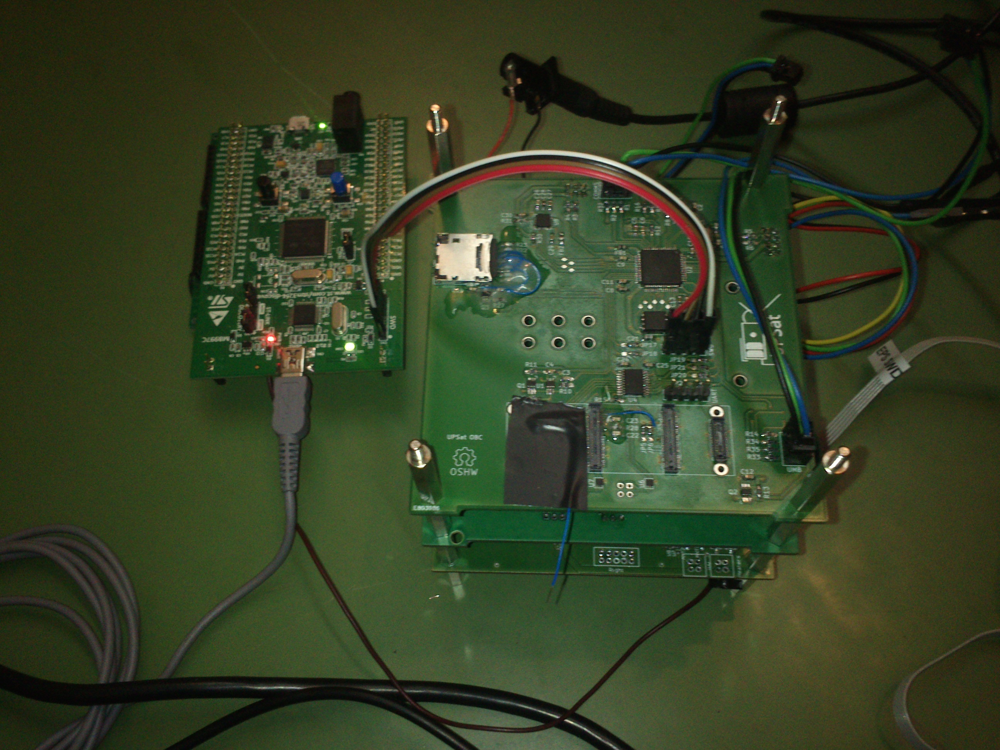                   
  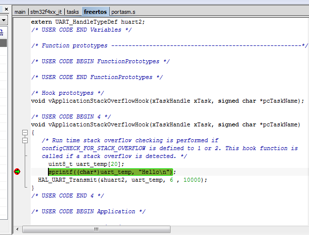
                                                                                                         
  Image 5.4 The on-board ST-link connected to the stack   Figure 5.4 Example use of a breakpoint

### Segger J-Link

The ST-link found on-board the discovery kit has some limitations that
hinder the testing process e.g. the number of breakpoints is limited to
8.

Segger's J-Link not only overcomes these limitations with unlimited
breakpoints but also offer some extra functionality like Real Time
Transfer (RTT) that the systemview uses to interact with the
microcontroller.

Moreover, Segger provides an ecosystem with free software like
systemview and J-scope that are invaluable during testing.

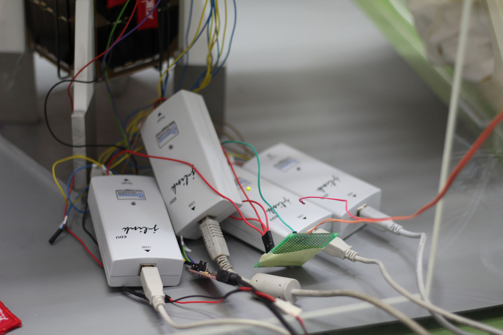

Image 5.5 J-links
connected to UPSat for debugging

### Segger systemview

Finally, even though the above techniques worked fine, they didn’t allow
to have a continuous view of the system without addicting it. The UART
and event packet, generated traffic that was hindering with the normal
operation of the system and SWD need to pause the system in order to
view its state. A way was needed to test the system using techniques
that had minimal effect. That way was found in Seggers systemview. In
addition, systemview had native support for FreeRTOS.

In order to use systemview with freeRTOS analytics in OBC, the
systemview headers had to be included in FreeRTOS files. For better
examination of the results the ISR names were manually added in
systemview configuration file. Finally, the sysview module files were
added in repository in the core folder.

Listing 5.4 ISR naming in systemview

  SEGGER\_SYSVIEW\_SendSysDesc("I\#15=SysTick,I\#53=EPS\_U1,I\#54=SU\_U2,I\#55=UMB\_U3,I\#65=SDIO,I\#67=IAC\_SPI3,I\#68=COMMS\_U4,I\#87=ADCS\_U6,I\#86=EPS\_DMA,I\#33=SU\_DMA,I\#30=UMB\_DMA,I\#31=COMMS\_DMA,I\#70=ADCS\_DMA");

The SYSVIEW definition enables the sysview module. All subsystems must
include the sysview functions. If the sysview functionality is disable,
all the definitions and functions remain empty. This happens because
sysview events are called in different ECSS modules. If the module is
enabled sysview defines the structures needed for systemview to register
and display new events. Trace definitions are called from other modules,
systemview modules form from structures that have specific ids for that
events, the type of the event parameter, plus a description for that
event. Using different structures for events helps to group them. All
subsystems should initialize all modules, even if they don't use them.

If the subsystem doesn't have RTOS, there is a bare metal configuration.
Besides the sysview module, for systemview to work, the subsystems need
to include the systemview source files. The code and configuration are
taken from Segger website \[10\].

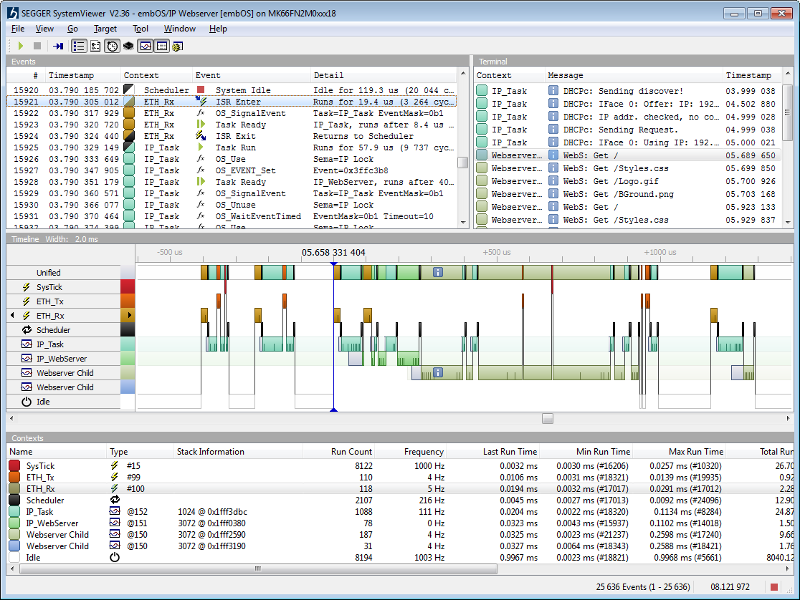

Figure 5.5 Systemview
events display

RTOS and services timing analysis
---------------------------------

After most of the modules were implemented and adequate tested, there
was the need to make the timing profile of the services, to evaluate the
RTOS behavior and check if the real-time constraints were met.

There were 3 main concerns about the systems behavior:

-   If the timing of the tasks were quick enough, for the next packet to
    be processed in time.

-   The duration of mass storage services operations. SD memory are
    general a lot slower than onboard flash operations

-   If the FreeRTOS scheduler would handle the task switch in time so
    that wouldn't hinder operation.

### Python script

The first set of tests were performed, in order to identify packet loss
and get a sense of the systems process times. The concept was to send
continuous test packets and measure how many responses were lost.

The first attempt was made with a python script running in a PC. No
packet losses were detected but the script couldn't stress the OBC
enough. The script needed a 1ms delay between each packet or else the
script stopped functioning.

### Arduino stress test

In order to stress test the OBC, an Arduino Due was used. A program was
made, that was sending repeatable test service packets to all 4 UARTs of
the OBC, simulating the OBC's connections (ADCS, COMMS, EPS, umbilical).
The program compared the packets send with the responses received and
calculated the packet loss. The Arduino Due was used, due to the 3.3v of
the pins and 4 hardware UARTs.

The test was left running for a long period of time, and after 4.000.000
total packets there weren't any loses.

### Packet processing time analysis

the next step is to calculate the exact operation timings of the
services. The time analysis was performed with the use of SWD and
systemview.

### Packet pool timestamp

The packet pool module was modified, so when a packet was used a
timestamp field was updated, with the current time. When the same packet
was about to get released, the difference of the timestamp and the
current time, showed the time spend on the packet processing. Tests were
made with different service packets and they result was 1ms. The timer
used for time keeping has resolution of 1ms, so the processing time
could have been less than 1ms.

The tests had 2 versions. First the OBC was in running mode, having a
breakpoint after the time calculation were performed. After the time was
noted, the OBC was put in running mode again, waiting to test another
packet. This allowed to examine each packet's timings individually. In
the second version, the OBC was in running mode and the times of each
packet was displayed in "live mode". Live mode was a debugging mode of
the SWD that allowed variables to be displayed without stopping the
program. The only issue was that the update of the values was a bit slow
taking 1-2 seconds. Even though there was loss of information due to the
delay, that way enabled to get an indication for nonstop operation.

### Systemview

Tests performed with systemview gave a perfect view of the OBC
internals. Systemview has a great advantage that it's use on the system
has minimal impact.

Tests were performed with the OBC standalone, OBC connect with other
subsystems in the UPSat testing stack and finally in the live satellite.

With the aid of systemview, a bug was found, due to the nature of the
bug it would be impossible to find without systemview.

When a new packet arrives, the interrupt responsible for packet
reception signals the FreeRTOS scheduler to make a task switch if
necessary, to the UART task, so the packet is processed as soon as
possible. An instruction necessary for the signaling was omitted so
after a new packet arrived, the UART task was put on the tasks ready
list but it started running after a variable time of 1-400ms and not
immediately. When the instruction was added the issue was solved and the
task run instantly.

  ---------------------------------------------------------------------------------------------------------------------------------------------------------------------------
  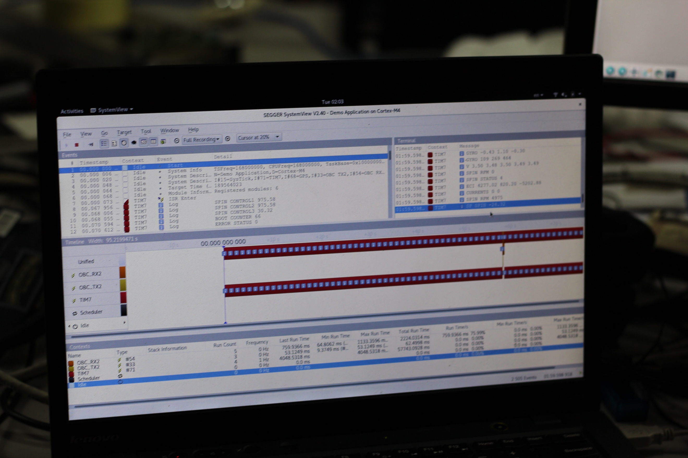   
  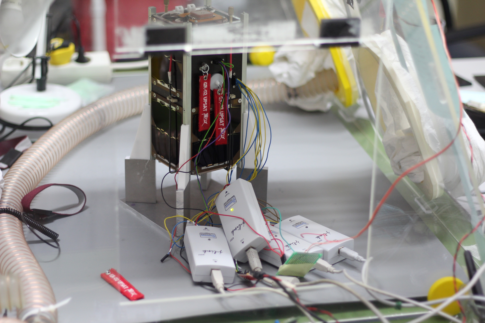
                                                                                          
  Image 5.6 UPSat systemview               Image 5.7 UPSat systemview testing

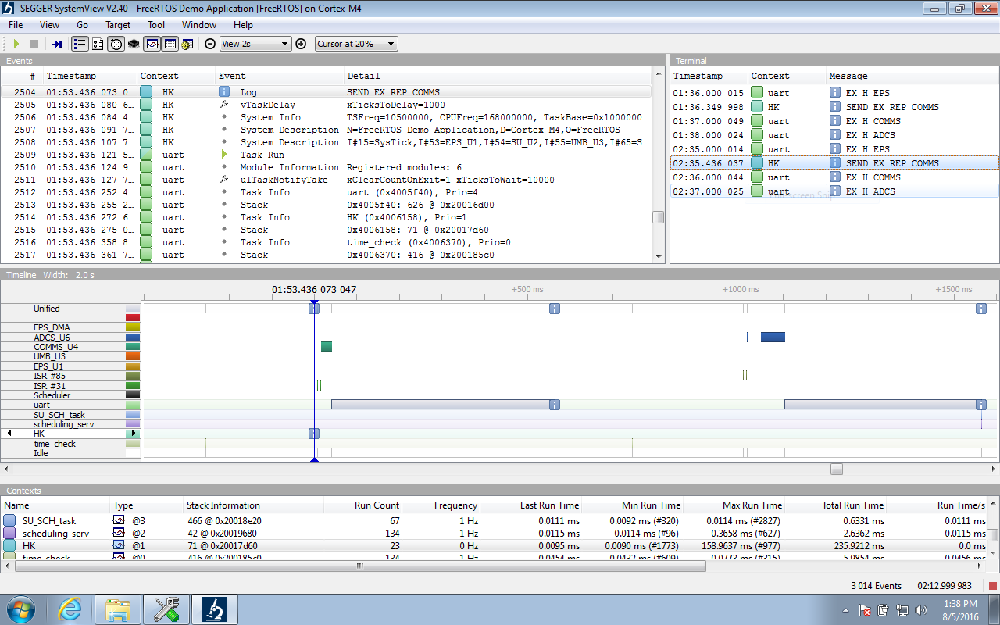

Figure 5.6 OBC extended
WOD communications

As it was suggested from previous findings, most of the packets showed a
processing time less than 1ms.

A surprising finding was that the idle time of the microcontroller in
normal operation, was close to 100\\%. Even though it was hoped that the
service operation would be fast, it didn't suspect to be that fast. In
normal operation, the OBC handles tasks like housekeeping, logging etc.

From the start of the project, one of my main concerns, was the behavior
of the SD card and particularly the timing in relation with other
modules.

From the start the mass storage, was expected to break the real-time
constraints of the OBC and the tests verified it. Unfortunately, there
wasn't much that could be have done in the projects time restrictions.

Real time constraints are broken only when the ground station interacts
with the mass storage service. In housekeeping, the mass storage runs in
the housekeeping task and it doesn't affect processing of the incoming
packets. When the ground station, searches, uploads or downloads files
there is a delay of \~100ms.

With more careful analysis, the breaking of the real-time constraints
resolves to a minor issue. The reason is that this happens only with
ground station interaction, when there is communication with the earth,
the housekeeping activity is suspended, so there aren’t any logs lost.
there isn't an issue for packet loss since the ground station initiates
the communication, even if there is packet loss the ground user should
request again the information. In any case the time delay of the mass
storage is very small for a human. Finally, the communication window is
very small compared to normal operation.

Tests were also made for timing in searching/storing/loading files, with
different number of files in storage, from 0 to the maximum of 5000
files in a mass service store. These tests were made, in order to
examine if timing was relative to the number of files present in the
store. The results showed no change in timings.

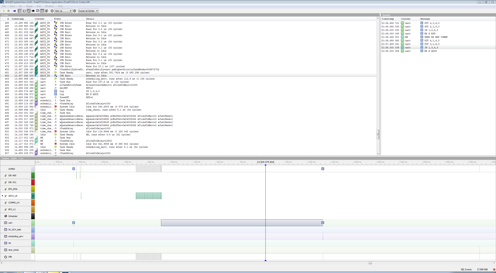

Figure 5.7 Delay before
task notification fix

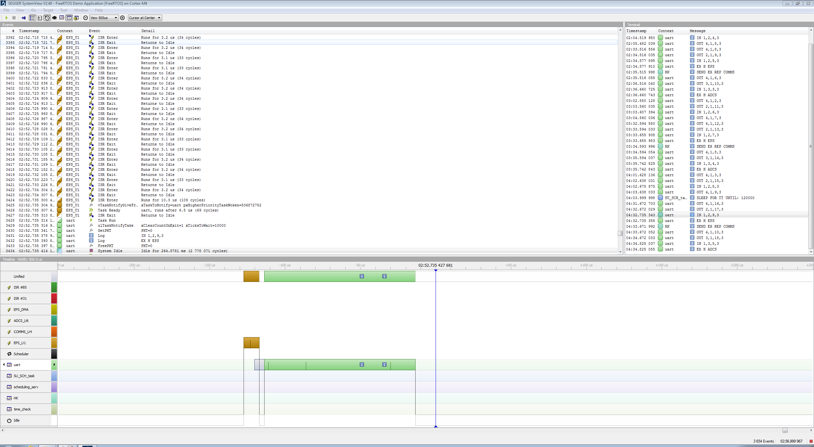

Figure 5.8 Delay after
task notification fix

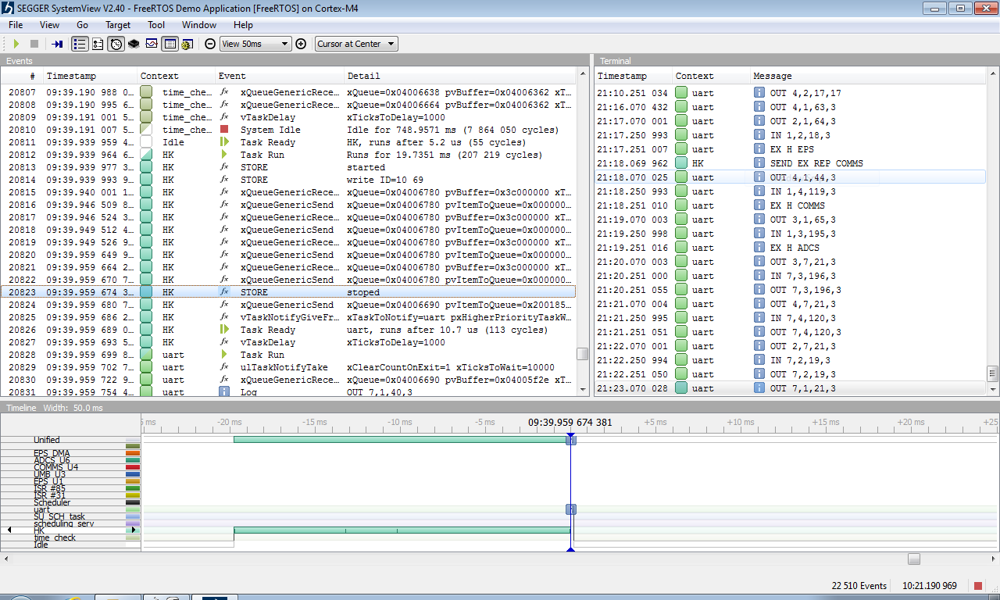

Figure 5.9 Mass storage
service WOD storage

ECSS statistics
---------------

During the early testing phase, it was easily found using techniques
discussed in the previous sections, that there weren't any packet
losses. But as the subsystem integrated and UPSat became more complex
and the previous techniques couldn't longer be used, there was a need to
discover if there were packet losses after hours of continuous
operation. For that reason, the ECSS statistics module was created.

The implementation was very easy: every subsystem has 2 arrays for
incoming and outgoing packets. Each cell of the array holds a counter
that corresponds to a subsystem. Every time a packet is received or
transmitted the counter is received. By comparing the incoming and
outgoing counters in the subsystems it would be possible to figure if
there were packet losses e.g. if the ADCS had send to the EPS 6 packets
but the EPS had received only 4, there would be 2 packets missing.

The housekeeping service was used to send the statistics to the operator
during testing. The ECSS statistics were given a unique structure ID and
they were configured to transmit the information every 60 seconds during
the testing phase. The ECSS statistics functionality was left after the
testing phases finished but the information is only send per operator
request and automatically.

Unfortunately, there wasn't enough time to fully analyze the statistics
during testing but some early results showed no significant packet loss.

System operation test
---------------------

During orbit, UPSat would have to continuously operate for months. In
order to simulate that condition and to check for bugs that might happen
after a while, UPSat was

The state of the UPSat was determined by WOD and extended WOD.

WOD and extended WOD was continuously collected through the umbilical
and RF communication, examined and logged.

The first check was to see if a subsystem had a reset and what was the
reason. Periodically UPSat was tested for correct operation through the
command and control module. The tests included test service operation in
all subsystems, health checks and correct logging of housekeeping in
mass storage.

Systemview was running along the system operation test, for further
examination, in case there was an error.

The logs where analyzed by the team by using a custom python script that
plotted UPSat parameters.

  --------------------------------------------------------------------------------------------------------------------------------------------------------------------------------------------
  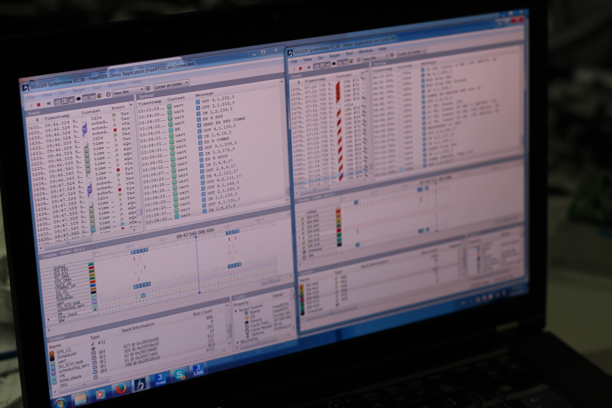            
  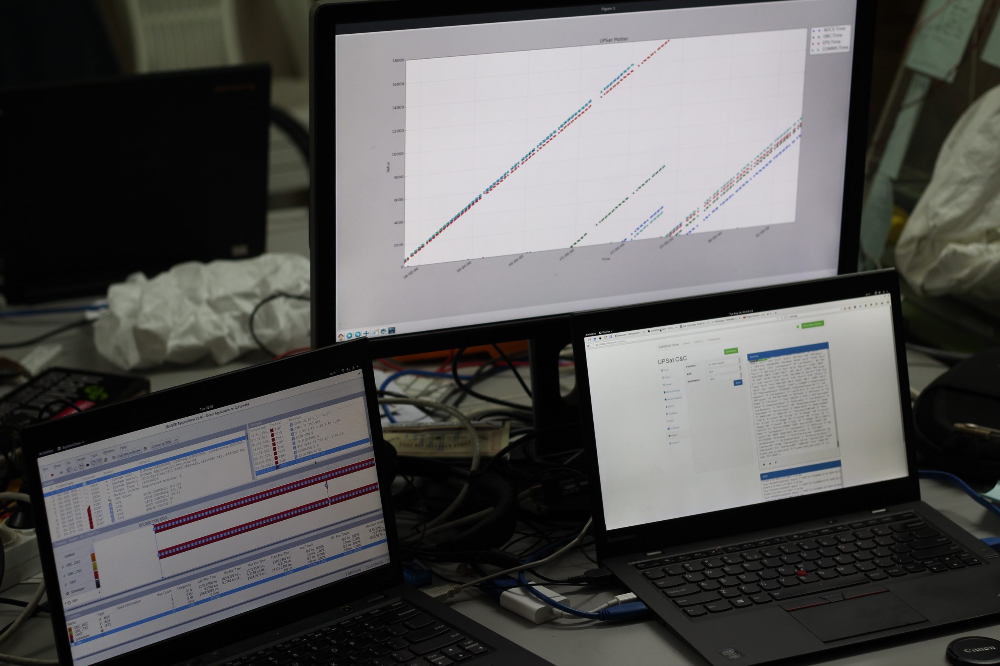
                                                                                                  
  Image 5.8 UPSat systemview testing operation     Image 5.9 UPSat systemview operational plot

  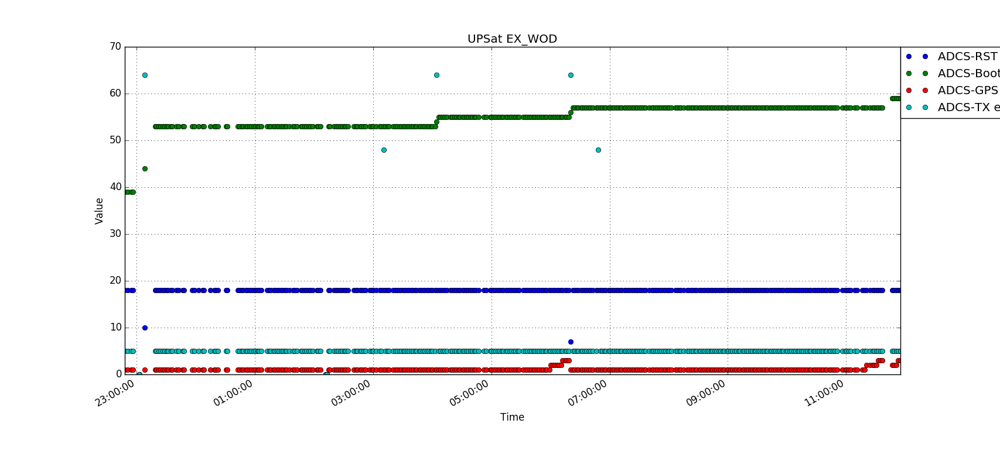

  Image 5.10 UPSat extended WOD operational plot

Functional tests
----------------

One of the QB50 requirements were the validation of functionality before
and after various tests (TVAC, vibration etc) with the use of functional
tests. QB50 states a generic description of the tests and it's up to the
team to implement it.

In most cases, e.g. when verification that the subsystem is operational
the test service is used. In some cases, the tests weren't applicable to
UPSat so they weren't implemented.

e2e tests
---------

QB50 required to run a set of tests that prove that SU is handled
properly. These tests included time handling, SU script upload and load,
SU script running on time, SU logs stored and verification of correct
operation by downloading SU logs through mass storage service and
analysis.

Even though these tests are for the SU by running them, all system
functionality is tested. After all, UPSat primary exists for the SU
operation: EPS SU power management, RF communication, ground station
operation, ECSS services mass storage etc, OBC RTOS task timing, proper
script handling and finally the SU interface.

One issue that was discovered during the e2e tests, with the aid of
systemview, was that sometimes the SU script engine task run delayed.
This was due to different priorities in the task that had the script
engine and the task that kept the timing. It was corrected by signaling
a task switch. Since the delay start of the task happened randomly,
without systemview it would have been impossible to discover the exact
nature of the bug.

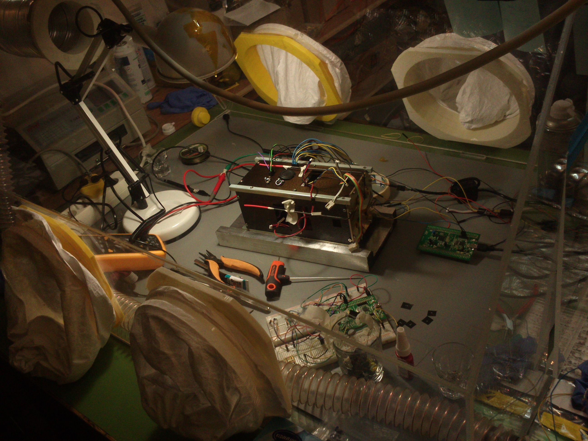

Image 5.11 During S.U.
E2E tests

Table 5.1 Functional test
list and description

  Test ID   Test Verification Description
  --------- ------------------------------------------------------------------------------------------------------------------
  OBC01     Verify that EPS supplies power to OBC board
  OBC02     Verify that OBC receives power and commands through umbilical connector
  OBC03     Verify that OBC transmits data to COMM subsystem.
  OBC04     Verify that OBC receives and stores in the memory data from COMM subsystem.
  OBC05     Verify that OBC can access and read data stored in memory.
  OBC06     Verify that OBC can read, store and transmit to COMM sub-system, data coming from sensors or subsystems boarded.
  COM08     Verify that COMM subsystem transmits signals to OBC.
  COM09     Verify that transceiver decodes the received signals into the expected data format.
  COM10     Verify that transceiver encodes the received signals from OBC into the expected data format.
  COM12     Verify the capability to shut down the transmitter after receiving the transmitter shutdown command.
  COM13     Verify that a power reboot doesn't re-enable the transmitter after receiving the shutdown command.
  COM16     Verify beacon timing and transmitted data.
  COM17     Verify and establish communications with the ground station.
  EPS02     Verify battery voltage both with GSE and by telemetry data reading.
  EPS04     Verify battery voltage both with GSE and by telemetry data reading after a complete charge and discharge cycle.
  EPS05     Verify battery temperature readings by telemetry.
  EPS09     Verify that solar panels provide expected voltage and power outputs when enlightened.
  ACS01     Verify that power is supplied to ADCS board(s).
  ACS02     Verify capability to enable/disable power to ADCS.
  ACS03     Verify magnetic field intensity measurements of magnetometers.
  ACS04     Verify that power is supplied to magneto-torquers.
  ACS05     Verify the capability to enable/disable power to coils.
  ACS06     Verify polarity of magneto-torquers.
  ACS08     Verify that ADCS sensors data are consistent (gyroscopes, accelerometers, etc).
  ACS09     Verify power supplying to GPS antenna.
  ACS10     Verify GPS telemetry.
  ACS11     Verify that power is supplied to momentum wheels.
  PLU01     Verify power supplying to the payload.
  PLU02     Verify that payload unit receives signals from OBC.
  PLU04     Verify that OBC is capable to enable/disable power to the payload unit.
  SEU04     Verify that OBC is capable to enable/disable power to the payload unit.

Environmental testing
---------------------

Among the software tests, in order to be eligible to launch, UPSat
needed to pass environmental testing.

Thermal vacuum testing, simulates the conditions in space. The tests are
different thermal scenarios: heating, cooling, and cycles of cool and
heat, while UPSat resides in vacuum.

  -------------------------------------------------------------------------------------------------------------------------------------------------------------------------------------
  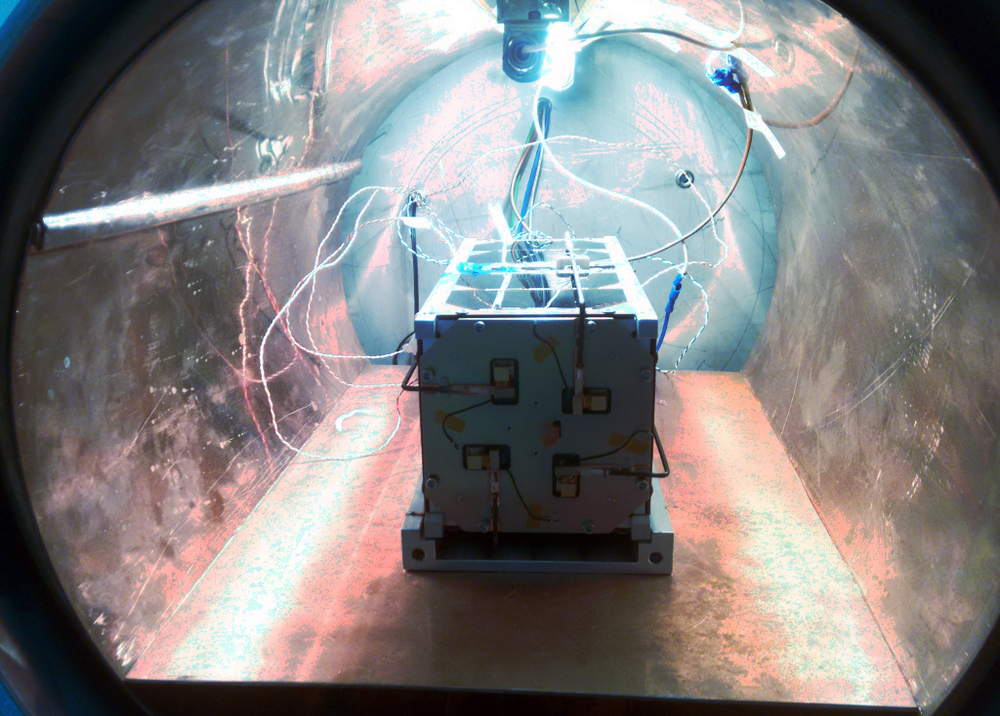   
  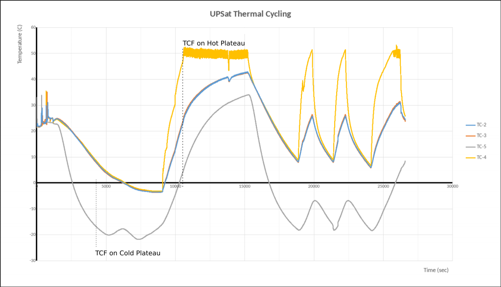
                                                                                         
  Image 5.12 TVAC chamber with UPSat      Image 5.13 TVAC results
  -------------------------------------------------------------------------------------- ----------------------------------------------------------------------------------------------
  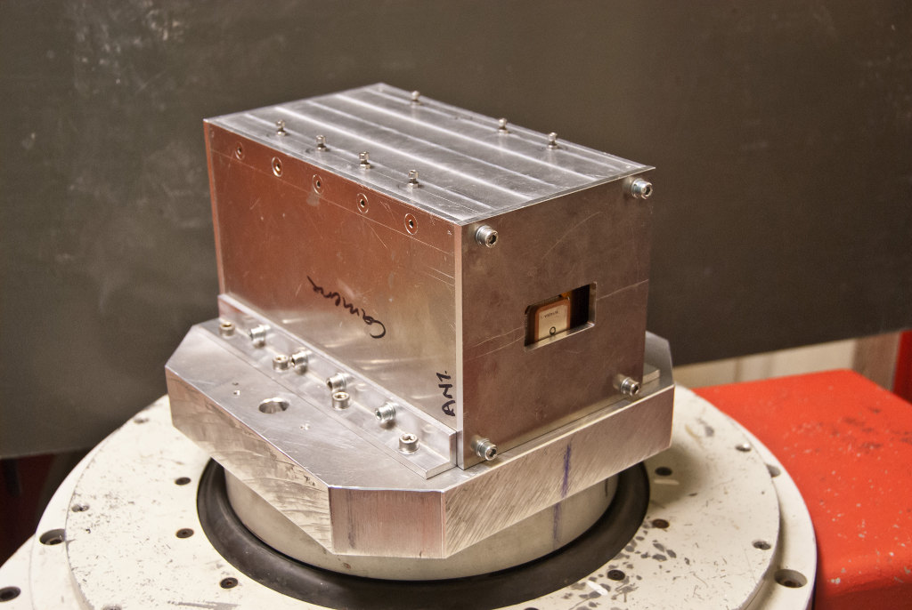    
  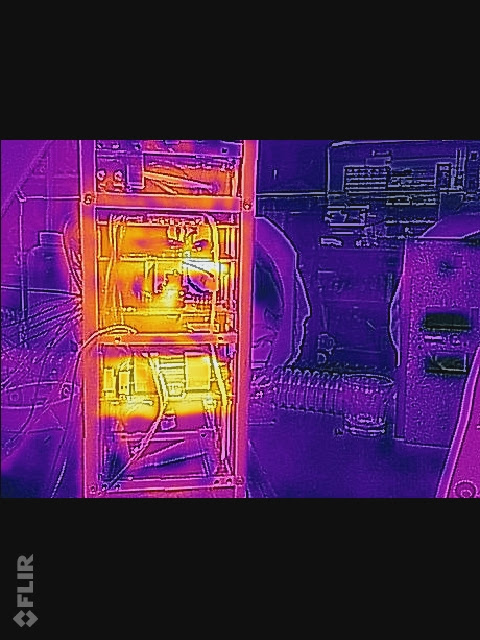
                                                                                         
  Image 5.14 UPSat vibration test pod     Image 5.15 UPSat subsystem thermal inspection
  -------------------------------------------------------------------------------------------------------------------------------------------------------------------------------------

Testing campaign
----------------

In this section, an overview of the testing, will be described.

In the beginning the first tests for ECSS modules, were made with unit
testing. Also, some concepts and the subsystems peripherals were tested,
in the development kit and early phase PCBs.

As the design became more mature, tests happened with the use of SWD.
The use of assertions made testing a lot easier. Using a python script
and later packetcraft, ECSS services were tested. The combination of SWD
and packetcraft gave a better understanding of the systems behavior.
Using custom code, timings were measured. As packetcraft got to its
limitations, the SatNOGS client command and control module was
developed.

In order to get the complete view of the subsystems behaviour and
perform timing analysis, systemview was used. Systemview gave task
timings and ECSS modules events display with almost no disturbance in
the system. It was first used in each subsystem separately and as
integration finished, it was used in all subsystems simultaneously.

As the SU e2e tests were mandatory from QB50, were also used to stress
the UPSat. Finally, UPSat was left operating in normal conditions, for
several days with continuous monitoring and command and control testing.

Conclusions
===========

During the development of UPSat, there was a phrase that you could hear
a lot: "we will do this in the next satellite", meaning all the features
that we wanted to implement but we couldn't due to the time constraints.

Managing to make a CubeSat in approximately 6 months starting almost
from scratch especially in software, was a herculean task and I am not
suggesting it to anyone. Indeed, most of the people working managed to
sleep very little during these six months, including my shelf.

After UPSat passed all the tests and was successful delivered to
Isispace, the first CubeSat of the QB50 program and in total of 35
CubeSats, we all felt a sense of relief accompanied with exhaustion
along with a thirst for more.

In this final chapter, we will discuss the key points that made this
project successful, the things we wanted to add or refactor and the
things we hope to make in the future.

Project key points
------------------

In my opinion, the success of the project can be attributed to some key
points:

-   Assertions and use of JPL's 10 rules.

-   The use of the ECSS standard.

-   Systemview and J-link.

-   The people comprising the team.

-   The use of FreeRTOS.

-   Good design of the project with software modularity and
    re usability.

The use of assertions made possible to catch many early errors, plus
some bugs that otherwise would be difficult to find. The use of one
global error handling function made easier to debug in real time.

The general adoption of the 10 rules made design easier since it
provided a general guideline even if we didn't always follow the rules
due to the strict times. It is worth mentioning that rule 4 and 5 were
validated from our experience. Indeed, the only functions that were
larger that 60 lines were the most difficult to work with parts of the
software and most functions had at least 2 assertions.

Using the ECSS specification we had a well-tested template for the
command and control design while we didn't have to made a protocol from
scratch. Due to the great structure of the specification we didn't worry
if the design was safe enough to use.

With systemview, the system behavior analysis become a breeze, while
having the system behaving as close to production code as possible.
Systemview allowed to debug and test the system in a more efficient way
than other techniques used before.

Working with FreeRTOS was easier than it was thought before I start the
project. The only issues were resets due to stack overflow. That
behavior was easily identified and with some trial and error, the
correct stack parameters were found. The only bug that was found in
FreeRTOS, was an assertion on memory release, that wasn't allowed due to
heap 1 usage.

The design of software with modularity and fault containment in mind
simplified the fault tolerance approach while made testing easier.

Finally, the people comprising the team were a good match, with the
right technical skills and attitude. Even if communication wasn't the
best at time due to the frantic rhythms there were always good faith
that allowed to resolve disputes and continue working.

Simplicity
----------

As a general feeling that I had reading all the literature about safety
critical code and after finishing the project was a sense that
simplicity is key when designing for safety critical. Simple software
and hardware designs lead to better clarity, showing better the design
intention, less misconceptions and finally software less prone to bugs.
Sure, some designs can have better performance and less lines of code
but that could lead to undefined behaviours in C, a situation that isn't
always understood by C developers and less safe code. Complex designs in
tented for fault tolerant systems could introduce faults in the systems
by adding to the level of complexity.

In my opinion safe is intertwined with simplicity.

Refactor
--------

Things I've should have done if I knew better:

Start developing the SatNOGS client from the start, in order to use it
for testing. There was too much effort put in packetcraft, that it was
later in the project aborted. That would had saved valuable time.

The developers used different environments for the development, from the
ST's libraries to compiler versions compilers and operating systems.
That could lead to introduction of subtle errors that would had been
very difficult to discover. It also made testing different subsystems
difficult since different settings would had been used, wasting time
that would had been used in more testing. The solution to that would had
been to share a virtual machine image with all the tools used installed,
that would had given the same environment, minimizing error introduced
from different versions.

Adding mass storage in all subsystems. That would have allowed that
every subsystem could store configuration parameters and events.

One of the most difficult part of the development was the design and
implementation of the mass storage service. The use of the FAT file
system FatFS library was partial responsible due to the nature of FAT
file system that is unsuitable for the project and the insufficient
documentation of the library.

Use of FreeRTOS in all subsystems. that would had minimized development
time used in designing simple task handlers and would lead to simpler
designs with tasks. The only reason that we didn't used FreeRTOS from
the start was because we didn't had the experience working with it and
didn't wanted to take the risk.

Definitely more testing and automation. Unit testing, hardware in the
loop, testing integration of SatNOGS client and systemview. Testing is
never enough.

Implementation of the event services used with mass storage in all
subsystems. This will allow better monitoring and debugging in the case
of failures during orbit.

Adding more hardware and software fault tolerance. In UPSat due to the
time restrictions, fault tolerance was at a minimum level.

Future work
-----------

"At present software is lagging behind hardware in modularity and
reusability, and represents the largest hurdle to delivering CubeSat
missions.” \[19\] Derived from our experience from the participation of
UPSat which was designed from scratch, this a perfect representation of
the state of software for a CubeSat mission implementation. If you take
into consideration the trend to shift the fault tolerance from hardware
to software, this makes it critical to provide better software in order
to make space development easier.

With that in mind, together with the experience accumulated from UPSat
design my goal is to create a software framework that handles all the
low-level fault tolerance and radiation protection, so that the operator
focuses in the mission development. Using the framework will provide
more reliability thus making CubeSat a target for more difficult
missions away from the protected LEO.

Finally, I would like to think that our work contributed back to the
community and will provide the future engineer a reference in the design
so he won't fail in the same pitfalls as us and won't have to reinvent
the wheel.

**Godspeed UPSat**

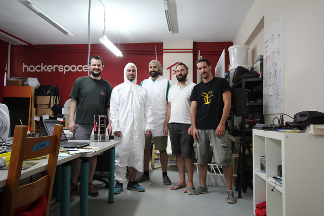

Image 6.1 Some people of
the team, the day before the delivery

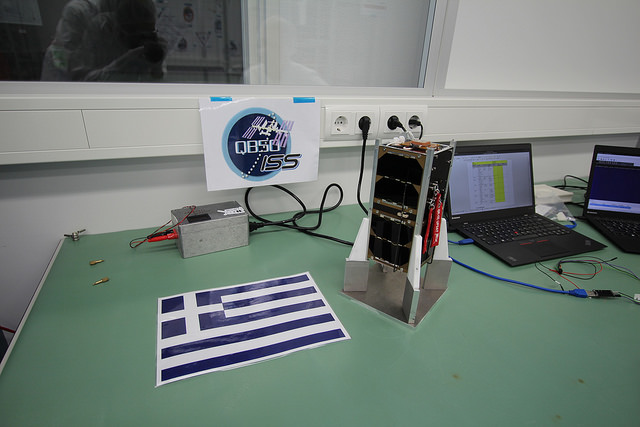

Image 6.2 UPSat during
the final tests before delivery

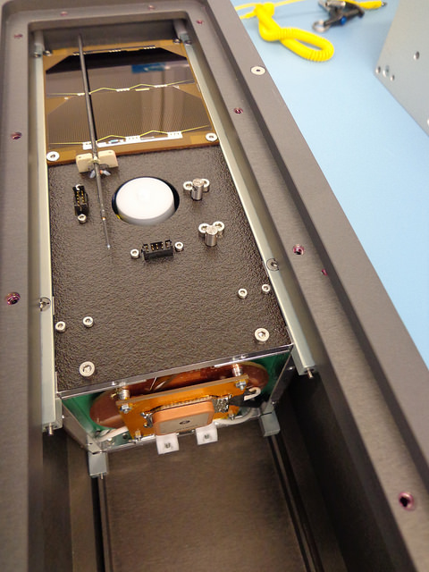

Image 6.3 UPSat in the
Nanorack's deployment pod.

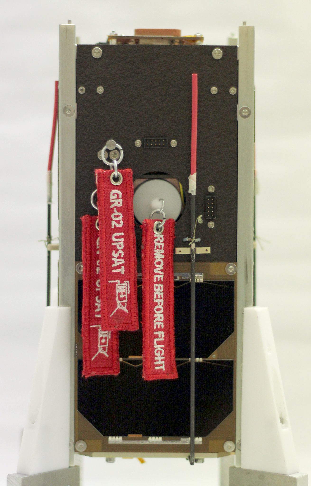

Image 6.4 UPSat

Image 6.5 the CYGNUS
supply ship that had UPSat, before docking to ISS

Image 6.6 UPSat along
with 2 other CubeSats released from ISS

REFERENCES 
==========

1.  https://github.com/librespacefoundation/packetcraft.

<!-- -->

1.  https://hackernoon.com/so-you-think-you-know-c-8d4e2cd6f6a6.j5lzd64lt.

2.  https://librespacefoundation.org/.

3.  https://network.SatNOGS.org/.

4.  https://riot-os.org/.

5.  https://upsat.gr/.

6.  https://www.micrium.com/rtos/.

7.  https://www.qb50.eu/.

8.  <https://www.segger.com/embos.html>.

9.  https://www.segger.com/systemview.html.

10. https://www.vki.ac.be/index.php/news-topmenu-238/318-qb50-project.

11. http://www.freertos.org/.

12. http://www.nanosats.eu/.

13. http://www.throwtheswitch.org/unity/.

14. http://www.ti.com/lit/ds/symlink/cc1120.pdf.

15. http://www.windriver.com/products/vxworks/.

16. JPL Institutional Coding Standard for the C Programming Language.

17. MISRA-C:2004.

18. Small Spacecraft Technology State of the Art.

19. Whole Orbit Data Packet Format.

20. Ben cheLf AnDY chou BRYAn fuLton-seth hALLem chARLes henRi GRos AsYA

KAmsKY scott mcPeAK AL BesseY, Ken BLocK and DAWson enGLeR. A few
Billion Lines of code Later using static Analysis to find Bugs in the
Real World.

1.  Ken Y. Oyadomari Cedric Priscal-Rogan S. Shimmin Oriol Tintore
    Gazulla Jasper

L. Wolfe. Alberto Guillen Salas, Watson Attai. PHONESAT IN-FLIGHT
EXPERIENCE

RESULTS.

1.  Barr. Embedded C Coding Standard.

2.  Ted Choueiri Benoit Cosandier, Florian George. SwissCube Flight
    Software Architecture.

3.  Allan H. Johnston Bruce E. Pritchard, Gary M. Swift. Radiation
    Effects Predicted,

Observed, and Compared for Spacecraft Systems.

1.  Ricky W. Butler. A Primer on Architectural Level Fault Tolerance.

2.  Checksum. <https://en.wikipedia.org/wiki/checksum>.

3.  CMOCKA. <https://cmocka.org/>.

4.  Priya Narasimhan. Daniel P. Siewiorek. FAULT-TOLERANT ARCHITECTURES
    FOR

SPACE AND AVIONICS APPLICATIONS.

1.  Michael Dowd. How Rad Hard Do You Need? The Changing Approach To
    Space

Parts Selection?

1.  ESA. C and C++ Coding Standards.

2.  FatFS. http://elm-chan.org/fsw/ff/00index e .html.

3.  Fat file system. <http://rtcmagazine.com/articles/view/100892>.

4.  Jr. Frederick P. Brooks. No silver bullet: essence and accident in
    software engineering.

5.  GomSpace. <http://gomspace.com/>.

6.  André Emile Heunis. Design and Implementation of Generic Flight
    Software for a CubeSat.

7.  Gerard J. Holzmann. Code Clarity.

8.  Gerard J. Holzmann. Landing a Spacecraft on Mars.

9.  Gerard J. Holzmann. The Power of Ten Rules for Developing Safety
    Critical Code.

10. Thomas Honold.Seventeen
    steps tohttp://www.embedded.com/design/programming-languages-and-tools/4215552/seventeen-steps-to-safer-c-code.

11. Diaa Jadaan. Memory management and error handling in FreeRTOS for a
    CubeSat project.

12. Robert E. Lombardi Kelly A. Long Justin J. Likar, Stephen E. Stone.
    Novel Radiation Design Approach for CubeSat Based Missions.

13. D. L. Wood J. H. Beall P. P. Shirvani N. Oh E. J. McCluskey M. N.
    Lovellette, K. S. Wood. Strategies for Fault-Tolerant, Space-Based
    Computing: Lessons Learned from the ARGOS Testbed.

14. Gerard J. Holzmann Michael McDougall. Experience using The Power of
    Ten coding rules.

15. Nicolas Steiner Ted Choueiri Florian George Guillaume Roethlisberger
    Noémy Scheidegger Hervé Peter-Contesse Maurice Borgeaud Renato
    Krpoun Herbert Shea Muriel Noca,Fabien Jordan. Lessons Learned from
    the First Swiss Pico-Satellite: SwissCube.

16. NASA. C STYLE GUIDE.

17. Critical Design Overview. I-INSPIRE.

18. John Penix. Peter C. Mehlitz. Design for Verification with
    Dynamic Assertions.

19. John Penix. Peter C. Mehlitz. Expecting the Unexpected: Radiation
    Hardened Software.

20. Michel PIGNOL. COTS-based Applications in Space Avionics.

21. David Ratter. FPGAs ON MARS.

22. Mark N. Martin Richard H. Maurer, Martin E. Fraeman and David R.
    Roth. Harsh Environments: Space Radiation Environment, Effects,
    and Mitigation.

23. JEROD
    SANTO.<https://changelog.com/posts/one-sure-fire-way-to-improve-your-coding>.

24. Ground systems and operations. Telemetry and telecommand
    packet utilization.

25. Yung-Fu Tsai Yun-Peng Tsai Jia-Shing Sheu. Tai-Lin Kuo,
    Jyh-Ching Juanq. Flight Software Development for a
    University Microsatellite.

26. Christian Dietrich Horst Schirmeier Martin Hoffmann-Olaf Spinczyk
    Daniel Lohmann Flávio Rech Wagner Thiago Santini, Christoph Borchert
    and Paolo Rech. Evaluating the Radiation Reliability of
    Dependability-Oriented Real-Time Operating Systems.

27. Wilfredo Langley Torres-Pomales. Software Fault Tolerance:
    A Tutorial.

28. Wikipedia.
    <https://en.wikipedia.org/wiki/airdatainertialreferenceunit>.

29. Wikipedia. <https://en.wikipedia.org/wiki/faulttolerance>.

30. Wikipedia. <https://en.wikipedia.org/wiki/fileallocationtable>.

31. Wikipedia.
    <https://en.wikipedia.org/wiki/high-leveldatalinkcontrol>.

32. Wikipedia. https://en.wikipedia.org/wiki/real-timecomputing.

33. Alvin Cheung Zhihao Jia Nickolai Zeldovich-M. Frans Kaashoek Xi
    Wang, Haogang Chen. Undefined Behavior: What Happened to My Code.

34. M. Frans Kaashoek Armando Solar-Lezama. Xi Wang, Nickolai Zeldovich.
    Towards Optimization-Safe Systems: Analyzing the Impact of
    Undefined Behavior.

 This work is licensed under a <a rel="license" href="http://creativecommons.org/licenses/by-nc-nd/4.0/">Creative Commons Attribution-NonCommercial-NoDerivatives 4.0 International License</a>.

